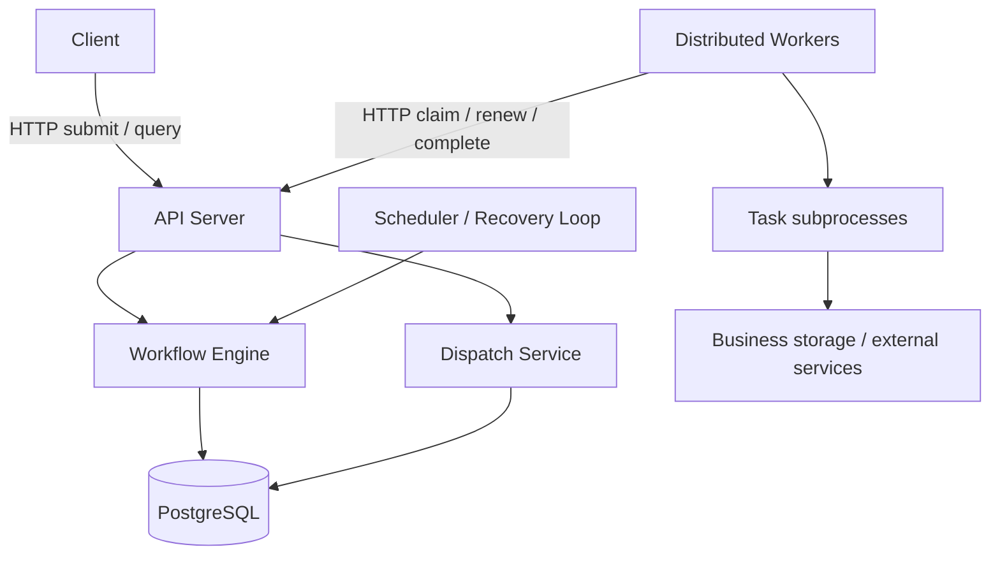

# Distributed Workflow Engine

A backend and distributed systems project for executing DAG workflows across
multiple workers, with durable state, explicit task ownership, and failure
recovery.

The project explores what happens when processes crash, requests are duplicated,
leases expire, and execution results arrive late. The execution contract will be
at-least-once; business side effects require cooperating idempotent handlers.

## Current status

**M0.2: Automated quality checks and CI configuration.**

Available now:

- An installable Python package using a `src/` layout.
- A CLI exposing help and the installed package version.
- A uv dependency lockfile and pytest entry-point smoke tests.
- Ruff lint/format checks and strict mypy checks for source code and tests.
- A GitHub Actions workflow targeting Python 3.13 on Linux and Windows.

Workflow submission, scheduling, workers, database storage, and Docker are
**not implemented yet**. The architecture below is the agreed target design.

## Planned architecture



API, scheduler, and worker will be separate process roles in one codebase.
Workflow Engine and Dispatch Service are modules, not separate microservices.

The architecture baseline is:

- Immutable workflow versions and static DAGs.
- Separate WorkflowRun, Task, and TaskAttempt models.
- PostgreSQL as both durable state storage and the ready-task queue.
- Workers pull work only when they have execution capacity.
- Lease-based ownership and rejection of stale attempt results in the MVP.
- Short transactions coordinated per run; task execution happens outside locks.
- Persistent retry deadlines, exponential backoff with jitter, and recovery scans.
- At-least-once execution with explicit API and business idempotency contracts.

Task terminal states will remain terminal. An attempt failure may move its task
to RETRY_WAIT; FAILED represents a task that will receive no further automatic
attempts.

### Known design trade-offs

PostgreSQL simplifies atomic state changes and dispatch, but shares queue and
storage load. Per-run coordination simplifies correctness but may constrain
large-DAG control throughput. Polling adds scheduling latency. A lease can reject
stale results inside the engine; it cannot undo external side effects or prove
that an old worker has stopped. The MVP assumes trusted workers and handlers.

## Local setup

Prerequisites: Python 3.13 and [uv](https://docs.astral.sh/uv/getting-started/installation/).
CI pins uv to 0.12.5; use that version locally when reproducing CI behavior.
Run these commands from the repository root:

```console
uv sync --locked
uv run --locked engine --version
uv run --locked engine --help
uv run --locked python -m workflow_engine --version
uv run --locked pytest
```

Expected version output:

```text
engine 0.1.0
```

The CLI does not start a server or execute a workflow at this stage.
Development dependencies are included by default. Python support is deliberately
limited to 3.13 until additional versions are tested.

### Quality checks

Run the same checks as CI:

```console
uv sync --locked
uv run --locked ruff check .
uv run --locked ruff format --check .
uv run --locked mypy
uv run --locked pytest
uv build
```

Ruff checks Python errors, imports, modernization rules, and common bug patterns.
It also owns formatting (88-column target). mypy uses strict mode for both
`src/` and `tests/`. All configuration lives in `pyproject.toml`; tool versions
are recorded in `uv.lock`.

To apply formatting locally:

```console
uv run --locked ruff format .
```

CI only checks formatting; it does not edit or commit files.

### Continuous integration

[CI workflow runs](https://github.com/Shenggyyy/distributed-workflow-engine/actions/workflows/ci.yml)

The workflow runs on pushes to `main`, pull requests, and manual dispatch.
Each Linux/Windows job installs Python from `.python-version`, syncs locked
dependencies, and runs lint, format, type, test, and package build checks.
Jobs have a 10-minute timeout; newer runs cancel superseded runs for the same
ref. Actions are pinned to commit SHAs and repository permissions are read-only.
No deployment or publishing is performed.

Local checks do not establish a successful GitHub run. After pushing this
subtask, inspect the Actions tab and confirm both platform jobs pass before
starting the next subtask. Making CI mandatory for merges requires a separate
GitHub branch protection/ruleset configuration; this workflow does not enable it.

### Build the package

```console
uv build
```

The source distribution and wheel are written to `dist/`, which is ignored by Git.

## Repository layout

```text
.github/workflows/
    ci.yml
src/workflow_engine/
    __init__.py
    __main__.py
    cli.py
tests/
    test_cli.py
.python-version
.gitignore
pyproject.toml
uv.lock
README.md
```

Tests invoke the installed console script and module from outside the repository
root to catch packaging and entry-point problems. No PYTHONPATH override is used.

## Development milestones

| Milestone | Scope |
| --- | --- |
| M0 | Packaging, quality checks, configuration, logging, API health, containers, migrations |
| M1 | DAG validation, immutable definitions, durable and idempotent run creation |
| M2 | First scheduling and execution loop with basic leased attempts |
| M3 | Concurrent scheduling and multiple workers |
| M4 | Retries, timeout, crash recovery, and stale-result rejection |
| M5 | Failure propagation, aggregation, idempotency demonstration, end-to-end acceptance |

Each milestone is divided into independently verifiable commit-sized subtasks.
After M0.2 is committed, pushed, and its CI run passes, the next subtask is
M0.3: environment-based application configuration and validation.

V2 will add resource controls, routing, cancellation, scheduled jobs, and
observability. V3 will focus on measured scaling, storage lifecycle, and any
broker integration justified by benchmarks. UI remains low priority.

## Contribution workflow

1. Explain important architecture, schema, protocol, and state-model decisions.
2. Implement one bounded subtask with appropriate tests and documentation.
3. Run checks and report completed work, core files, capabilities, and limitations.
4. Stop at the commit boundary. The repository owner runs git add, commit, and push.
5. Continue to the next major subtask only after the owner confirms commit/push.

Never commit credentials or real environment files. Keep local settings in
ignored `.env` files; future `.env.example` files must contain placeholders only.
Review the staged diff before each commit. Git ignore rules are not a secret
scanner.
