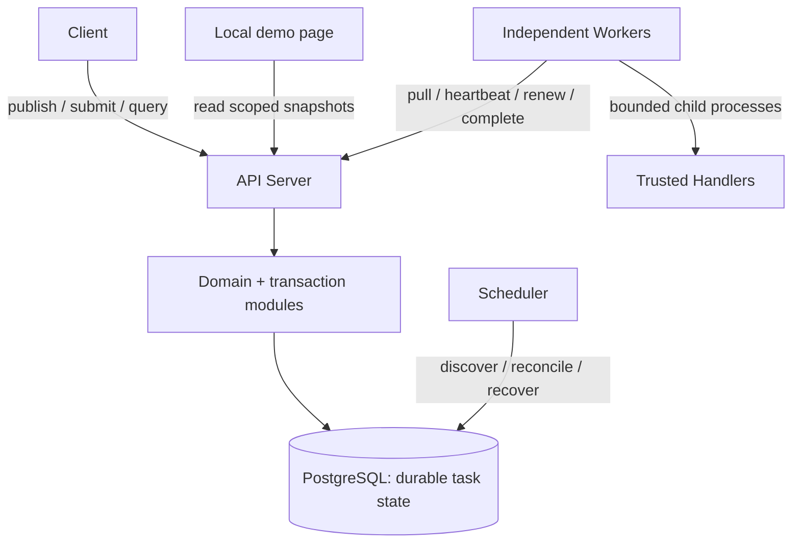
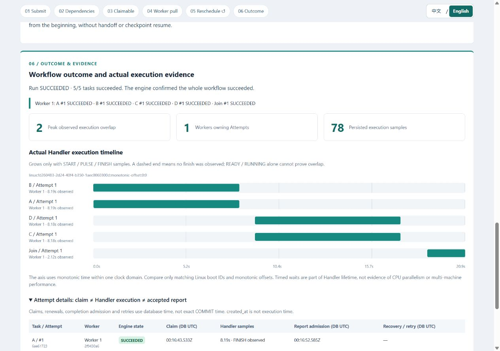
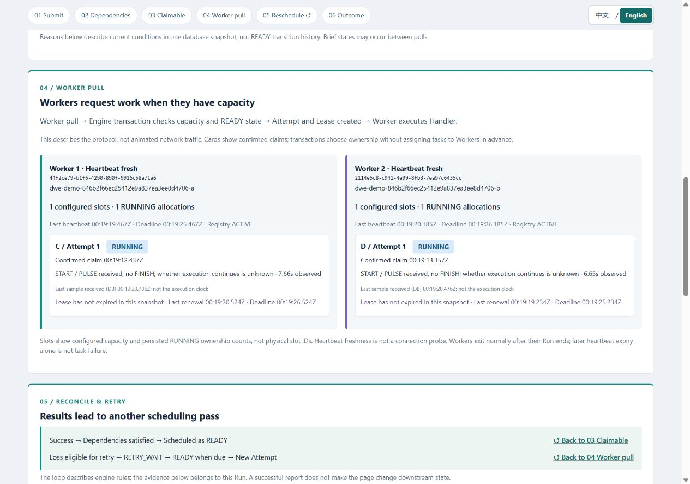

[English](README.md) | [简体中文](README.zh-CN.md)

# Distributed Workflow Engine

Execute static DAG workflows across independent Workers, with PostgreSQL-backed
task ownership and recovery when processes crash or requests are repeated.
This backend/distributed systems project makes the difficult parts explicit:
**who owns an Attempt, when that ownership expires, and which results may commit.**

## First-version status

The **M0–M5 core MVP is complete**: DAG validation, versioned workflows, idempotent
Run submission, parallel execution, multi-Worker/Scheduler coordination, heartbeat,
Lease fencing, durable retries with exponential backoff, fixed timeouts, crash
recovery, failed-dependency propagation and Run aggregation.

The **local demonstration is complete** under a separate acceptance gate: a real
six-step page shows dependencies, confirmed ownership, sampled execution overlap
and recovery, with complete English/Chinese presentation. See the dated
[core review](docs/mvp-review.md) and [bilingual demo acceptance](docs/release-review.md).
This is a trusted-deployment first version;
no production SLA, multi-machine validation or throughput claim is implied.

## Architecture



| Component | Responsibility |
| --- | --- |
| API + domain/repositories | Validate DAGs and protocol requests; apply guarded transitions in short transactions; report success after commit. |
| Scheduler | Discover Runs, resolve dependencies, promote retries, recover expired Attempts and aggregate outcomes. |
| Worker | Pull with free capacity, maintain heartbeat/Lease and supervise concurrent Handler processes. |
| PostgreSQL | Store immutable workflow versions, Runs, Tasks, Attempts, ownership, receipts and retry schedules. |
| Optional demo | Read a coherent snapshot and genuine Handler observations; it does not authorize execution. |

One Python package, three process roles: **FastAPI, SQLAlchemy Core/psycopg,
PostgreSQL and Alembic**. Vanilla HTML/CSS/JavaScript serves the demo without a
frontend build or extra service. [Architecture and trade-offs](docs/architecture.md).

## Distributed contracts

- **Worker pull and a durable queue:** READY is PostgreSQL Task state. Workers ask
  for work; the Scheduler never pushes to a separate broker.
- **Ownership and consistency:** ordered row locks and post-lock database time
  authorize one current persisted Attempt. Handler execution stays outside the transaction.
- **Lease and timeout:** renewal extends the Lease, never the fixed execution
  deadline. Heartbeat loss alone does not revoke a still-valid Lease.
- **Recovery:** a Scheduler reconstructs work from durable state after restart.
  Lost/timed-out Attempts can enter persisted backoff and produce a new Attempt;
  a crashed Handler is rerun, not resumed.
- **Retries and duplicates:** execution is at least once, bounded by the Attempt
  budget and system availability. Stable submission/claim/completion identities
  resolve repeated requests. Ownership fencing rejects stale results; external
  effects require [business idempotency](docs/business-idempotency.md).

## Quick start

Requires **Python 3.13, uv and Docker Desktop running Linux containers** (or a
local Linux Docker Engine with Compose). Node.js 22+ is only needed for UI tests.
From your clone's root:

```console
uv sync --locked
uv run python scripts/demo.py up
```

Open **[http://127.0.0.1:18080/demo/](http://127.0.0.1:18080/demo/)**. Keep
**Follow newest Run / 跟随最新 Run** enabled, then run:

```console
uv run python -m scripts.demo_acceptance
```

Switch **中文 / English** in the page navigation. Browser language is the initial
default; your manual preference is remembered without restarting or changing the Run.

The first command builds the image and starts a dedicated demo database/API/Scheduler;
the second creates three real Runs and injects one scoped Worker failure.
Initial downloads/builds take additional time. The development database is separate.
[Full startup, individual commands and three-minute guide](docs/demo.md).

Stop services while retaining demo history:

```console
uv run python scripts/demo.py down
```

## Three demonstrations: what to observe

Read **01 submission → 02 dependencies → 03 claimable Tasks → 04 Worker pull →
05 results/retry → 06 outcome/evidence**. Step 05 links back to the next scheduling pass.

| Scenario | Real work and evidence |
| --- | --- |
| Parallel | One Worker with two slots; A/B/C/D then Join. Overlapping START/PULSE/FINISH intervals prove concurrent Handler lifetimes. |
| Distribution | Two independent one-slot Workers pull from the same Run. Compare actual Task/Attempt/Worker IDs; ownership is not preassigned. |
| Recovery | Stop only the dedicated Worker. Observe stopped heartbeat/renewal, LOST Attempt, RETRY_WAIT, a new Attempt on script-started Worker B and final success. |

Claim time, Handler samples and completion admission are distinct. RUNNING and
`created_at` do not prove execution; Lease expiry is not a Handler finish time.
Missing FINISH stays unknown. Timed demo Handlers do not pretend to process sales
reports or transfer outputs along DAG edges. [Evidence contracts](docs/demo-design.md).

Real English browser captures: one Worker's overlapping Handler intervals, then
two Workers executing the same Run. Run IDs and paired Chinese captures are in the
[dated review](docs/release-review.md); new Runs receive new identities:





## Test and verify

```console
uv run --locked ruff check .
uv run --locked ruff format --check .
uv run --locked mypy
uv run --locked pytest
node --test tests/demo-evidence.test.mjs tests/demo-i18n.test.mjs tests/demo-page.test.mjs
uv run --locked python scripts/check_docs.py
uv build
```

Default pytest skips PostgreSQL integration tests unless a dedicated test database
is configured. CI runs Linux/Windows checks, PostgreSQL integration, real HTTP and
container/crash scenarios. Actual demo/browser acceptance is a separate check.
[Test database setup, CI and verification](docs/testing.md) ·
[GitHub Actions](https://github.com/Shenggyyy/distributed-workflow-engine/actions/workflows/ci.yml).

## Limits and further reading

Single PostgreSQL authority; control writes serialize within a Run. Polling adds
latency and does not guarantee FIFO/fairness. No authentication, tenant isolation,
untrusted-code sandbox, automatic artifact transfer or autoscaling. History is
retained without a production archival policy. The demo validates **one machine
with multiple Linux containers**, not multi-machine clocks, HA or exactly-once effects.

- [Documentation guide](docs/README.md): navigation by reader need; deeper references are in English.
- [Local development](docs/local-development.md) and [configuration/logging](docs/configuration.md).
- [HTTP API](docs/api.md), [Run API](docs/run-api.md), [runnable examples](examples); live OpenAPI: [demo /docs](http://127.0.0.1:18080/docs).
- [Failure scenarios](docs/failure-scenarios.md), [Lease/timeout recovery](docs/timeouts.md), [known architecture limits](docs/architecture.md#explicit-mvp-limits).
