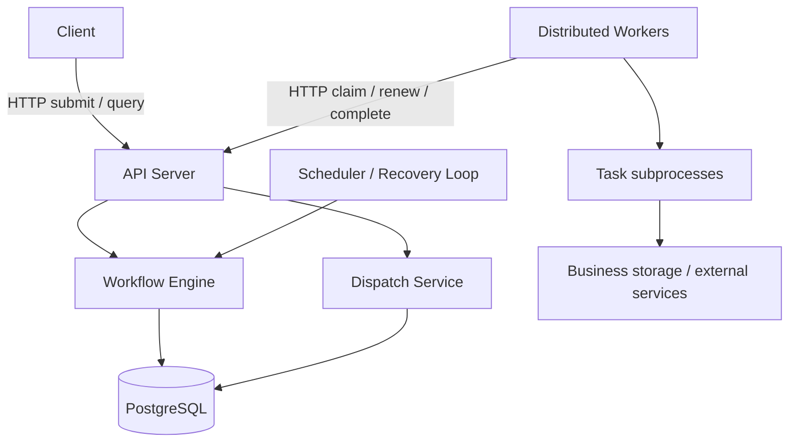

# Distributed Workflow Engine

A backend and distributed systems project for executing DAG workflows across
multiple workers, with durable state, explicit task ownership, and failure
recovery.

The project explores what happens when processes crash, requests are duplicated,
leases expire, and execution results arrive late. The execution contract will be
at-least-once; business side effects require cooperating idempotent handlers.

## Current status

**M2.1d: Worker registration and heartbeat HTTP API with commit/error contracts.**

Available now:

- An installable Python package using a `src/` layout.
- A CLI exposing help, version, configuration validation, API startup, and database checks.
- A FastAPI application with liveness, OpenAPI, and interactive API documentation.
- Immutable settings loaded from environment variables and explicit dotenv files.
- JSON application logs on stderr, with log-level control and correlation fields.
- A uv dependency lockfile and pytest entry-point smoke tests.
- Ruff lint/format checks and strict mypy checks for source code and tests.
- A GitHub Actions workflow targeting Python 3.13 on Linux and Windows.
- A non-root API image and Compose environment with persistent PostgreSQL storage.
- Local secret initialization and a separate container integration CI job.
- A bounded PostgreSQL connection pool using SQLAlchemy 2 and psycopg 3.
- Real PostgreSQL integration tests for transactions, pool limits, and SQL timeouts.
- Packaged Alembic revisions with explicit upgrades and a PostgreSQL migration lock.
- Frozen workflow/task definitions with strict fields and complete DAG validation.
- Deterministic topological ordering, root detection, and dependency indexes.
- Migrated workflow/version tables with JSONB snapshots and database mutation guards.
- A transaction-scoped repository with concurrent version allocation and validated reads.
- PostgreSQL tests for concurrent first publication, rollback, and workflow lock isolation.

- Workflow publication and version lookup HTTP endpoints with typed OpenAPI contracts.
- Commit-before-success responses, sanitized validation/storage errors, and lazy API pooling.
- Real HTTP container checks plus PostgreSQL tests for commit failure and concurrent requests.

- Immutable Run, TaskRun and TaskAttempt snapshots with explicit event-driven transitions.
- Terminal-state protection and separate task-retry versus attempt-outcome semantics.

- Migrated run/task/attempt tables with foreign keys and lifecycle/history guards.
- Scoped task/attempt uniqueness and at most one RUNNING attempt row per task.

- Transactional creation of version-pinned runs and complete DAG task sets.
- Root-only readiness with rollback, concurrent creation and visibility tests.

- Durable request-binding storage with immutable keys and deferred Run/Version validation.

- Keyed run creation with stable receipt replay and different-input conflict handling.
- PostgreSQL tests for concurrent duplicates, owner rollback, timeouts and commit failure.

- Typed Run metadata and Run/Task queries with one-statement snapshot consistency.
- Read-only transaction support, bounded results and explicit invalid-data errors.

- Run creation HTTP API with required idempotency keys, stable receipts and conflicts.
- Run metadata/task HTTP queries, typed contracts and real HTTP checks in CI.

- Immutable WorkerSession models with per-process identity and terminal lifecycle rules.
- Worker identity/heartbeat/lease design boundaries and an in-memory lifecycle example.

- Migrated Worker sessions with immutable identities, terminal-state and time guards.
- PostgreSQL tests for concurrent identities, late renewal and preserved migration data.

- Transactional Worker registration through Python with same-session replay and conflicts.
- Database-clock initialization after lock waits, rollback and concurrent registration tests.

- Transactional Worker heartbeat renewal and per-session expiry with post-lock clock checks.
- PostgreSQL tests for exact deadlines, concurrent renewal/expiry and commit rollback.

- Worker registration/replay and heartbeat HTTP endpoints with server-owned timeout policy.
- Strict request validation, typed error mapping and real Worker HTTP checks in CI.

Background heartbeat/expiry loops, scheduling and execution are **not implemented yet**.
The architecture below is the agreed target design.

## Validate a workflow

```console
uv run --locked python examples/validate_workflow.py
```

Expected output:

```text
Workflow: diamond
Roots: A
Topological order: A, B, C, D
Validation only; no tasks were executed.
```

The [example definition](examples/diamond.json) declares A → B → C → D and an
additional B → D dependency. Validation rejects duplicate IDs, invalid references,
self-dependencies, and cycles. Multiple roots and independent branches are
allowed. Topological order describes dependencies; it is not a serial execution
plan. See the [workflow/DAG contract](docs/workflows.md) for field rules, limits,
immutability, and errors.

## Publish and retrieve a workflow

After starting PostgreSQL on port 15432 and applying migrations:

```powershell
$env:DWE_DATABASE_PORT = "15432"
$env:DWE_DATABASE_PASSWORD_FILE = "secrets/postgres_password.txt"
uv run --locked alembic upgrade head
uv run --locked python examples/publish_workflow.py
```

For a new `diamond` workflow this prints:

```text
Workflow: diamond
Version: 1
Version ID: <generated UUID>
Published and retrieved; no tasks were executed.
```

Run the example again to append version 2. Each invocation creates a version,
even with the same definition; publication is not yet request-idempotent.
The example commits the publication, reads it back in another transaction, and
checks equality before reporting success. It also accepts an explicit
`--env-file .env.database-test`.

The [repository contract](docs/workflow-storage.md#transactional-repository)
explains locking, transaction ownership, typed lookups, and failure semantics.
HTTP publication and retrieval use this repository. Task execution remains a later subtask.

## Publish through HTTP

Start Compose, then apply the packaged migration explicitly:

```powershell
docker compose exec api alembic upgrade head
$body = Get-Content examples/diamond.json -Raw
$published = Invoke-RestMethod -Method Post -Uri http://127.0.0.1:8000/workflows -ContentType "application/json" -Body $body
$published | ConvertTo-Json -Depth 10
Invoke-RestMethod "http://127.0.0.1:8000/workflow-versions/$($published.id)"
```

The POST returns HTTP `201` only after commit, with version UUID, workflow UUID,
version number, creation time, and the validated definition. Its `Location`
header points to the immutable version. Repeating the request appends another
version; `Idempotency-Key` is explicitly rejected until supported.

Run the automated network check against a disposable local database:

```console
uv run --locked python scripts/check_workflow_api.py
```

Expected output: `HTTP workflow checks passed: publication, history, latest, 404 and 422.`
This check creates two versions under a unique workflow name; it does not execute
tasks. See [HTTP API contracts and failure semantics](docs/api.md) for all routes,
responses, configuration, and limitations.

## Create and query a run through HTTP

Using the version published above:

```powershell
$runBody = @{ workflow_version_id = $published.id } | ConvertTo-Json
$runHeaders = @{ "Idempotency-Key" = [guid]::NewGuid().ToString() }
$run = Invoke-RestMethod -Method Post -Uri http://127.0.0.1:8000/runs -Headers $runHeaders -ContentType "application/json" -Body $runBody
Invoke-RestMethod -Method Post -Uri http://127.0.0.1:8000/runs -Headers $runHeaders -ContentType "application/json" -Body $runBody
Invoke-RestMethod "http://127.0.0.1:8000/runs/$($run.run_id)/tasks" | ConvertTo-Json -Depth 10
```

Both POSTs return 201 with the same Run ID and version ID. A different version
with that key returns 409. For the diamond, the queried run is RUNNING, A is READY
and B/C/D are PENDING; no task executes yet. Keep the key and version for retries.

```console
uv run --locked python scripts/check_run_api.py
```

Expected output: `HTTP run checks passed: creation, replay, queries, 409, 404 and 422.`
This smoke check creates two versions and one run under a unique workflow name;
use a disposable database. See [Run HTTP contracts](docs/run-api.md) for all
responses, transaction semantics, query consistency and testing.

## Explore runtime state transitions

```console
uv run --locked python examples/runtime_lifecycle.py
```

```text
Attempt 1: FAILED; task: RETRY_WAIT
Attempt 2: SUCCEEDED; task: SUCCEEDED; run: SUCCEEDED
In-memory lifecycle only; no scheduling, waiting or task execution.
```

The [runtime model contract](docs/runtime.md) defines identities, event/state
tables, terminal states, retry semantics, and the checks required from future
database transactions. This example requires no Docker or database. A legal
in-memory transition alone does not prove dependency readiness or task ownership.

## Create a persisted workflow run

After publishing a version and configuring PostgreSQL:

```console
uv run --locked python examples/create_run.py --version-id "<published Version ID>"
```

For the diamond definition, the committed run is RUNNING, task A is READY,
and B/C/D are PENDING. There are no attempts and no execution yet. Each call
creates a new run, including repeated calls for the same version. See the
[run creation contract](docs/run-creation.md) for a complete example, transaction
ownership, initialization guarantees and uncertain-commit behavior.

## Create a run with an idempotency key

```powershell
$versionId = "<published Version ID>"
$requestKey = [guid]::NewGuid().ToString()
uv run --locked python examples/create_idempotent_run.py --version-id $versionId --idempotency-key $requestKey
uv run --locked python examples/create_idempotent_run.py --version-id $versionId --idempotency-key $requestKey
```

With PostgreSQL configured as above, both invocations return the same Run ID.
Keep the same key/version for retries. Different input with that key is rejected;
a new key creates a distinct run. This does not execute tasks. See
[run-creation idempotency](docs/run-idempotency.md) for the transaction, concurrency,
failure and receipt contracts.

## Query a persisted run

```console
uv run --locked python examples/query_run.py --run-id "<Run ID from creation>"
```

With PostgreSQL configured, this reads the run and its tasks from one statement
snapshot. Tasks are sorted by key; querying does not aggregate statuses or execute
work. A missing run exits with code 1. See the [Run query contract](docs/run-queries.md)
for consistency, ordering, limits and diagnostic behavior.

## Explore worker session identities

```console
uv run --locked python examples/worker_lifecycle.py
```

```text
First session: ACTIVE -> LOST
Restart uses a new session ID: True
Restarted session: ACTIVE -> STOPPED
Old LOST session rejects further transitions.
In-memory lifecycle only; no registration, heartbeat or task execution.
```

Each process start will use a new session UUID. Worker names may repeat; a restarted
process cannot take over an old session's identity through its name. LOST and
STOPPED are terminal. The [Worker contract](docs/workers.md) separates session
heartbeat from attempt leases and marks which guarantees still require storage
and coordinated transactions. This example needs no Docker or database.

## Register a Worker session

With PostgreSQL configured and migrated to 0005:

```powershell
$sessionId = [guid]::NewGuid().ToString()
uv run --locked python examples/register_worker.py --session-id $sessionId
uv run --locked python examples/register_worker.py --session-id $sessionId
```

Both commands return the same persisted session without extending its heartbeat
deadline. Use the same UUID/name/capacity for retries, and a new UUID for a new
process start. Different fields with an existing UUID raise a conflict. This
example registers a record; it does not start a heartbeat loop or execute tasks.
See [Worker registration](docs/worker-registration.md) for the transaction,
advisory lock, clock and failure contracts.

## Register and heartbeat over HTTP

With the API rebuilt and the database migrated, run:

```console
uv run --locked python scripts/check_worker_api.py
```

This checks `PUT /worker-sessions/{session_id}` and
`POST /worker-sessions/{session_id}/heartbeat` against the running container.
Registration/replay and accepted heartbeats return 200 after commit. Registration
replay never renews a session; heartbeats require an empty JSON object and an
unexpired ACTIVE session. Each script run retains one session record.
See [Worker HTTP API](docs/worker-api.md) for requests, errors, policy and tests.

## Renew or expire a Worker session

Using a freshly registered session, before its displayed heartbeat deadline:

```powershell
uv run --locked python examples/worker_heartbeat.py heartbeat --session-id $sessionId
uv run --locked python examples/worker_heartbeat.py expire --session-id $sessionId
```

Heartbeat renews a live ACTIVE session. Expire leaves it ACTIVE until the deadline;
after that deadline it records LOST. A late heartbeat is rejected even if no
expiry scan has run. Neither method changes task ownership. See
[heartbeat and expiry contracts](docs/worker-heartbeat.md) for exact boundaries,
race outcomes, clock limitations and examples. These are individual transactions;
no background loop runs yet.

## Planned architecture



API, scheduler, and worker will be separate process roles in one codebase.
Workflow Engine and Dispatch Service are modules, not separate microservices.

The architecture baseline is:

- Immutable workflow versions and static DAGs.
- Separate WorkflowRun, Task, and TaskAttempt models.
- PostgreSQL as both durable state storage and the ready-task queue.
- Workers pull work only when they have execution capacity.
- Lease-based ownership and rejection of stale attempt results in the MVP.
- Short transactions coordinated per run; task execution happens outside locks.
- Persistent retry deadlines, exponential backoff with jitter, and recovery scans.
- At-least-once execution with explicit API and business idempotency contracts.

Task terminal states will remain terminal. An attempt failure may move its task
to RETRY_WAIT; FAILED represents a task that will receive no further automatic
attempts.

### Known design trade-offs

PostgreSQL simplifies atomic state changes and dispatch, but shares queue and
storage load. Per-run coordination simplifies correctness but may constrain
large-DAG control throughput. Polling adds scheduling latency. A lease can reject
stale results inside the engine; it cannot undo external side effects or prove
that an old worker has stopped. The MVP assumes trusted workers and handlers.

## Local setup

Prerequisites: Python 3.13 and [uv](https://docs.astral.sh/uv/getting-started/installation/).
CI pins uv to 0.12.5; use that version locally when reproducing CI behavior.
Run these commands from the repository root:

```console
uv sync --locked
uv run --locked engine --version
uv run --locked engine --help
uv run --locked python -m workflow_engine --version
uv run --locked pytest
```

Expected version output:

```text
engine 0.1.0
```

The `api` command starts the HTTP server. Workflow execution is not implemented.
Development dependencies are included by default. Python support is deliberately
limited to 3.13 until additional versions are tested.

### Run with Docker

With Docker Desktop running Linux containers:

```console
python scripts/init_dev_secrets.py
# On Linux, first apply the secret permissions documented below.
docker compose up --build --wait --wait-timeout 120
```

The API is available at `http://127.0.0.1:8000/health/live`; PostgreSQL is
published at `127.0.0.1:5432`. Stop with `docker compose down` to retain data.
The API connects to PostgreSQL by Compose service name and reads a mounted secret.
On Linux, apply the [secret directory/file permissions](docs/local-development.md#linux-secret-permissions)
before starting the non-root API. See
[container development instructions](docs/local-development.md) for credentials,
port overrides, persistence semantics, and acceptance checks.

### Run the API

Start the server in a terminal:

```console
uv run --locked engine api
```

Or explicitly load a local dotenv file:

```console
uv run --locked engine api --env-file .env
```

Defaults are `127.0.0.1:8000`. From another PowerShell terminal:

```powershell
Invoke-RestMethod http://127.0.0.1:8000/health/live
```

HTTP response:

```http
HTTP/1.1 200 OK
Content-Type: application/json

{"status":"ok"}
```

Open [Swagger UI](http://127.0.0.1:8000/docs) or
[OpenAPI JSON](http://127.0.0.1:8000/openapi.json) while the server is running.
Swagger UI uses FastAPI's default CDN assets; OpenAPI JSON and the health
endpoint do not require those assets. Press Ctrl+C in the server terminal to stop.

The API uses an application factory, `create_app(settings)`, with explicit
settings injection and FastAPI lifespan startup/shutdown hooks. Importing the
API module does not read environment variables, bind a port, or start services.
The CLI validates settings before starting Uvicorn. `DWE_API_HOST`,
`DWE_API_PORT`, and `DWE_LOG_LEVEL` control the server. It runs one process,
without reload or trusted proxy headers, with a 10-second graceful-shutdown
timeout. Invalid configuration exits before server startup.

`GET /health/live` is **liveness only**: a successful response means the API
can serve this request. It does not prove that PostgreSQL, schedulers, workers,
or workflow execution are healthy. It makes no dependency calls and exposes no
configuration. A separate readiness endpoint will be introduced alongside
persistent infrastructure. No readiness success is claimed in this milestone.

### Check PostgreSQL connectivity

With the local Compose database published on port 15432:

```powershell
$env:DWE_DATABASE_PORT = "15432"
$env:DWE_DATABASE_PASSWORD_FILE = "secrets/postgres_password.txt"
uv run --locked engine check-db
```

Success prints `Database connection is valid.` This checks an authenticated
SQL round trip; it does not check schema readiness. See
[database configuration and transaction contracts](docs/database.md) for all
settings, credentials, timeouts, and running PostgreSQL integration tests.

### Apply database migrations

After setting database credentials as described above:

```console
uv run --locked alembic upgrade head
uv run --locked alembic current
uv run --locked alembic check
```

Revision `0001` records the initial baseline; `0002` adds workflow identity and
append-only version tables; `0003` adds run/task/attempt storage and lifecycle guards.
Revision `0004` adds immutable run-creation request bindings; `0005` adds
[Worker session storage](docs/worker-storage.md) and heartbeat/lifecycle constraints.
Current revision should be `0005 (head)`. See the
[runtime storage contract](docs/runtime-storage.md) for guarantees and boundaries.
Migration commands are explicit and never run on API startup. With Compose,
`docker compose exec api alembic upgrade head` uses the container's existing
settings and mounted secret. See the
[workflow storage schema](docs/workflow-storage.md) for constraints, snapshot
semantics, and the limits of database immutability. See
[migration execution and failure semantics](docs/migrations.md) for transactions,
concurrent migration protection, SQL review, and authoring new revisions.

### Application configuration

Settings use [pydantic-settings](https://docs.pydantic.dev/latest/concepts/pydantic_settings/)
and the `DWE_` environment prefix.

| Variable | Default | Accepted values |
| --- | --- | --- |
| `DWE_ENVIRONMENT` | `development` | `development`, `test`, `production` |
| `DWE_LOG_LEVEL` | `INFO` | `DEBUG`, `INFO`, `WARNING`, `ERROR`, `CRITICAL` |
| `DWE_API_HOST` | `127.0.0.1` | An IPv4 or IPv6 address literal |
| `DWE_API_PORT` | `8000` | An integer from 1 through 65535 |
| `DWE_WORKER_HEARTBEAT_TIMEOUT_SECONDS` | `30` | API session heartbeat window, integer 1–86400 seconds |

Environment variable names are case-insensitive; enum values use the exact
spelling shown above. Empty values are validated rather than silently ignored.
The API address is validated syntactically; no port binding or network check
takes place.

Configuration precedence is **environment variables > explicitly selected
dotenv file > defaults**. No dotenv file is loaded automatically, and no parent
directories are searched. An explicitly selected file must exist and be a
readable UTF-8 file. Relative paths are resolved against the current directory.

To use a local file in PowerShell:

```powershell
Copy-Item .env.example .env
uv run --locked engine check-config --env-file .env
```

Or validate only environment variables and defaults:

```console
uv run --locked engine check-config
```

Success prints `Configuration is valid.` to stdout and exits with code 0. It also
emits a `configuration_validated` INFO log to stderr when the log level permits.
Invalid settings or an unreadable file exit with code 2. Validation errors report field names and
error types, without echoing input values or printing the complete settings.
Help and version commands do not load settings.

Use a dedicated dotenv file: unknown keys in that file are errors, which catches
typos. Unrecognized process environment variables are ignored, including unknown
`DWE_` names; this is a limitation of the environment source. Never put real
credentials in `.env.example`; local `.env` files remain ignored by Git.

Application code will call `load_settings()` at startup and pass the resulting
immutable `Settings` object to the components that need it. Each explicit call
loads a fresh snapshot; imports do not load settings, and existing snapshots do
not change when the environment changes. There is no hot reload or global cache.
Logging is initialized after successful configuration validation. API settings
are used by `engine api`; `check-config` does not start a server.
Database settings are documented in [database.md](docs/database.md).
`DWE_WORKER_HEARTBEAT_TIMEOUT_SECONDS` controls the API's session heartbeat
window (default 30 seconds, range 1–86400), loaded once at startup. Compose forwards
it into the API container. It is separate from task leases and heartbeat send
intervals; see [Worker API configuration](docs/worker-api.md#server-configuration).

### Structured logging

Engine logs use the Python standard library and are written to stderr as one JSON
object per physical line. Command results remain on stdout. Try:

```console
uv run --locked engine check-config --env-file .env.example
```

At the default INFO level, stderr contains a record with these fields
(timestamp varies):

```json
{"timestamp":"2026-09-07T00:00:00.000Z","level":"INFO","logger":"workflow_engine.cli","component":"cli","environment":"development","event":"configuration_validated","message":"Configuration validation completed."}
```

Every record includes `timestamp` (UTC), `level`, `logger`, `component`,
`environment`, `event`, and `message`. Newlines and Unicode are JSON-escaped so
the stream remains parseable on Windows and Linux. `DWE_LOG_LEVEL` controls the
handler as well as the application logger, so verbose child loggers cannot
bypass the configured threshold.

At startup, call `configure_logging(settings, component="worker")` once.
Application modules use `logging.getLogger(__name__)` and pass context per event:

```python
logger.info(
    "Task completed",
    extra={
        "event": "task_completed",
        "run_id": run_id,
        "task_id": task_id,
        "attempt_id": attempt_id,
        "worker_session_id": worker_session_id,
        "duration_ms": duration_ms,
    },
)
```

This is the intended logging pattern for future task execution; workers are not
implemented yet. Supported optional identifiers are `request_id`, `run_id`,
`task_id`, `attempt_id`, and `worker_session_id` (strings or UUIDs).
`duration_ms` accepts finite, non-negative numbers. Unsupported extra fields
and incorrectly typed optional values are omitted. A missing event name becomes
`log`. Core component/environment fields cannot be overwritten through extras.

Context is passed explicitly, without shared mutable request/task state.
This does not create traces or propagate IDs across HTTP/process boundaries;
those protocols will supply the IDs when implemented.

`logger.exception(...)` adds the current exception type and stack locations
(filename, line, function). Exception messages, source lines, local variables,
and chained exceptions are deliberately omitted. Caller-provided messages and
accepted identifiers are still logged verbatim: keep credentials, URLs containing
credentials, configuration dumps, and business payloads out of these fields.
This formatter is not a general-purpose secret redactor.

Only the `workflow_engine` logger hierarchy is configured. Root and third-party
handlers are left alone, and engine records do not propagate to root handlers.
Sequential initialization replaces the engine-owned handler, rather than adding
duplicates; configure it before starting concurrent work, once in each process.
Help/version and invalid-configuration errors retain their normal CLI output
because logging starts only after settings validate.

API lifespan events are `api_startup_complete` and `api_shutdown_complete`.
The startup event means application initialization finished, not that the server
has successfully bound its socket; use an HTTP request to verify reachability.
Uvicorn retains its own text service/error logs on stderr, with access logging
disabled. The API process stderr therefore contains both engine JSON records
and Uvicorn text. Unifying server logs and adding request logging are later work.

Logs are synchronous diagnostic output, not a durable event log. File rotation,
central collection, and queued logging are deferred until their operational need
is established.

### Quality checks

Run the same checks as CI:

```console
uv sync --locked
uv run --locked ruff check .
uv run --locked ruff format --check .
uv run --locked mypy
uv run --locked pytest
uv build
```

Ruff checks Python errors, imports, modernization rules, and common bug patterns.
It also owns formatting (88-column target). mypy uses strict mode with the
Pydantic plugin for `src/`, `tests/`, `scripts/`, and `examples/`. All configuration
lives in `pyproject.toml`; tool versions are recorded in `uv.lock`.

To apply formatting locally:

```console
uv run --locked ruff format .
```

CI only checks formatting; it does not edit or commit files.
Pytest defaults to short tracebacks to avoid expanding third-party frame arguments
that can contain database credentials. This is not a general secret redactor;
do not enable verbose tracebacks or local-variable dumps in shared CI logs.

### Continuous integration

[CI workflow runs](https://github.com/Shenggyyy/distributed-workflow-engine/actions/workflows/ci.yml)

The workflow runs on pushes to `main`, pull requests, and manual dispatch.
Each Linux/Windows job installs Python from `.python-version`, syncs locked
dependencies, and runs lint, format, type, test, and package build checks.
Python jobs have a 10-minute timeout; newer runs cancel superseded runs for the same
ref. Actions are pinned to commit SHAs and repository permissions are read-only.
After both Python jobs pass, a 15-minute Ubuntu container job builds and starts
the Compose services, checks the API/runtime image, runs the application's
PostgreSQL and HTTP integration tests, applies and checks the current revision,
executes a real HTTP publication/query smoke test, and verifies that data survives
database container replacement. Its credentials
and volumes are disposable. No deployment or publishing is performed.

Local checks do not establish a successful GitHub run. After pushing this
subtask, inspect the Actions tab and confirm both platform jobs and the container
integration job pass before starting the next subtask. Making CI mandatory for merges requires a separate
GitHub branch protection/ruleset configuration; this workflow does not enable it.

### Build the package

```console
uv build
```

The source distribution and wheel are written to `dist/`, which is ignored by Git.

## Repository layout

```text
.github/workflows/
    ci.yml
docs/
    api.md
    database.md
    local-development.md
    migrations.md
    runtime.md
    runtime-storage.md
    run-creation.md
    run-idempotency.md
    run-queries.md
    run-api.md
    workflows.md
    workers.md
    worker-storage.md
    worker-registration.md
    worker-heartbeat.md
    worker-api.md
    workflow-storage.md
examples/
    diamond.json
    validate_workflow.py
    publish_workflow.py
    create_run.py
    create_idempotent_run.py
    query_run.py
    runtime_lifecycle.py
    worker_lifecycle.py
    register_worker.py
    worker_heartbeat.py
scripts/
    init_dev_secrets.py
    check_workflow_api.py
    check_run_api.py
    check_worker_api.py
src/workflow_engine/
    __init__.py
    __main__.py
    cli.py
    config.py
    database.py
    logging.py
    schema.py
    domain/
        __init__.py
        idempotency.py
        dag.py
        runtime.py
        workflow.py
        worker.py
    repositories/
        __init__.py
        workflows.py
        runs.py
        workers.py
    migrations/
        __init__.py
        env.py
        script.py.mako
        versions/
            0001_baseline.py
            0002_workflow_versions.py
            0003_runtime_storage.py
            0004_run_creation_requests.py
            0005_worker_sessions.py
    api/
        __init__.py
        app.py
        dependencies.py
        errors.py
        health.py
        workflows.py
        runs.py
        workers.py
tests/
    __init__.py
    conftest.py
    test_api.py
    test_cli.py
    test_config.py
    test_dag.py
    test_database.py
    test_dev_secrets.py
    test_logging.py
    test_idempotency.py
    test_migrations.py
    test_runtime.py
    test_worker.py
    test_workflow.py
    test_workflow_api.py
    test_run_api.py
    test_worker_api.py
    integration/
        __init__.py
        conftest.py
        migration_helpers.py
        test_migration_transactions.py
        test_postgresql.py
        test_workflow_schema.py
        test_workflow_repository.py
        test_workflow_http.py
        test_runtime_schema.py
        test_run_repository.py
        test_run_request_schema.py
        test_run_idempotency.py
        test_run_queries.py
        test_run_http.py
        test_worker_schema.py
        test_worker_registration.py
        test_worker_heartbeat.py
        test_worker_http.py
alembic.ini
Dockerfile
compose.yaml
.dockerignore
.env.example
.python-version
.gitignore
pyproject.toml
uv.lock
README.md
```

Tests invoke the installed console script and module from outside the repository
root to catch packaging and entry-point problems. No PYTHONPATH override is used.
HTTP tests use FastAPI's TestClient as a context manager so application startup
and shutdown run during each test. They cover the health response, OpenAPI,
settings injection, and lifecycle logs. The test client uses HTTPX2.
The locked Starlette 1.6.0 release currently emits a test-only deprecation warning
for its use of AnyIO's BlockingPortal alias. Tests pass; this upstream warning is
not suppressed and does not occur during normal API startup.

## Development milestones

| Milestone | Scope |
| --- | --- |
| M0 | Packaging, quality checks, configuration, logging, API health, containers, migrations |
| M1 | DAG validation, immutable definitions, durable and idempotent run creation |
| M2 | First scheduling and execution loop with basic leased attempts |
| M3 | Concurrent scheduling and multiple workers |
| M4 | Retries, timeout, crash recovery, and stale-result rejection |
| M5 | Failure propagation, aggregation, idempotency demonstration, end-to-end acceptance |

Each milestone is divided into independently verifiable commit-sized subtasks.
M0 provides the infrastructure foundation. M1.1 adds DAG definitions and
validation; M1.2 adds workflow/version storage schema and migrations; M1.3 adds
transactional publication and retrieval with concurrency/failure tests. M1.4
exposes HTTP publication/retrieval with commit and error contracts.
M1.5 defines runtime identities and explicit legal state transitions for
runs/tasks/attempts. M1.6 adds runtime storage, database lifecycle constraints and
migration verification. M1.7 implements transactional run creation and DAG-node/root
initialization. M1.8a adds durable request-binding storage and migration tests.
M1.8b adds atomic keyed creation, receipt replay and conflict handling. M1.9a adds
Run query storage operations with consistent statement snapshots. M1.9b exposes
keyed Run creation and queries over HTTP with commit/error contracts and container
smoke checks. M2.1a adds pure Worker session identities, terminal lifecycle rules,
and registration/heartbeat/lease design boundaries. M2.1b adds Worker session
storage, database lifecycle/time constraints and migration/concurrency tests.
M2.1c.1 adds transactional registration, replay/conflict and database-clock
initialization with concurrency/failure tests. M2.1c.2 adds heartbeat renewal and
per-session expiry with deadline, clock and race tests. M2.1d adds Worker
registration/heartbeat HTTP contracts, server policy and real HTTP checks; see
[the Worker subtask plan](docs/workers.md#commit-sized-follow-up-steps).
After M2.1d is committed, pushed, and all three CI jobs pass, move to M2.2:
task claim and attempt lease ownership foundations. Specify the ownership model,
lock ordering and schema changes before implementing the next bounded subtask.

V2 will add resource controls, routing, cancellation, scheduled jobs, and
observability. V3 will focus on measured scaling, storage lifecycle, and any
broker integration justified by benchmarks. UI remains low priority.

## Contribution workflow

1. Explain important architecture, schema, protocol, and state-model decisions.
2. Implement one bounded subtask with appropriate tests and documentation.
3. Run checks and report completed work, core files, capabilities, and limitations.
4. Stop at the commit boundary. The repository owner runs git add, commit, and push.
5. Continue to the next major subtask only after the owner confirms commit/push.

Never commit credentials or real environment files. Keep local settings in
ignored `.env` files; `.env.example` must contain only non-sensitive defaults or
placeholders.
Review the staged diff before each commit. Git ignore rules are not a secret
scanner.
