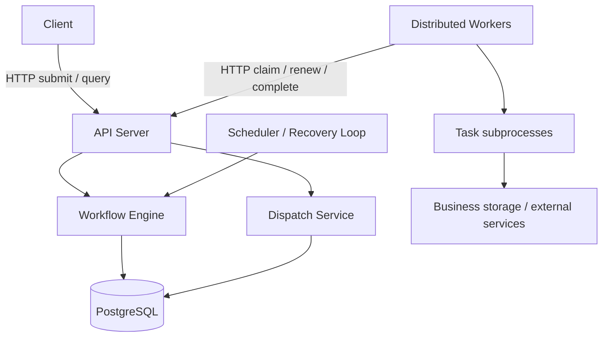

# Distributed Workflow Engine

A backend and distributed systems project for executing DAG workflows across
multiple workers, with durable state, explicit task ownership, and failure
recovery.

The project explores what happens when processes crash, requests are duplicated,
leases expire, and execution results arrive late. The execution contract will be
at-least-once; business side effects require cooperating idempotent handlers.

## Current status

**M0.5: Minimal HTTP API and liveness endpoint.**

Available now:

- An installable Python package using a `src/` layout.
- A CLI exposing help, version, configuration validation, and API startup.
- A FastAPI application with liveness, OpenAPI, and interactive API documentation.
- Immutable settings loaded from environment variables and explicit dotenv files.
- JSON application logs on stderr, with log-level control and correlation fields.
- A uv dependency lockfile and pytest entry-point smoke tests.
- Ruff lint/format checks and strict mypy checks for source code and tests.
- A GitHub Actions workflow targeting Python 3.13 on Linux and Windows.

Workflow submission, scheduling, workers, database storage, and Docker are
**not implemented yet**. The architecture below is the agreed target design.

## Planned architecture



API, scheduler, and worker will be separate process roles in one codebase.
Workflow Engine and Dispatch Service are modules, not separate microservices.

The architecture baseline is:

- Immutable workflow versions and static DAGs.
- Separate WorkflowRun, Task, and TaskAttempt models.
- PostgreSQL as both durable state storage and the ready-task queue.
- Workers pull work only when they have execution capacity.
- Lease-based ownership and rejection of stale attempt results in the MVP.
- Short transactions coordinated per run; task execution happens outside locks.
- Persistent retry deadlines, exponential backoff with jitter, and recovery scans.
- At-least-once execution with explicit API and business idempotency contracts.

Task terminal states will remain terminal. An attempt failure may move its task
to RETRY_WAIT; FAILED represents a task that will receive no further automatic
attempts.

### Known design trade-offs

PostgreSQL simplifies atomic state changes and dispatch, but shares queue and
storage load. Per-run coordination simplifies correctness but may constrain
large-DAG control throughput. Polling adds scheduling latency. A lease can reject
stale results inside the engine; it cannot undo external side effects or prove
that an old worker has stopped. The MVP assumes trusted workers and handlers.

## Local setup

Prerequisites: Python 3.13 and [uv](https://docs.astral.sh/uv/getting-started/installation/).
CI pins uv to 0.12.5; use that version locally when reproducing CI behavior.
Run these commands from the repository root:

```console
uv sync --locked
uv run --locked engine --version
uv run --locked engine --help
uv run --locked python -m workflow_engine --version
uv run --locked pytest
```

Expected version output:

```text
engine 0.1.0
```

The `api` command starts the HTTP server. Workflow execution is not implemented.
Development dependencies are included by default. Python support is deliberately
limited to 3.13 until additional versions are tested.

### Run the API

Start the server in a terminal:

```console
uv run --locked engine api
```

Or explicitly load a local dotenv file:

```console
uv run --locked engine api --env-file .env
```

Defaults are `127.0.0.1:8000`. From another PowerShell terminal:

```powershell
Invoke-RestMethod http://127.0.0.1:8000/health/live
```

HTTP response:

```http
HTTP/1.1 200 OK
Content-Type: application/json

{"status":"ok"}
```

Open [Swagger UI](http://127.0.0.1:8000/docs) or
[OpenAPI JSON](http://127.0.0.1:8000/openapi.json) while the server is running.
Swagger UI uses FastAPI's default CDN assets; OpenAPI JSON and the health
endpoint do not require those assets. Press Ctrl+C in the server terminal to stop.

The API uses an application factory, `create_app(settings)`, with explicit
settings injection and FastAPI lifespan startup/shutdown hooks. Importing the
API module does not read environment variables, bind a port, or start services.
The CLI validates settings before starting Uvicorn. `DWE_API_HOST`,
`DWE_API_PORT`, and `DWE_LOG_LEVEL` control the server. It runs one process,
without reload or trusted proxy headers, with a 10-second graceful-shutdown
timeout. Invalid configuration exits before server startup.

`GET /health/live` is **liveness only**: a successful response means the API
can serve this request. It does not prove that PostgreSQL, schedulers, workers,
or workflow execution are healthy. It makes no dependency calls and exposes no
configuration. A separate readiness endpoint will be introduced alongside
persistent infrastructure. No readiness success is claimed in this milestone.

### Application configuration

Settings use [pydantic-settings](https://docs.pydantic.dev/latest/concepts/pydantic_settings/)
and the `DWE_` environment prefix.

| Variable | Default | Accepted values |
| --- | --- | --- |
| `DWE_ENVIRONMENT` | `development` | `development`, `test`, `production` |
| `DWE_LOG_LEVEL` | `INFO` | `DEBUG`, `INFO`, `WARNING`, `ERROR`, `CRITICAL` |
| `DWE_API_HOST` | `127.0.0.1` | An IPv4 or IPv6 address literal |
| `DWE_API_PORT` | `8000` | An integer from 1 through 65535 |

Environment variable names are case-insensitive; enum values use the exact
spelling shown above. Empty values are validated rather than silently ignored.
The API address is validated syntactically; no port binding or network check
takes place.

Configuration precedence is **environment variables > explicitly selected
dotenv file > defaults**. No dotenv file is loaded automatically, and no parent
directories are searched. An explicitly selected file must exist and be a
readable UTF-8 file. Relative paths are resolved against the current directory.

To use a local file in PowerShell:

```powershell
Copy-Item .env.example .env
uv run --locked engine check-config --env-file .env
```

Or validate only environment variables and defaults:

```console
uv run --locked engine check-config
```

Success prints `Configuration is valid.` to stdout and exits with code 0. It also
emits a `configuration_validated` INFO log to stderr when the log level permits.
Invalid settings or an unreadable file exit with code 2. Validation errors report field names and
error types, without echoing input values or printing the complete settings.
Help and version commands do not load settings.

Use a dedicated dotenv file: unknown keys in that file are errors, which catches
typos. Unrecognized process environment variables are ignored, including unknown
`DWE_` names; this is a limitation of the environment source. Never put real
credentials in `.env.example`; local `.env` files remain ignored by Git.

Application code will call `load_settings()` at startup and pass the resulting
immutable `Settings` object to the components that need it. Each explicit call
loads a fresh snapshot; imports do not load settings, and existing snapshots do
not change when the environment changes. There is no hot reload or global cache.
Logging is initialized after successful configuration validation. API settings
are used by `engine api`; `check-config` does not start a server.
Database and worker settings will be introduced alongside their implementations.

### Structured logging

Engine logs use the Python standard library and are written to stderr as one JSON
object per physical line. Command results remain on stdout. Try:

```console
uv run --locked engine check-config --env-file .env.example
```

At the default INFO level, stderr contains a record with these fields
(timestamp varies):

```json
{"timestamp":"2026-09-07T00:00:00.000Z","level":"INFO","logger":"workflow_engine.cli","component":"cli","environment":"development","event":"configuration_validated","message":"Configuration validation completed."}
```

Every record includes `timestamp` (UTC), `level`, `logger`, `component`,
`environment`, `event`, and `message`. Newlines and Unicode are JSON-escaped so
the stream remains parseable on Windows and Linux. `DWE_LOG_LEVEL` controls the
handler as well as the application logger, so verbose child loggers cannot
bypass the configured threshold.

At startup, call `configure_logging(settings, component="worker")` once.
Application modules use `logging.getLogger(__name__)` and pass context per event:

```python
logger.info(
    "Task completed",
    extra={
        "event": "task_completed",
        "run_id": run_id,
        "task_id": task_id,
        "attempt_id": attempt_id,
        "worker_session_id": worker_session_id,
        "duration_ms": duration_ms,
    },
)
```

This is the intended logging pattern for future task execution; workers are not
implemented yet. Supported optional identifiers are `request_id`, `run_id`,
`task_id`, `attempt_id`, and `worker_session_id` (strings or UUIDs).
`duration_ms` accepts finite, non-negative numbers. Unsupported extra fields
and incorrectly typed optional values are omitted. A missing event name becomes
`log`. Core component/environment fields cannot be overwritten through extras.

Context is passed explicitly, without shared mutable request/task state.
This does not create traces or propagate IDs across HTTP/process boundaries;
those protocols will supply the IDs when implemented.

`logger.exception(...)` adds the current exception type and stack locations
(filename, line, function). Exception messages, source lines, local variables,
and chained exceptions are deliberately omitted. Caller-provided messages and
accepted identifiers are still logged verbatim: keep credentials, URLs containing
credentials, configuration dumps, and business payloads out of these fields.
This formatter is not a general-purpose secret redactor.

Only the `workflow_engine` logger hierarchy is configured. Root and third-party
handlers are left alone, and engine records do not propagate to root handlers.
Sequential initialization replaces the engine-owned handler, rather than adding
duplicates; configure it before starting concurrent work, once in each process.
Help/version and invalid-configuration errors retain their normal CLI output
because logging starts only after settings validate.

API lifespan events are `api_startup_complete` and `api_shutdown_complete`.
The startup event means application initialization finished, not that the server
has successfully bound its socket; use an HTTP request to verify reachability.
Uvicorn retains its own text service/error logs on stderr, with access logging
disabled. The API process stderr therefore contains both engine JSON records
and Uvicorn text. Unifying server logs and adding request logging are later work.

Logs are synchronous diagnostic output, not a durable event log. File rotation,
central collection, and queued logging are deferred until their operational need
is established.

### Quality checks

Run the same checks as CI:

```console
uv sync --locked
uv run --locked ruff check .
uv run --locked ruff format --check .
uv run --locked mypy
uv run --locked pytest
uv build
```

Ruff checks Python errors, imports, modernization rules, and common bug patterns.
It also owns formatting (88-column target). mypy uses strict mode with the
Pydantic plugin for both `src/` and `tests/`. All configuration lives in
`pyproject.toml`; tool versions are recorded in `uv.lock`.

To apply formatting locally:

```console
uv run --locked ruff format .
```

CI only checks formatting; it does not edit or commit files.

### Continuous integration

[CI workflow runs](https://github.com/Shenggyyy/distributed-workflow-engine/actions/workflows/ci.yml)

The workflow runs on pushes to `main`, pull requests, and manual dispatch.
Each Linux/Windows job installs Python from `.python-version`, syncs locked
dependencies, and runs lint, format, type, test, and package build checks.
Jobs have a 10-minute timeout; newer runs cancel superseded runs for the same
ref. Actions are pinned to commit SHAs and repository permissions are read-only.
No deployment or publishing is performed.

Local checks do not establish a successful GitHub run. After pushing this
subtask, inspect the Actions tab and confirm both platform jobs pass before
starting the next subtask. Making CI mandatory for merges requires a separate
GitHub branch protection/ruleset configuration; this workflow does not enable it.

### Build the package

```console
uv build
```

The source distribution and wheel are written to `dist/`, which is ignored by Git.

## Repository layout

```text
.github/workflows/
    ci.yml
src/workflow_engine/
    __init__.py
    __main__.py
    cli.py
    config.py
    logging.py
    api/
        __init__.py
        app.py
        health.py
tests/
    conftest.py
    test_api.py
    test_cli.py
    test_config.py
    test_logging.py
.env.example
.python-version
.gitignore
pyproject.toml
uv.lock
README.md
```

Tests invoke the installed console script and module from outside the repository
root to catch packaging and entry-point problems. No PYTHONPATH override is used.
HTTP tests use FastAPI's TestClient as a context manager so application startup
and shutdown run during each test. They cover the health response, OpenAPI,
settings injection, and lifecycle logs. The test client uses HTTPX2.
The locked Starlette 1.6.0 release currently emits a test-only deprecation warning
for its use of AnyIO's BlockingPortal alias. Tests pass; this upstream warning is
not suppressed and does not occur during normal API startup.

## Development milestones

| Milestone | Scope |
| --- | --- |
| M0 | Packaging, quality checks, configuration, logging, API health, containers, migrations |
| M1 | DAG validation, immutable definitions, durable and idempotent run creation |
| M2 | First scheduling and execution loop with basic leased attempts |
| M3 | Concurrent scheduling and multiple workers |
| M4 | Retries, timeout, crash recovery, and stale-result rejection |
| M5 | Failure propagation, aggregation, idempotency demonstration, end-to-end acceptance |

Each milestone is divided into independently verifiable commit-sized subtasks.
After M0.5 is committed, pushed, and its CI run passes, the next subtask is
M0.6: Docker and the local PostgreSQL development environment.

V2 will add resource controls, routing, cancellation, scheduled jobs, and
observability. V3 will focus on measured scaling, storage lifecycle, and any
broker integration justified by benchmarks. UI remains low priority.

## Contribution workflow

1. Explain important architecture, schema, protocol, and state-model decisions.
2. Implement one bounded subtask with appropriate tests and documentation.
3. Run checks and report completed work, core files, capabilities, and limitations.
4. Stop at the commit boundary. The repository owner runs git add, commit, and push.
5. Continue to the next major subtask only after the owner confirms commit/push.

Never commit credentials or real environment files. Keep local settings in
ignored `.env` files; `.env.example` must contain only non-sensitive defaults or
placeholders.
Review the staged diff before each commit. Git ignore rules are not a secret
scanner.
