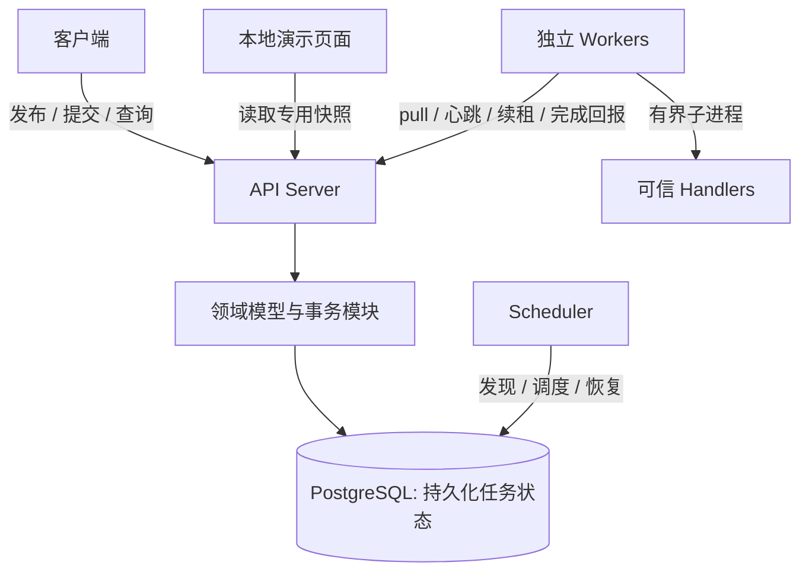
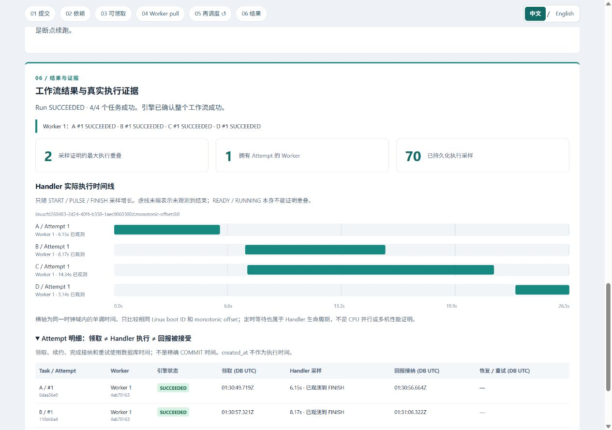
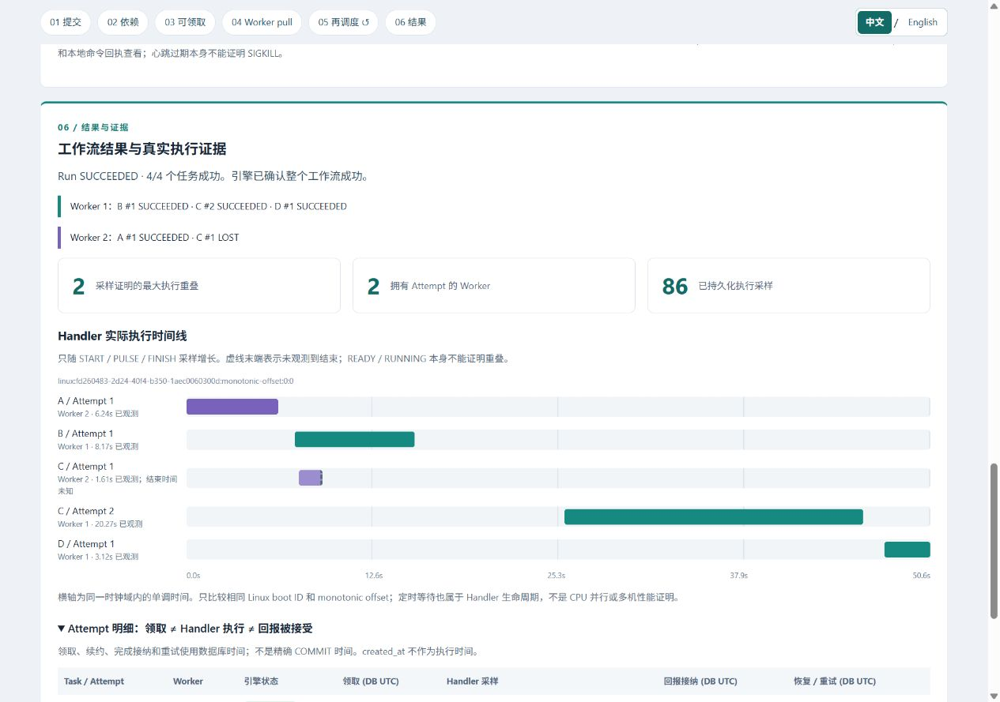

[English](README.md) | [简体中文](README.zh-CN.md)

# Distributed Workflow Engine

在多个独立 Worker 上执行静态 DAG 工作流，使用 PostgreSQL 持久化任务归属，并在进程崩溃或请求重复时恢复执行。
这个 Backend / Distributed Systems 项目重点解决：**一个 Attempt 归谁所有、归属何时失效，以及哪些结果可以提交。**

## 第一版状态

**M0–M5 核心 MVP 已完成**：DAG 校验、Workflow 版本管理、幂等 Run 提交、并行执行、多 Worker/Scheduler 协调、心跳、Lease fencing、持久化重试与指数退避、固定超时、故障恢复、失败依赖传播和 Run 状态聚合。

**中英双语六步演示层已完成**。当前场景采用菱形 DAG `A → B/C → D`，展示依赖、并行与故障恢复。
**三个菱形场景均已通过真实运行与双语浏览器验收**：B/C 采样重叠、不同执行归属以及保留兄弟任务成功结果的恢复，
见[菱形场景验收（英文）](docs/diamond-review.md)。
核心完成情况有独立的[验收记录（英文）](docs/mvp-review.md)。
当前第一版面向可信部署环境，不代表生产 SLA、多机验证或已测得的吞吐量。

## 系统架构



| 组件 | 职责 |
| --- | --- |
| API 与领域/Repository 模块 | 校验 DAG 和协议请求；通过短事务执行受约束的状态转换；提交成功后再响应。 |
| Scheduler | 发现 Run、解析依赖、推进重试、恢复失效 Attempt、聚合结果。 |
| Worker | 有空位时拉取任务，维持心跳和 Lease，监督并发 Handler 子进程。 |
| PostgreSQL | 保存不可变 Workflow 版本、Run、Task、Attempt、归属、回执和重试计划。 |
| 可选演示层 | 读取一致快照与真实 Handler 采样，不参与执行授权。 |

一个 Python 包、三个进程角色，采用 **FastAPI、SQLAlchemy Core/psycopg、PostgreSQL 和 Alembic**。
演示页面使用原生 HTML/CSS/JavaScript，无前端构建流程或额外服务。[架构与取舍（英文）](docs/architecture.md)。

## 分布式核心契约

- **Worker pull 与持久化队列：** READY 是 PostgreSQL 中的 Task 状态。Worker 主动领取，Scheduler 不向独立消息中间件推送任务。
- **归属与一致性：** 有序行锁与获取锁后的数据库时间，授权当前持久化 Attempt；Handler 在事务之外执行。
- **Lease 与超时：** 续租只延长 Lease，不延长固定执行期限。仅心跳失效不会撤销仍有效的 Lease。
- **恢复：** Scheduler 重启后从持久化状态重建待处理工作。失效或超时 Attempt 可以进入已记录的退避等待，再产生新 Attempt；故障 Handler 从头重新执行。
- **重试与重复：** 执行采用 at-least-once，受 Attempt 预算和系统可用性约束。稳定的提交、领取和完成标识处理重复请求。归属校验拒绝旧结果；外部副作用需要[业务幂等（英文）](docs/business-idempotency.md)配合。

## 快速启动

需要 **Python 3.13、uv，以及运行 Linux 容器的 Docker Desktop**，也可使用本地 Linux Docker Engine 与 Compose。
Node.js 22+ 仅用于前端测试。在克隆后的仓库根目录执行：

```console
uv sync --locked
uv run python scripts/demo.py up
```

打开 **[http://127.0.0.1:18080/demo/](http://127.0.0.1:18080/demo/)**，保持
**Follow newest Run / 跟随最新 Run** 勾选，然后执行：

```console
uv run python -m scripts.demo_acceptance
```

页面导航中可切换 **中文 / English**。首次按浏览器语言选择，手动偏好会被记住，
切换不会重启或改变当前 Run。

前一条演示命令构建镜像，启动专用数据库、API 和 Scheduler；后一条创建三个真实 Run，并对专用 Worker 注入一次故障。
首次下载、构建需要额外时间。开发数据库与演示环境独立。
[完整启动步骤、单独场景命令与三分钟指南](docs/demo.zh-CN.md)。

停止服务并保留演示历史：

```console
uv run python scripts/demo.py down
```

## 三个演示场景：应该观察什么

按 **01 提交 → 02 依赖 → 03 可领取任务 → 04 Worker pull → 05 结果与重试 → 06 最终结果与证据** 阅读。
第 05 步的回路链接返回下一轮调度。

| 场景 | 真实工作与证据 |
| --- | --- |
| 并行 | 一个 Worker、两个槽位，先执行 A（6 秒），再执行 B（8 秒）与 C（14 秒），最后执行 D（3 秒）。B/C 的采样区间必须重叠；D 等待两者成功。 |
| 分配 | 两个独立、单槽位 Worker 从同一菱形 Run 拉取任务。对比 B/C 的真实执行者，归属没有预先写死。两个会话先通过限定范围的启动就绪检查。 |
| 恢复 | C 持续 20 秒。本地命令在 B/C 重叠时确定并停止 C 的实际 Worker。存活 Worker 完成 B，待 Lease 到期与重试退避后领取 C Attempt #2；D 仍等待两条分支成功。不启动替代 Worker。 |

领取时间、Handler 采样和完成回报准入时间分别展示。RUNNING 与 `created_at` 不是执行证据，Lease 到期不代表 Handler 结束。
没有 FINISH 就保持未知。计时演示 Handler 不伪装成销售报表处理，也不暗示 DAG 边会传递输出。[证据契约（英文）](docs/demo-design.md)。

以下为真实中文浏览器截图：一个 Worker 上的 B/C 执行区间重叠，以及恢复时保留 B 的成功，
由存活 Worker 完成 C #2。Run ID、实测区间及[全部双语截图（英文索引）](docs/diamond-review.md#browser-captures)
属于带日期的证据，不是性能保证；新运行使用新身份。





旧版[多根汇合与根任务恢复截图（英文索引）](docs/release-review.md#browser-captures)仍作为历史证据保留。
已有 Run 继续显示其保存的 DAG。

## 测试与验证

```console
uv run --locked ruff check .
uv run --locked ruff format --check .
uv run --locked mypy
uv run --locked pytest
node --test tests/demo-evidence.test.mjs tests/demo-i18n.test.mjs tests/demo-page.test.mjs
uv run --locked python scripts/check_docs.py
uv build
```

默认 pytest 在没有显式配置专用测试数据库时跳过 PostgreSQL 集成测试。CI 执行 Linux/Windows 检查、PostgreSQL 集成、真实 HTTP 和容器/崩溃场景。
实际演示和浏览器验收是独立检查。[测试数据库、CI 与验证方法（英文）](docs/testing.md) ·
[GitHub Actions](https://github.com/Shenggyyy/distributed-workflow-engine/actions/workflows/ci.yml)。

## 已知限制与深入阅读

PostgreSQL 是单一持久化权威，同一 Run 的控制写入串行化。轮询带来延迟，不保证 FIFO 或公平性。
未实现认证、多租户隔离、不可信代码沙箱、自动产物传递或自动扩容；历史数据保留，尚无生产归档策略。
演示验证的是**单机多 Linux 容器**，不代表多机时钟、数据库高可用或 exactly-once 副作用保证。

- [文档导航（英文）](docs/README.md)：按读者需求组织，深入技术资料保留英文。
- [本地开发（英文）](docs/local-development.md)与[配置、日志（英文）](docs/configuration.md)。
- [HTTP API（英文）](docs/api.md)、[Run API（英文）](docs/run-api.md)、[可运行示例](examples)；运行中的 OpenAPI：[演示 /docs](http://127.0.0.1:18080/docs)。
- [失败场景（英文）](docs/failure-scenarios.md)、[Lease/超时恢复（英文）](docs/timeouts.md)、[架构限制（英文）](docs/architecture.md#explicit-mvp-limits)。
