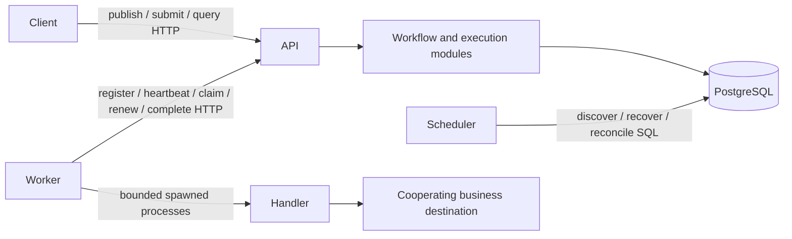

# MVP architecture and consistency boundaries

This engine coordinates trusted application tasks across processes when workers,
network requests and schedulers can fail independently. PostgreSQL owns all durable
execution decisions; a process-local queue or timer is never the recovery authority.

## Components and responsibilities

| Component | Responsibility and boundary |
| --- | --- |
| `domain/` | Validated static DAGs, immutable identities, explicit state events, pure policy/dependency decisions. No database or HTTP. |
| `api/` | Typed HTTP contracts and transaction orchestration. Publish success only after COMMIT; sanitize errors and return stable codes. |
| `repositories/` | PostgreSQL READ COMMITTED transactions, guarded state changes, historical receipts and ordered locking. Caller owns commit/rollback. |
| `scheduler/` | Bounded keyset scans, Worker expiry, Attempt recovery, retry/readiness promotion, failure propagation and Run aggregation. Each mutation uses a fresh transaction. |
| `worker/` | HTTP pull, stable request identities, capacity reservations, shared heartbeat, independent execution slots, lease/deadline supervision and direct child cleanup. |
| PostgreSQL | Immutable definitions/history, durable queue and single writer authority. Engine state remains available after process restarts. |
| Business destination | Atomically deduplicates effects under the stable Task UUID if the application requires it. Outside the engine transaction. |

API, Scheduler and Worker are independent process roles in one Python package,
not independently versioned microservices. FastAPI provides HTTP contracts;
SQLAlchemy Core/psycopg make transaction boundaries explicit; Alembic packages
schema evolution. Redis, Kafka and a separate leader service are unnecessary for
the current durable pull protocol. PostgreSQL queue traffic shares storage load.

## Data and execution

Workflow identity has immutable numbered versions. A WorkflowRun pins one version;
one TaskRun per DAG node retains its identity across numbered TaskAttempts. Each
claimed Attempt has an immutable Worker session/token binding and renewable lease.
Durable claim request bindings, completion receipts and retry schedules retain
protocol history. See [storage](runtime-storage.md), [claims](claim-requests.md),
[completion](completion-storage.md) and [retry](retry-policy.md).

Run creation atomically creates the complete Task set, with roots READY and other
nodes PENDING. Claims allocate RUNNING Task/Attempt/lease together. Only committed
parent success releases dependencies. Failed Attempts either schedule RETRY_WAIT
or exhaust their Task budget into FAILED. Failed dependencies cascade SKIPPED;
independent branches finish before Run aggregation. All terminal states remain
terminal. See [state machines](runtime.md) and [settlement](settlement.md).

## Concurrency and failure decisions

Execution writers lock **Run -> Worker -> Task -> Attempt -> lease**. Scheduler
reconciliation locks **Run -> Tasks** and never takes a later Worker lock.
Worker expiry holds only its Worker lock in a separate transaction. This prevents
the reverse acquisition that would deadlock a completion against scheduling.
Post-lock database timestamps decide ownership; transaction-start time is stale
after waiting. Discovery is advisory and is revalidated under locks.

One Run's control writes serialize; unrelated Runs can progress concurrently.
SKIP LOCKED prevents busy Run discovery/recovery from blocking all other Runs.
Polling and keyset traversal may delay eligibility; UUID order is not FIFO or a
fairness guarantee. Handler execution occurs outside these short transactions.

Timeout is fixed at first lease acquisition plus pinned timeout. Lease renewal
cannot extend it. Recovery chooses the earlier of lease expiry and hard timeout,
atomically recording LOST/TIMED_OUT plus the next retry decision. Heartbeat loss
alone does not revoke a valid lease. A new Scheduler reconstructs work from durable
state, including work committed before its predecessor died.

Execution is **at least once**, subject to a finite configured Attempt budget and
availability of database/schedulers/eligible workers. A Task can exhaust retries
without its business handler starting. At most one *current persisted* RUNNING
Attempt does not prove an old process has stopped producing external effects.
Engine fencing rejects stale results; business idempotency needs destination
cooperation. See [failure cases](failure-scenarios.md) and
[the duplicate-effect demonstration](business-idempotency.md).

## Explicit MVP limits

- Static DAGs: at most 1000 Tasks and 10000 dependency edges; no runtime expansion,
  input/output payload propagation or arbitrary uploaded code.
- Trusted deployment only: no API authentication, tenant isolation or handler
  security sandbox. Credentials and service access need operator controls.
- Bounded local slots/pools/request identities provide local backpressure;
  no global admission quotas, priority fairness or measured throughput SLA.
- Single PostgreSQL authority; HA/failover, disaster recovery and broker integration
  are not validated here. Clock jumps can reject work or defer expiry; clock health
  and process restart supervision remain operational responsibilities.
- History is retained; production archival/garbage collection is future work.
- V2: routing, resource limits, cancellation, scheduled jobs and observability.
  V3: benchmarks, measured scaling and storage lifecycle. UI remains low priority.
