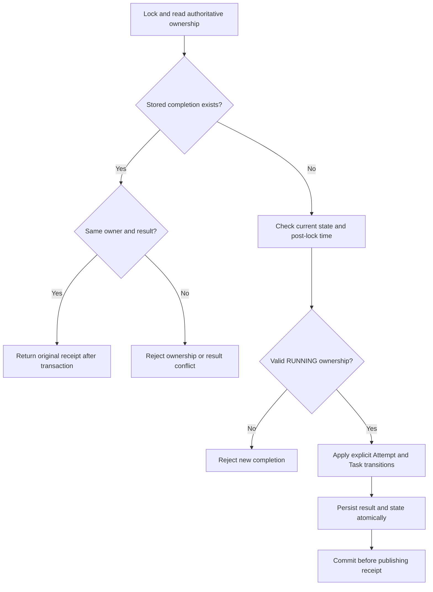

# Attempt completion results and replay

M2.3a adds pure completion models, acceptance/replay checks, unit tests and an
in-memory example. No tables, routes or running tasks change. A constructed
receipt is a proposal until the later repository commits it with all state changes.
M2.3b adds [receipt storage](completion-storage.md) in revision `0008`. M2.3c.1
implements [completion transactions](completion-transactions.md); completion HTTP
and extended cross-operation race tests remain later work.

## Why completion needs a retained result

A Worker reports success, the database commits, then the connection drops. The
Attempt is now terminal and the lease may expire before the retry arrives. Checking
only RUNNING state and lease validity would reject the retry without confirming
whether the original report succeeded. Checking only SUCCEEDED would incorrectly
accept an unrelated owner or a different result.

The chosen contract retains one immutable completion per Attempt. An identical
report can replay that receipt after expiry without performing another state
transition. This confirms the engine's accepted result; it does not authorize
another execution or provide exactly-once business side effects.

## Models and identity

| Model | Fields and rules |
| --- | --- |
| CompletionResult | Required outcome SUCCEEDED or FAILED; error_code is required for FAILED and forbidden for SUCCEEDED. |
| AttemptCompletion | Required attempt_id, worker_session_id, lease_token UUIDs and result. |
| CompletionReceipt | Original completion, terminal TaskAttempt snapshot and server accepted_at. Attempt ID and outcome must match the original completion. |

All models are frozen, reject extra fields and revalidate nested instances. Python
UUID/enum inputs are strict; JSON uses UUID/outcome strings. accepted_at is an aware
datetime normalized to UTC. Python model_copy/model_construct can bypass validation;
acceptance and replay explicitly revalidate their inputs.

An error code uses the existing Identifier contract: 1–64 characters, starting with
an ASCII letter, followed by letters, digits, underscores or hyphens. Equality is
case-sensitive. Success with an omitted code and success with explicit null are the
same normalized result. Different failure codes are different results. There is no
hash-only comparison, free-text traceback, retryable flag, output payload or artifact
reference. Task input/output transport needs its own size, serialization and
retention design before it becomes part of duplicate-result equality.

The **Attempt ID is the completion deduplication key**. A single Attempt cannot have
two legitimate completions, so another request UUID or Idempotency-Key adds no useful
identity. The original session/token bind the submitted result to its owner; a new
Worker process cannot inherit the receipt using the same display name. UUIDs and
tokens do not replace authentication.

This is an internal storage/domain receipt, not a public response DTO. It contains
the ownership token for comparison. Tokens and nested reports are hidden from repr,
but model_dump/model_dump_json still include them; never log or expose the internal
receipt directly. A later HTTP response should omit the token. Validation messages
hide input values, but raw ValidationError.errors() also must not be logged directly.

## First acceptance versus replay



The diagram describes the future repository transaction. The current pure functions
implement these narrower pieces:

* `accept_completion(attempt, lease, submitted, observed_at=...)` validates that the
  Attempt and lease refer to the same identity, applies the existing SUCCEED/FAIL
  event, and checks submitted ownership against the lease at the supplied time.
  It returns a terminal Attempt inside a new receipt without mutating the originals.
* `receipt.replay(submitted)` validates both models, compares Attempt/session/token
  first, then compares the normalized result. It preserves the original accepted_at
  and terminal snapshot. It does not receive a current clock or lease.

For first acceptance, a terminal Attempt raises InvalidStateTransition even if the
new proposal agrees with its status. A wrong owner raises LeaseOwnershipError; time
before last_renewed_at raises LeaseClockRegressionError; time equal to or after
lease_expires_at raises LeaseExpiredError. At last_renewed_at acceptance is allowed.
Mismatched Attempt/lease snapshots are invalid caller/storage data.

For replay, wrong ownership raises LeaseOwnershipError before result comparison.
A different result raises CompletionConflictError. A retained receipt may replay
after lease expiry, Worker STOPPED/LOST, Run settlement or a later Task retry because
it confirms historical acceptance. It never reopens execution. A terminal Attempt
without a receipt is not assumed to have accepted this report, especially for
recovery-generated LOST or TIMED_OUT outcomes.

## Transaction obligations for subsequent milestones

The pure helper cannot read current Run/Task/Worker state, detect an existing
receipt, lock rows or prove durability. Before first acceptance, the repository
must perform the following protocol in a fresh READ COMMITTED transaction:

1. Discover retained ownership and acquire the established order:
   `Run -> stored Worker -> Task -> Attempt -> lease`. Re-read and validate all
   identities and relationships. Never lock a caller-supplied unrelated Worker.
2. Read the retained completion under this coordination. If it exists, validate its
   correspondence with the authoritative terminal Attempt and original ownership,
   then compare/replay it. Corrupt storage is an error, not successful replay.
3. If absent, require Run/Task/Attempt RUNNING and Worker not STOPPED. An expired
   heartbeat or LOST Worker does not invalidate a still-live Attempt lease. Observe
   `clock_timestamp()` after all locks and validate ownership with the pure helper.
4. Atomically persist the Attempt outcome, server-selected Task outcome and receipt.
   Success uses ATTEMPT_SUCCEEDED. In M2's initial no-retry execution path, failure
   uses FAIL_PERMANENTLY. M4 will add retry policy/deadline selection before choosing
   RETRY_SCHEDULED; the Worker never chooses Task state or retry time.
5. Validate the outgoing receipt and COMMIT before publishing it. Capacity is derived
   from RUNNING Attempts, so the terminal transition releases the reservation once;
   replay must not decrement a counter or repeat other effects. Downstream readiness
   and Run aggregation remain separate durable scheduling work, with independent
   branches permitted to finish after a failure.

All cooperating completion, renewal, claim and recovery writers must share the
ordered locks. No additional request advisory lock is needed for completion: the
existing per-Run serialization covers both the absent-receipt check and insertion.
A unique Attempt key remains a storage backstop. Do not hold a transaction during
handler execution, network operations or backoff.

The proposed receipt storage retains immutable ownership, normalized outcome/code,
accepted_at and the Attempt reference. The immutable TaskAttempt identity and
terminal-state guards allow reconstruction of its historical snapshot. M2.3b now
defines the [schema, foreign keys, mutation guards and migration compatibility](completion-storage.md);
existing terminal Attempts do not receive invented completion receipts.

## Failure cases and limits

| Scenario | Required result in the future durable path |
| --- | --- |
| Worker report arrives after deadline, without a receipt | Reject it; never revive ownership. Recovery determines LOST/retry/failure. |
| Identical concurrent reports | Serialize; first commits, second replays the same receipt. |
| Conflicting concurrent reports | First committed valid report wins; the other conflicts. A rolled-back first transaction establishes no winner. |
| Write, response validation or deferred COMMIT failure | Roll back receipt and state together; publish no success. |
| COMMIT outcome/response uncertain | Retain original Attempt/session/token/result and retry that exact report; do not report a replacement result. |
| Recovery wins the lock first | Its terminal LOST/TIMED_OUT Attempt has no Worker receipt; reject late success. |
| Completion wins and commits first | Recovery sees terminal state; retry confirms the retained receipt without new effects. |
| Renewal wins first | First completion checks its updated persisted deadline. |
| Clock regresses | Reject a new completion; replay of an already accepted result requires no new observation. |

These concurrency and commit guarantees are **requirements, not implemented by the
pure model**. A locally constructed or forged valid receipt is not proof of a commit.
An accepted_at timestamp is the locked database observation, not a Worker finish
time or precise COMMIT timestamp. A slow commit may return after lease expiry.

Worker-reported failure means FAILED; the Worker cannot self-authorize LOST or
TIMED_OUT. Task timeout has no persisted deadline yet. M4 must check that independent
absolute deadline for new acceptance, resolve simultaneous timeout/lease expiry and
ensure renewal cannot reset it. Neither terminal metadata nor a receipt proves the
process stopped or removes duplicate external effects.

Retention currently has no TTL or deletion contract. Losing a receipt loses the
ability to confirm that exact historical report. Garbage collection, authentication,
large outputs and redaction require later explicit designs.

## Run and verify

```console
uv run --locked python examples/attempt_completion.py
uv run --locked pytest tests/test_completion.py
```

No Docker or PostgreSQL is needed. Expected output:

```text
Accepted outcome: SUCCEEDED
Expired lease rejects a new completion.
Original receipt replayed: True
Different result rejected as a conflict.
In-memory contract only; no commit, execution or capacity release.
```

Tests cover outcome/error boundaries, strict identities, first-report clock/owner
checks, terminal-without-receipt rejection, normalized duplicate equality, conflicts,
JSON round trips, receipt consistency, UTC conversion, frozen nested values and
validation bypasses. Real races, rollback and migration tests belong to storage work.

| Subtask | Deliverable |
| --- | --- |
| M2.3a (implemented) | Pure completion results, receipts, acceptance/replay and this protocol. |
| M2.3b (implemented) | [Completion storage schema](completion-storage.md) and guarded migration with PostgreSQL tests. |
| M2.3c.1 (implemented) | [Atomic completion/replay repository](completion-transactions.md), basic concurrency and failure tests. |
| M2.3c.2 (next) | Controlled completion/renewal/recovery interleavings and lock timeout verification. |
| M2.3d | Completion HTTP contract, sanitized errors and real HTTP verification. |

Proceed only after each subtask's owner commit/push and CI confirmation. Handler
execution follows when claim, renewal and completion are connected end to end.
