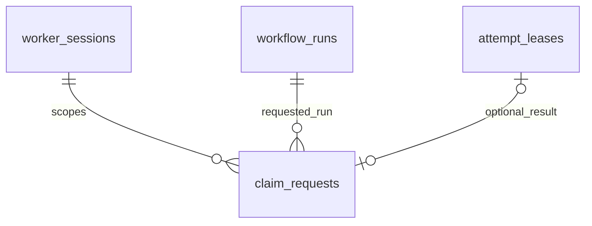

# Durable claim request bindings

M2.2d.1a adds schema revision `0007`. This commit stores completed claim decisions
and defines the replay protocol. M2.2d.1b now implements it in
[ClaimRequestRepository](idempotent-claims.md). The older
`ClaimRepository.claim_next()` remains unkeyed; no claim HTTP endpoint exists yet.

## Why a claim needs its own request identity

Suppose a Worker claims Task A, the transaction commits, and the response is lost.
Calling the current unkeyed primitive again can claim Task B. Capacity checks do
not tell the Worker whether its first request succeeded. A durable binding lets
the next keyed repository recognize the original allocation without allocating
again. It does not deduplicate handler side effects or guarantee exactly-once
execution.

The caller generates a UUID request ID **before** each new poll and retain it
across network retries. The identity is `(worker_session_id, request_id)`; the
input bound to that identity is `run_id`. A different Run under the same identity
is a conflict. Different sessions can reuse the same request UUID. A process
restart creates a new Worker session and cannot inherit old execution ownership.
UUIDs identify requests; they are not authentication credentials.

## Stored decisions



| Column | Contract |
| --- | --- |
| worker_session_id | UUID, first part of the primary key; references a retained Worker session. |
| request_id | UUID, second part of the primary key. |
| run_id | Required UUID referencing the requested Run; immutable input. |
| attempt_id | Nullable UUID: one allocated Attempt, or NULL for a completed no-work decision. |
| created_at | Required finite timestamptz supplied explicitly by the transaction; audit time, not a lease deadline. |

There are no server defaults. Omitting attempt_id stores the same no-work decision
as explicit NULL. Multiple no-work requests are allowed; non-null attempt_id is
unique across bindings, so one Attempt cannot be assigned to two request IDs.
Existing unkeyed Attempts and leases remain valid without a binding.

A composite foreign key `(attempt_id, worker_session_id)` references the exact
lease owner. PostgreSQL requires an additional unique key on that pair in
`attempt_leases`, even though attempt_id is already a primary key. The redundant
index costs writes/storage but makes incorrect owner bindings a database error.
The separate Worker foreign key still applies when attempt_id is NULL. All three
foreign keys are immediate and use ON DELETE RESTRICT.

A statement trigger rejects UPDATE, DELETE and TRUNCATE, including no-op updates
and empty predicates. No-work cannot be changed into a grant. Request IDs, inputs,
results and audit times cannot be overwritten. INSERT ... ON CONFLICT DO UPDATE
is therefore unsuitable. The keyed path serializes first and inserts
one final row. There is no IN_PROGRESS row, expiration field, TTL or purge path.

Run membership (`Attempt -> Task -> Run`), execution status, clock freshness and
capacity remain ordered-transaction checks. The schema verifies parent existence
and lease ownership, but can store a structurally valid binding with a different
existing Run or a terminal Attempt. Such a raw SQL row is not execution authority.
Tests record this boundary explicitly. No cross-row trigger is added to acquire
locks in reverse order. Table owners can bypass guards; they are integrity checks,
not protection against database administrators.

## Transaction and replay protocol — M2.2d.1b

The [keyed repository](idempotent-claims.md) implements this protocol with
concurrency/failure tests:

1. Validate UUID inputs and the fresh PostgreSQL READ COMMITTED transaction.
2. Take a transaction-scoped advisory lock derived from the full session/request
   identity, before any Run or Worker row lock. Use a documented, stable hash and
   a separate namespace from migration/other locks. Hash collisions may serialize
   unrelated requests; the full primary key, never the hash, determines identity.
3. Look up the immutable binding in a statement after acquiring that lock. A
   different run_id is a conflict, even if the original ownership has expired.
4. On a miss, use the existing `Run -> Worker -> Task -> Attempt/lease` order to
   authorize and allocate, or decide no-work. Insert the complete binding in that
   same transaction, after its referenced rows exist. Only successful COMMIT
   makes either the allocation or the binding usable.
5. On a hit, never allocate another Attempt. A no-work binding stays no-work,
   including when capacity or READY tasks have since appeared. A subsequent new
   poll uses a new request ID.
6. A bound Attempt requires re-reading its current Run, Worker, Task, Attempt and
   lease under their established lock order, validating Run membership and owner,
   then sampling the database clock. A still-valid RUNNING ownership may be
   returned. Expired or terminal ownership returns an unavailable/stale outcome;
   it must not become a new allocation or be resurrected.

Grant replay preserves allocation identity, not byte-for-byte response equality.
The lease snapshot may reflect an independently committed renewal. Replay itself
must not extend a deadline; renewal remains a separate operation. A server lease
duration change affects new claims, not stored request identity or replayed leases.
The immutable task definition comes from the Run's pinned workflow version.

Like renewal, replay of existing live ownership must distinguish Worker liveness
from lease validity. Expired heartbeats and LOST status prohibit **new** claims;
they do not revoke an existing valid lease. STOPPED owners and terminal execution
are rejected. A no-work receipt grants nothing and can be replayed without
reactivating a Worker. A delayed response can already be expired when received;
the eventual Worker execution loop must honor ownership/renewal rules.

The request lock is outermost and transaction-scoped. Callers must not acquire it
while already holding Run/Worker/Task locks, combine unrelated requests in one
transaction, or run handlers inside the transaction. Completion, renewal and
recovery need not acquire request locks because bindings never change. They must
continue to observe the shared Run/Worker/Task/Attempt/lease order.

If the claimant aborts, its allocation and binding roll back together and its
advisory lock is released. A waiting duplicate can then make a fresh decision.
If COMMIT succeeds but the response is lost, a retry finds the retained binding.
Admission errors and SQL/lock/commit failures do not create success/no-work rows;
the caller rolls back. No retry loop or network delivery guarantee is provided.

## Migration, retention and rollback

Upgrade `0006 -> 0007` adds an empty binding table, its guards and indexes, plus
the composite unique lease key. All existing data is preserved. The migration
does not invent request IDs for old claims. Building the extra unique index can
block writes; apply migrations during a controlled window as storage grows.

Downgrade `0007 -> 0006` destroys claim deduplication history, including no-work
decisions, while preserving Attempts, tokens, deadlines and older data. It drops
the new table/function and composite unique constraint. Re-upgrade recreates an
empty table, not lost bindings. Retrying old request IDs after such a downgrade
would be unsafe once keyed claims exist. Downgrade is not failure recovery.

Retention is currently indefinite. Each new keyed empty poll also consumes a row. Measure poll volume before adding a bounded retention
contract: deleting old bindings would allow old requests to allocate again. The
primary key supports scoped lookup; an index on run_id supports per-Run history.
Neither index implements a scheduler or promises throughput.

## Local verification

After initializing development secrets/ports and starting Docker:

```powershell
docker compose up --build --wait --wait-timeout 120
docker compose exec api alembic upgrade head
docker compose exec api alembic current
docker compose exec api alembic check
```

Expect `0007 (head)` and `No new upgrade operations detected.` Existing API
examples still work. Startup does not automatically migrate the database.

```console
uv run --locked pytest tests/integration/test_claim_request_schema.py --database-env-file .env.database-test
```

Tests use private schemas in a dedicated PostgreSQL database. They cover grants
and no-work, required fields, finite times, exact owner foreign keys, scoped
request uniqueness, Attempt uniqueness, mutation/history guards, uncommitted
visibility, waiting duplicates after commit/rollback, metadata comparison, and a
populated `0006 -> 0007 -> 0006 -> 0007` round trip. M2.2d.1b adds repository replay tests; HTTP
tests follow with the endpoint. See [migrations](migrations.md) for configuration.
