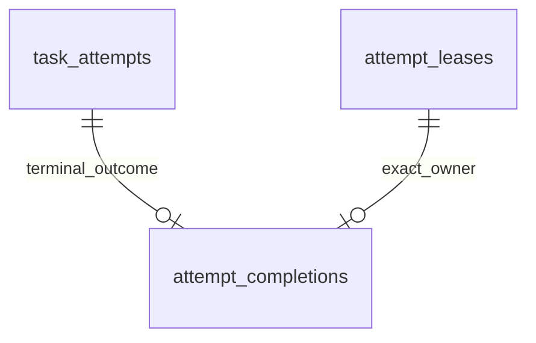

# Completion receipt storage

M2.3b adds revision `0008` and the `attempt_completions` table. It persists the
shape defined by the [completion contract](attempt-completion.md). It does not
implement an application completion transaction, HTTP endpoint or execution loop.
Existing APIs continue to register, claim and renew; they do not insert receipts.

## Stored identity and result



| Column | Constraint |
| --- | --- |
| attempt_id | UUID primary key; at most one completion per Attempt. |
| worker_session_id | Required UUID bound to the stored lease owner. |
| lease_token | Required UUID bound to that exact Attempt/session lease. |
| outcome | Required, case-sensitive SUCCEEDED or FAILED. |
| error_code | NULL for success; required for failure, using the domain Identifier format and 64-character limit. |
| accepted_at | Required finite timestamptz, explicitly supplied by the future transaction. |

There are no server defaults, generated request IDs, replacement rows or TTLs.
The error-code check explicitly tests IS NOT NULL for failure because a SQL CHECK
also accepts an unknown/null expression. UUID text spellings normalize to the same
PostgreSQL UUID. Timestamp offsets normalize to the same instant. The C collation
keeps outcome and error-code comparisons case-sensitive. No output payload is stored.

The receipt retains an Attempt reference rather than copying task_id and
attempt_number. Existing immutable Attempt identity and terminal-state guards,
together with the outcome reference below, allow reconstruction of its historical
TaskAttempt snapshot. Run/Task states queried later are current states and must not
be represented as original completion receipt fields.

Tokens are internal ownership data. Do not log receipt rows or return them directly
as an HTTP response. This schema does not add authentication or database encryption.

## Foreign keys and commit consistency

The immediate composite foreign key
`(attempt_id, worker_session_id, lease_token) -> attempt_leases` uses ON DELETE
RESTRICT. Existence of an unrelated valid session or token cannot satisfy it. The
lease's own references retain the corresponding Attempt and Worker. An unleased
historical Attempt cannot receive a valid receipt through this schema.

The second composite foreign key is
`(attempt_id, outcome) -> task_attempts(id, status)`, using ON DELETE NO ACTION,
DEFERRABLE INITIALLY DEFERRED. The receipt may be inserted before or after the
Attempt's RUNNING-to-SUCCEEDED/FAILED transition in the same transaction. At COMMIT,
the terminal status must match. A mismatched transaction fails and rolls back both
the receipt and any state changes. Existing terminal history cannot be changed
to accommodate a new conflicting report.

Two supporting non-deferrable unique constraints provide PostgreSQL reference keys:
`uq_task_attempts_id_status` and `uq_attempt_leases_owner_token`. Existing Attempt
primary keys already guarantee their uniqueness, including on populated databases.
The extra indexes consume space and add write cost; the status key also participates
in foreign-key locking on Attempt status changes. Completion writers must use the
established ordered transaction protocol. These constraints do not remove the need
to lock and re-read state, and arbitrary SQL writers can still create lock conflicts.

No cross-table custom trigger queries parents in a different lock order. The
future repository will acquire Run -> stored Worker -> Task -> Attempt -> lease,
then inspect any receipt before applying first-acceptance rules. A primary-key
conflict alone is not successful replay: the repository must compare the retained
owner and result. Concurrent raw inserts wait for the competing transaction; its
COMMIT yields a duplicate-key error, while its rollback permits insertion.

## Retention and authorization boundary

A statement-level trigger rejects UPDATE, DELETE and TRUNCATE, including empty
predicates, no-op changes and empty tables. ON CONFLICT DO UPDATE is unsuitable.
Keep the original completion when retrying an uncertain response; do not replace
the result or refresh accepted_at. There is no supported receipt deletion path.

The database verifies identity, terminal outcome, local result shape and finite
time. It **does not authorize execution completion**: finite accepted_at can be
outside the lease window, a Worker can be STOPPED, and Task/Run can remain RUNNING
or disagree with a receipt after raw SQL. Tests explicitly demonstrate this limit.
The later repository must validate current state and post-lock time, then update
Task outcome and receipt atomically with the Attempt. No capacity counter is added;
capacity remains derived from RUNNING Attempts.

The schema permits terminal Attempts without receipts. They may be historical
records or engine-generated LOST/TIMED_OUT outcomes. Conversely, all committed
receipts must reference SUCCEEDED/FAILED Attempts. No migration fabricates which
report an old terminal row accepted. Table-owner trigger/constraint bypasses are
outside the supported writer protocol.

## Upgrade and rollback

Upgrade creates the supporting keys and an empty receipt table without modifying
existing workflows, versions, runs, tasks, attempts, Worker sessions, leases or
request bindings. Creating the indexes/constraints takes locks on existing tables;
use a maintenance window for a large live deployment. This revision does not claim
an online, zero-downtime migration.

Downgrade `0008 -> 0007` deletes completion receipts and removes only the newly added
keys/trigger function. It preserves prior execution metadata. A re-upgrade recreates
an empty table; it cannot restore completion confirmations. Back up receipt history
before a deliberate rollback. Tests exercise this destructive path only in isolated
test schemas, never in the development database.

For the configured development Compose project:

```console
docker compose exec -T api alembic upgrade head
docker compose exec -T api alembic current
docker compose exec -T api alembic check
```

Rebuild the API image first if it still contains revision `0007`. Expect `0008
(head)` and no new upgrade operations. See [migration instructions](migrations.md)
for host-based commands and database configuration.

## Verification and next step

```console
uv run --locked pytest tests/integration/test_completion_schema.py --database-env-file .env.database-test
```

Tests cover both write orders, real deferred COMMIT failure/rollback, strict result
and time constraints, full ownership references, statement-level retention,
concurrent duplicate insert commit/rollback, authorization limits, and populated
upgrade/downgrade/re-upgrade. Migration discovery, offline SQL, complete-chain
rollback and metadata comparison remain part of the existing test suite. CI checks
the packaged `0008` head inside the runtime image.

After owner commit/push and three passing CI jobs, M2.3c will implement the atomic
completion/replay repository. HTTP and handler execution remain subsequent commits.
