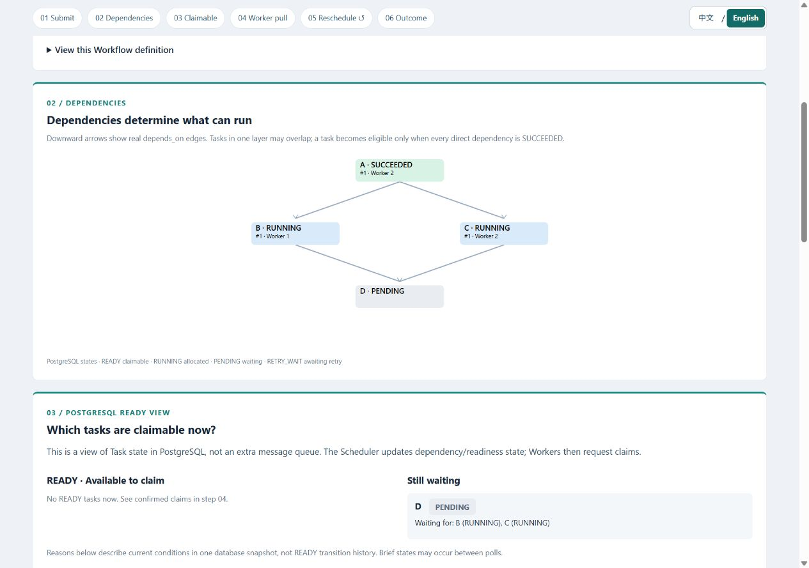
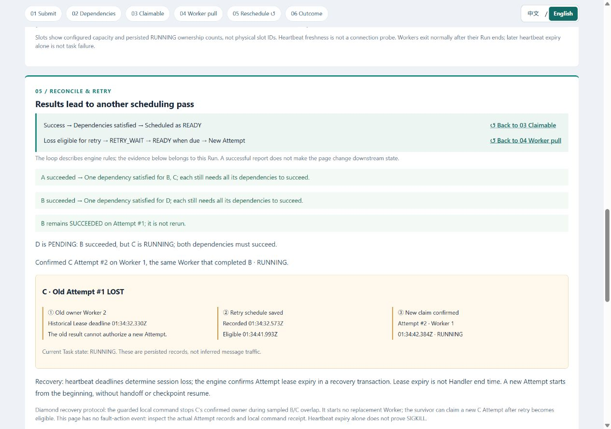

[English](demo.md) | [简体中文](demo.zh-CN.md)

# Local demonstration

The current scenarios use `A → B/C → D`. All three passed real execution and
bilingual browser acceptance; see the dated [diamond review](diamond-review.md).

## Start and open the page

Requires Docker Desktop running Linux containers, Python 3.13 and uv. Run from the
repository root. This is one machine with several independent containers, not a
multi-machine deployment test. Development Compose and existing data are untouched.

```powershell
uv sync --locked
uv run python scripts/demo.py up
```

This builds the image, creates an ignored password only if missing, starts the
dedicated PostgreSQL database, applies additive migrations and starts API/Scheduler.
The default address is `http://127.0.0.1:18080/demo/`.
Existing installations use the same `up` command to rebuild the latest page, then
refresh the browser. Documentation and page-text changes do not require resetting
the database. Keep Docker Desktop running while viewing/running scenarios.
If needed set `$env:DWE_DEMO_PORT = "18081"` before **all** demo commands; the
printed address reflects it. The database port is not exposed to the host.

## Choose the page language

Use **中文 / English** in the sticky flow navigation. The first visit follows the
browser's primary language (Chinese -> Simplified Chinese; otherwise English).
A manual choice is saved locally and wins on later visits. If local storage is
unavailable, switching still works for the current page. Switching does not create
or restart a Run, change its selection or make extra engine requests. Expanded
details remain open; the page preserves the current section's position where text
reflow permits. IDs, raw task names, protocol states, JSON and clock semantics do
not change. This is display translation, not translation of API data.

## Run individual scenarios

```powershell
uv run python scripts/demo.py run parallel
uv run python scripts/demo.py run distribution
uv run python scripts/demo.py run recovery
```

Each command creates a fresh Run and prints its ID and page address. Run scenarios
one at a time for a clear demonstration. Parallel uses one Worker with two slots;
distribution and recovery use two separate one-slot Worker containers. Each new
DAG starts A (6 seconds), then B (8 seconds) and C (14 seconds), then D (3 seconds)
after both branches succeed. Recovery uses C=20 seconds. These are trusted timed
Handlers; actual sampled lifetimes include observation overhead.

The two-Worker scenarios use a 60-second startup wait budget: both scoped sessions
must be registered, ACTIVE and heartbeat-fresh by database time. Workers heartbeat
while waiting and fail closed on expiry or timeout. Bounded I/O may delay timeout
reporting. `run` waits for registration readiness, not branch START; this does not
assign B/C to predetermined Workers or guarantee peers remain alive.

Immediately after starting recovery, copy its Run ID into this local command:

```powershell
uv run python scripts/demo.py fail --run-id "RECOVERY_RUN_ID"
```

Replace `RECOVERY_RUN_ID` with the printed UUID. Execute `fail` immediately after
`run` returns. Within a 60-second wait budget, it requires A success, D unclaimed,
and at least one second of actual B/C START/PULSE overlap on different Workers.
It resolves **C Attempt #1's actual owner**, rechecks the scoped container's
immutable ID and fresh evidence, then sends one SIGKILL. Missing START keeps it
waiting only while startup remains valid; a late, completed, stale or mismatched
target is refused. No arbitrary container or fixed Worker A is selected.

Six-second Lease/heartbeat windows and a persisted 5–10 second jittered backoff
expose recovery. B's surviving Worker finishes B, retains that success, and pulls
C Attempt #2 after the engine makes it eligible. **No replacement Worker starts.**
C executes from the beginning; D waits for both successful branches. The old
Attempt is LOST and has no observed FINISH. If the safe window was missed, create
a fresh recovery Run. Never automatically repeat an uncertain fault command;
retained fault files block duplicate injection. The UI never controls Docker or
accepts shell commands over HTTP. [Fault guard details](demo-design.md#scoped-fault-command).

## Custom DAG editor

Open **Custom DAG — validate, preview and create** at
`http://127.0.0.1:18080/demo/`. Load a template copy or paste Workflow JSON, then
choose **Validate and preview**. No Run is created by either action. Any edit
invalidates the preview. Inspect its real edges and canonical JSON, then choose
**Confirm and create Run**. The page selects the returned Run and shows its actual
six-step snapshot. Without Workers, roots are READY and dependent tasks wait.

Only the catalog's trusted timed Handlers are accepted: 1–12 tasks, 16 KiB UTF-8
body, at most two Attempts per task, 90s timeout and fixed 5–10s retry backoff.
Names follow the core ASCII identifier rules. These are demo-entry limits; naming
a node does not implement business processing and dependencies do not pass outputs.
A copied diamond becomes a custom Run with two one-slot Workers; predefined
scenario launch behavior and fault injection do not carry over.

If creation loses its response, use **Resolve with the same key and body**. The
editor retains the frozen operation, disables edits, and never sends an automatic
retry. A reload restores available local recovery data without POSTing. When local
storage fails, copy the displayed key/body before leaving the page. Language changes
preserve the draft, preview and selected Run. [API and error contracts](demo-api.md#custom-submission).

## Workers for an existing custom Run

The editor or [custom API](demo-api.md#custom-submission) creates a constrained
Run separately from execution. After receiving its real `run_id`, start Workers
explicitly from the repository root:

```powershell
uv run python scripts/demo.py workers --run-id "CUSTOM_RUN_ID"
```

Replace `CUSTOM_RUN_ID` with the returned UUID. Use `--port 18081` **before**
`workers` if the API uses that port. This command creates no Run. It validates the
saved custom definition, requires no Worker/Attempt history or existing expected
containers, then starts two dedicated one-slot Workers with the same readiness
gate as distribution. They pull from the specified Run without preset task owners.
Before this command, roots remain READY waiting for execution resources.

The runtime rechecks custom names, one-slot capacity, fresh registration, definition
limits and membership. A short lock on the demo membership row serializes admission
of at most two distinct sessions; no core lock/lease/claim contract changes. Repeated
or partial startup is refused. Already started containers and all evidence remain;
inspect that Run and container logs instead of blindly retrying. To repeat a demo,
explicitly create a new Run. This is a local resource bound, not autoscaling or
tenant isolation. `fail` remains exclusive to the predefined recovery scenario,
even if a custom definition copies the recovery diamond.

## Stop and keep the evidence

```powershell
uv run python scripts/demo.py down
```

`down` stops only labelled demo Workers and the dedicated demo services. It retains
containers, volume, password and all Run/evidence history. `up` resumes the services;
new scenario commands use new identities. Do not delete the password while keeping
the database volume. Commands never truncate, downgrade, reset, remove volumes or
operate on development Workers. A failed scenario-creation POST is not retried
automatically: inspect `http://127.0.0.1:18080/demo/runs` for any created Run.

Evidence semantics and acceptance boundaries: [demo design](demo-design.md).

## Repeatable evidence checks

After `up`, keep the page open with **Follow newest Run** enabled:

```powershell
uv run python -m scripts.demo_acceptance
```

This creates three real Runs, verifies at least one second of specifically B/C
measured overlap in a common clock domain, checks scenario-specific slots/owners,
and injects a scoped recovery failure. Final SUCCEEDED alone cannot pass.
In ignored `.uv-cache/demo-acceptance/`, it retains raw `root`, `branches` and
`join_wait` checkpoints as `RUN_ID-CHECKPOINT.json`; recovery also requires `retry`, `RUN_ID-fault-before.json`
and the acknowledged local command receipt `RUN_ID-fault.json`. The final snapshot
is `RUN_ID.json`. Missing evidence fails validation rather than inventing a state.

Checks include unchanged Run/version/Task/Attempt identities and sample prefixes,
one successful A/B/D Attempt, dependency admission/claim ordering, D remaining
unclaimed while C waits, and one actual invocation per Attempt. Recovery requires
C #1 LOST without FINISH/admission, persisted backoff, and C #2 succeeding on B's
existing Worker after B finishes; B is never retried. Successful observed durations
must cover their trusted waits. [Full evidence checks](demo-design.md#acceptance-evidence).
For one scenario use `--scenario recovery`; for a different port use `--port 18081`.
This script checks engine evidence; browser inspection remains a separate gate.
Pure timeline calculations can be tested with Node.js 22+:
`node --test tests/demo-evidence.test.mjs tests/demo-i18n.test.mjs tests/demo-page.test.mjs tests/demo-dag.test.mjs tests/demo-composer.test.mjs`. Node.js is not needed to run the demo.

## Three-minute walkthrough

Before starting the timer, run `up` and open `http://127.0.0.1:18080/demo/`.
First-time image downloads/builds are setup time. Keep **跟随最新 Run / Follow newest
Run** checked. Scroll down through the numbered sections or use the sticky links;
use the loop links in step 05 to revisit 03/04. No network traffic animation is shown.

| Time | Action and what to explain |
| --- | --- |
| 0:00 | Execute `uv run python -m scripts.demo_acceptance`. In 01, identify the Run, scenario and real published definition. Tasks are explicitly timed demo Handlers, not a sales report. |
| 0:05 | In 02, follow A down to B/C, then D. During A execution, B/C wait for A; D waits for both branches. In 03, read the actual PostgreSQL READY/PENDING state and named blockers, not an extra queue. |
| 0:10 | After A succeeds, B/C run in one Worker's two slots. In 06, their sampled intervals overlap; RUNNING alone does not prove execution. Claim, Handler receipt and Lease renewal remain separate. |
| 0:20 | B succeeds before C. D is still PENDING with no Attempt. In 05, explain that both dependencies must succeed before a scheduling transaction makes D READY; use the loop link back to 03/04. |
| 0:30 | Distribution starts. Compare two container/session IDs and the actual B/C owners in 04. Both Workers pull from the same Run; the script did not assign either branch to a specific Worker. |
| 0:45 | Watch the same root, parallel branches and join across two Workers. Identify A completion, B/C sampled overlap, B success while D waits, then D's later claim. |
| 1:00 | Recovery starts with two Workers. The local command waits for B/C overlap, resolves C's owner and confirms one scoped SIGKILL. In 04, that Worker's heartbeat/renewal stops; B's Worker continues. |
| 1:15 | In 05, read C #1 LOST, retained retry scheduling and RETRY_WAIT. D remains unclaimed. Registry loss and Attempt loss can appear in different snapshots; Lease expiry is not an observed Handler finish. |
| 1:30 | B succeeds once. Its existing Worker pulls C #2 after backoff, then runs C from the beginning. No replacement is started and no interrupted work is resumed. |
| 2:00 | After C #2 succeeds, D runs and the Run succeeds. In 06, compare both C intervals and the gap, actual owners, and claim/observation/admission times. Old C has no FINISH or accepted completion. |
| 2:30 | Explain at-least-once/business idempotency and the single-machine boundary. Normal Worker exit after success later expires its heartbeat; that alone is not a task failure. Open raw JSON or select a previous Run. |

Timings are approximate, not a recovery SLA. Individual `run` and `fail` commands
above give manual control. A pinned `?run=...` page stops following new Runs; use
the selector or re-enable **Follow newest Run**. API requests and snapshot schemas
are described in [demo API](demo-api.md); interactive OpenAPI is at
`http://127.0.0.1:18080/docs`.

Workers exit normally when their selected Run finishes. Their registry heartbeat
later expires to LOST even on a successful Run; this alone is not evidence of a
failed Task. The recovery evidence is the old LOST **Attempt**, retained retry
schedule, explicit fault command and new Attempt. Browser disconnection
freezes the last view and displays a stale-data warning.

## Actual captures

Unmodified browser captures of real diamond Runs from a requested 1280 × 900
viewport, taken on 2026-09-09
(Australia/Sydney; database timestamps are UTC). The
[acceptance record](diamond-review.md#browser-captures) identifies every Run and
capture. Language pairs were taken sequentially while execution continued.

Distribution in progress: A succeeded, B/C have distinct actual owners, and D
remains PENDING. The retained samples separately establish execution overlap:



Recovery after retry admission: B remains successful on Attempt #1; C #2 is already
RUNNING on that same Worker and D still waits. This image is after RETRY_WAIT;
the [earlier wait capture](images/diamond-recovery-workers-en.jpg) shows that state:



Also see [one Worker's final overlap](images/diamond-parallel-en.jpg),
[two Workers' final timeline](images/diamond-distribution-timeline-en.jpg) and
[final recovery](images/diamond-recovery-en.jpg).

[Earlier bilingual captures](release-review.md#browser-captures), the
[original demo review](demo-review.md) and [six-step flow review](demo-flow-review.md)
retain every historical image and Run identity. Those runs used parallel roots
feeding Join or root-A recovery with a script-started replacement; they are not
evidence for the current diamond. Selecting an old Run still renders its saved
definition. No history or screenshot state is rewritten or replayed into new Runs.

## Read the evidence accurately

`acquired_at` is database time for confirmed allocation. Handler START/PULSE/FINISH
are actual samples inside the trusted callable; their `recorded_at` is database
receipt time. Completion `accepted_at` is a database post-lock admission timestamp,
not exact Handler return or COMMIT time. `created_at` is only creation metadata.

Execution overlap is calculated from monotonic samples in matching clock domains
(Linux boot ID and frozen monotonic offset). Database timestamps remain UTC.
An old interval without FINISH stops at its last sample; lease expiry does not
fill in the missing end. Overlapping timed Handler lifetimes include waits and do
not establish CPU throughput, multi-machine deployment or exactly-once execution.
The engine's at-least-once execution still requires cooperating business idempotency.

The page polls real snapshots with a 500 ms delay between completed fetch cycles;
network/database time adds latency. It can miss brief transitions. Retained Attempt
and retry records remain evidence, but no complete request/event trace is claimed.
See [design and clock contracts](demo-design.md) and [API fields](demo-api.md).
