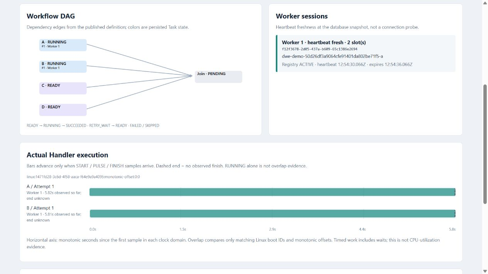
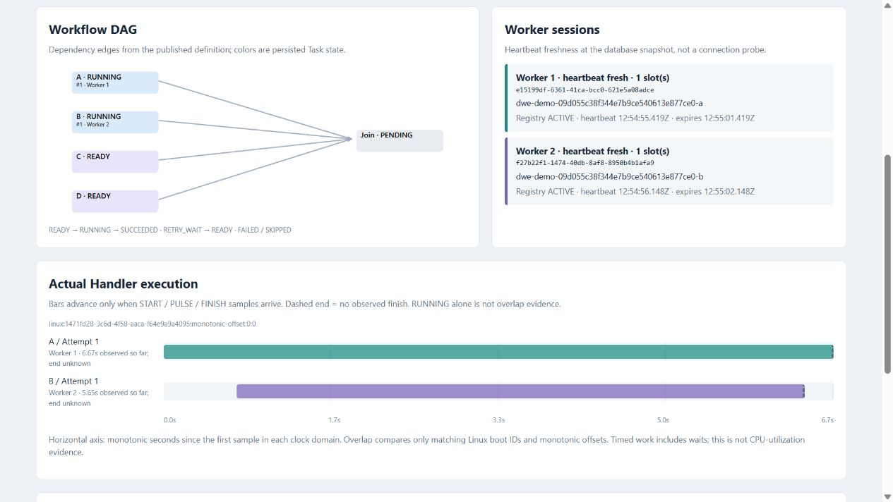
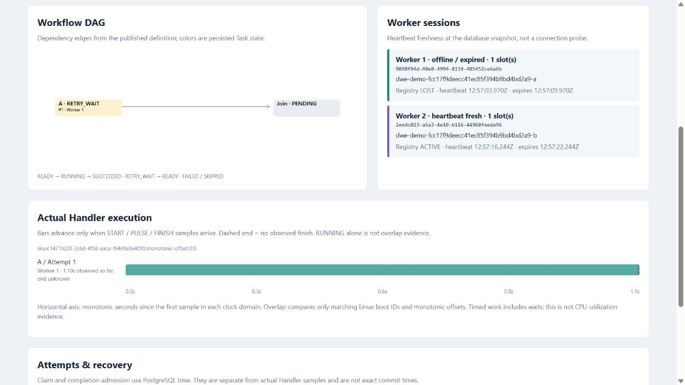
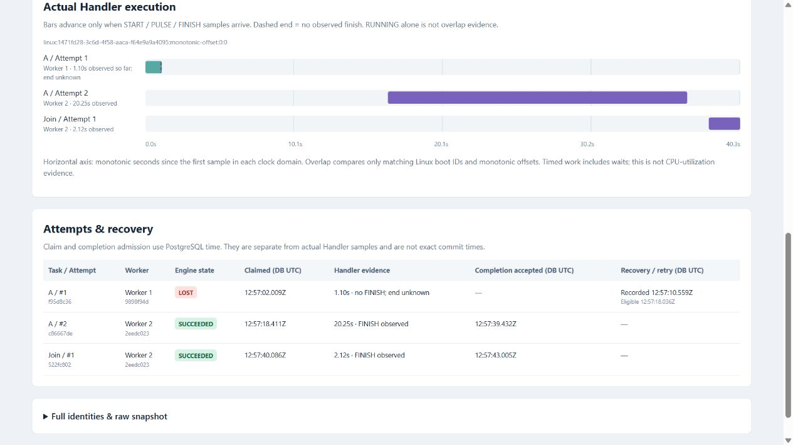

# Local demonstration

Requires Docker Desktop running Linux containers, Python 3.13 and uv. Run from the
repository root. This is one machine with several independent containers, not a
multi-machine deployment test. Development Compose and existing data are untouched.

```powershell
uv sync --locked
uv run python scripts/demo.py up
```

This builds the image, creates an ignored password only if missing, starts the
dedicated PostgreSQL database, applies additive migrations and starts API/Scheduler.
The default address is `http://127.0.0.1:18080/demo/`.
If needed set `$env:DWE_DEMO_PORT = "18081"` before **all** demo commands; the
printed address reflects it. The database port is not exposed to the host.

```powershell
uv run python scripts/demo.py run parallel
uv run python scripts/demo.py run distribution
uv run python scripts/demo.py run recovery
```

Each command creates a fresh Run and prints its ID and page address. Run scenarios
one at a time for a clear demonstration. Parallel uses one Worker with two slots;
distribution uses two separate one-slot Worker containers. Each root takes about
eight seconds, followed by a two-second join. Recovery uses a twenty-second root.

Immediately after starting recovery, copy its Run ID into this local command:

```powershell
uv run python scripts/demo.py fail --run-id <RECOVERY_RUN_ID>
```

It waits for actual root Handler START evidence, verifies container identity and
scope, sends SIGKILL to that container and starts replacement Worker B. If the root
already finished, create a fresh recovery Run. Six-second lease/heartbeat windows
and a persisted 5–10 second jittered backoff expose recovery. The old Attempt is
LOST; its actual finish is unknown. The retry has a new Attempt and Worker identity.
The UI never controls Docker and never accepts shell commands over HTTP.

```powershell
uv run python scripts/demo.py down
```

`down` stops only labelled demo Workers and the dedicated demo services. It retains
containers, volume, password and all Run/evidence history. `up` resumes the services;
new scenario commands use new identities. Do not delete the password while keeping
the database volume. Commands never truncate, downgrade, reset, remove volumes or
operate on development Workers. A failed scenario-creation POST is not retried
automatically: inspect `http://127.0.0.1:18080/demo/runs` for any created Run.

Evidence semantics and acceptance boundaries: [demo plan](demo-plan.md).

## Repeatable evidence checks

After `up`, keep the page open with **Follow newest Run** enabled:

```powershell
uv run python -m scripts.demo_acceptance
```

This creates three real Runs, checks positive measured overlap in a common clock
domain, verifies two Worker owners, and injects a scoped recovery failure. It must
observe RETRY_WAIT before accepting recovery success. It retains raw snapshots
(including the retry checkpoint) in ignored `.uv-cache/demo-acceptance/`.
For one scenario use `--scenario recovery`; for a different port use `--port 18081`.
This script checks engine evidence; browser inspection remains a separate gate.
Pure timeline calculations can be tested with Node.js 22+:
`node --test tests/demo-evidence.test.mjs`. Node.js is not needed to run the demo.

## Three-minute walkthrough

Before starting the timer, run `up` and open `http://127.0.0.1:18080/demo/`.
First-time image downloads/builds are setup time. Keep **Follow newest Run** checked
and scroll between the Run header, DAG/Workers and execution timeline.

| Time | Action and expected evidence |
| --- | --- |
| 0:00 | Run `uv run python -m scripts.demo_acceptance`. A new parallel Run appears automatically. A/B start while C/D remain READY and Join remains PENDING. |
| 0:10 | Point to overlapping sampled A/B bars and peak overlap 2. One Worker ID has two slots. The bars grow only on actual Handler samples. |
| 0:30 | Distribution starts automatically. Two Worker IDs and two colors now own tasks in one DAG. Their actual execution intervals overlap; four roots feed Join. |
| 1:00 | Recovery starts. The script waits for actual execution samples, kills only that demo Worker, and starts B. Heartbeat/lease expiry is not instantaneous. |
| 1:10 | A becomes RETRY_WAIT; Worker 1 is LOST. Its dashed bar stops at the last observed sample, with no claimed finish. Retry eligibility comes from the persisted backoff. |
| 1:30 | Attempt 2 is executed by Worker 2. It has a new identity and a separate bar after the gap. Join runs only after A succeeds. |
| 2:00 | Open the Attempt table: old LOST, no completion receipt, retry timestamps, new SUCCEEDED with an accepted completion. The final Run is SUCCEEDED. |
| 2:30 | Explain at-least-once execution, business idempotency, and the single-machine boundary. Expand full identities or open the real JSON snapshot. |

Timings are approximate, not a recovery SLA. Individual `run` and `fail` commands
above give manual control. A pinned `?run=...` page stops following new Runs; use
the selector or re-enable **Follow newest Run**. API requests and snapshot schemas
are described in [demo API](demo-api.md); interactive OpenAPI is at
`http://127.0.0.1:18080/docs`.

Workers exit normally when their selected Run finishes. Their registry heartbeat
later expires to LOST even on a successful Run; this alone is not evidence of a
failed Task. The recovery evidence is the old LOST **Attempt**, retained retry
schedule, explicit fault command and replacement Attempt. Browser disconnection
freezes the last view and displays a stale-data warning.

## Actual captures

These unmodified browser captures were taken on 2026-09-08, with Run IDs and measured
results recorded in [demonstration review](demo-review.md). Your new Runs get new IDs.

Parallel execution in two slots of one Worker:



Two independent Worker containers:



After the deliberate Worker crash, while the Task waits for its retry:



The completed replacement retains the original abandoned execution:


