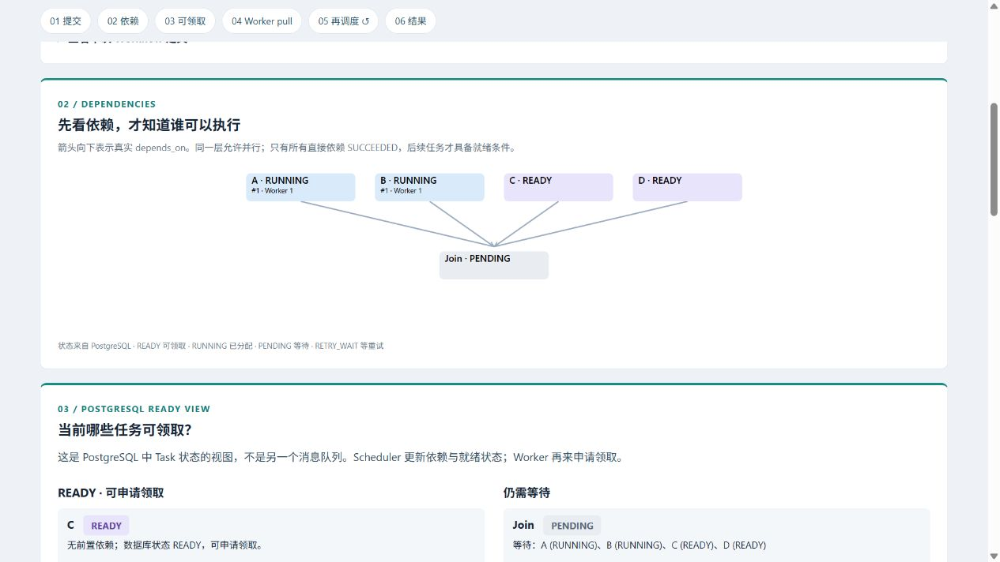
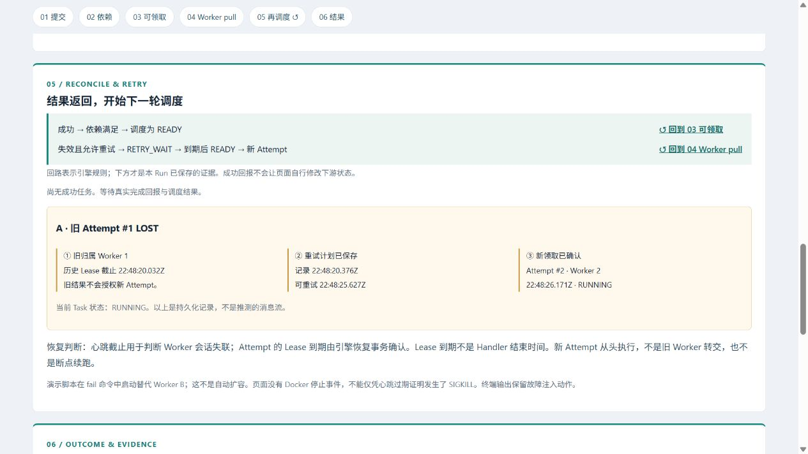

[English](demo.md) | [简体中文](demo.zh-CN.md)

# 本地演示指南

## 启动并打开页面

需要运行 Linux 容器的 Docker Desktop、Python 3.13 和 uv。所有命令均在仓库根目录执行。
这是单台机器上多个独立容器的演示，并非多机部署验证。演示环境与开发用 Compose
及其已有数据分开。

```powershell
uv sync --locked
uv run python scripts/demo.py up
```

命令构建镜像，仅在演示密码文件不存在时创建该忽略文件，启动专用 PostgreSQL，
应用增量迁移，再启动 API 和 Scheduler。默认页面地址为
`http://127.0.0.1:18080/demo/`。
已有安装同样执行 `up`，重建最新页面后刷新浏览器。文档和页面文案修改无需重置数据库。
运行或观看场景时保持 Docker Desktop 开启。
如需其他端口，在**所有**演示命令之前设置 `$env:DWE_DEMO_PORT = "18081"`；
命令输出的地址会反映该端口。演示数据库不向宿主机公开端口。

## 选择页面语言

使用固定流程导航中的 **中文 / English**。首次访问按浏览器首选语言选择：中文使用简体中文，
其他语言回退英文。手动选择会在本地保存，后续访问优先使用该选择；本地存储不可用时，
当前页面仍可切换。切换不会创建或重启 Run、改变当前选择，也不会额外请求引擎。
已展开的详情保持展开；文字换行允许时，页面保留当前阅读区域的位置。
ID、任务原始名称、协议状态、JSON 和时钟含义均不改变。这是界面翻译，不是 API 数据翻译。

## 单独运行场景

```powershell
uv run python scripts/demo.py run parallel
uv run python scripts/demo.py run distribution
uv run python scripts/demo.py run recovery
```

每条命令创建一个新的 Run，并输出 ID 和页面地址。为便于观察，请一次运行一个场景。
parallel 使用一个 Worker 的两个槽位；distribution 使用两个独立的单槽位 Worker 容器。
这两个场景的每个根任务约持续八秒，随后执行约两秒的 Join；recovery 的根任务约持续二十秒。

启动恢复场景后，立即把输出的 Run ID 填入以下本地命令：

```powershell
uv run python scripts/demo.py fail --run-id "RECOVERY_RUN_ID"
```

将 `RECOVERY_RUN_ID` 替换为输出的 UUID。命令等待根 Handler 的真实 START 证据，
验证容器身份和演示范围，向该容器发送 SIGKILL，然后启动替代 Worker B。
如果根任务已经完成，请重新创建恢复 Run。六秒的 Lease/心跳窗口与持久化的
5–10 秒抖动退避便于观察恢复。旧 Attempt 会被判定为 LOST，其实际结束时间未知；
重试使用新的 Attempt 和 Worker 身份。页面不控制 Docker，也不通过 HTTP 接收系统命令。

## 停止并保留证据

```powershell
uv run python scripts/demo.py down
```

`down` 只停止带专用标签的演示 Worker 和演示服务，保留容器、数据卷、密码以及全部
Run/执行证据。`up` 恢复服务；新的场景命令使用新的身份。保留数据库卷时，不要删除密码。
演示命令不会清空数据、降级、重置、删除数据卷或操作开发环境的 Worker。
创建场景的 POST 失败后不会自动重试：先查看
`http://127.0.0.1:18080/demo/runs`，确认是否已经创建了 Run。

证据语义和验收边界见[演示设计（英文）](demo-design.md)。

## 可重复的证据检查

执行 `up` 后，保持页面打开并勾选**跟随最新 Run / Follow newest Run**：

```powershell
uv run python -m scripts.demo_acceptance
```

脚本创建三个真实 Run，检查同一时钟域内的执行区间确有重叠，确认两个 Worker 的执行归属，
并注入一次限定范围的恢复故障。恢复验收必须实际观察到 RETRY_WAIT 才能通过。
原始快照（包括重试检查点）保留在被 Git 忽略的 `.uv-cache/demo-acceptance/` 中。
仅运行一个场景时使用 `--scenario recovery`；改变端口时使用 `--port 18081`。
脚本检查引擎证据，浏览器中的实际观察仍是独立验收步骤。
可用 Node.js 22+ 运行时间线计算测试：
`node --test tests/demo-evidence.test.mjs tests/demo-i18n.test.mjs tests/demo-page.test.mjs`。运行演示本身不需要 Node.js。

## 三分钟演示流程

计时之前先执行 `up`，打开 `http://127.0.0.1:18080/demo/`。
首次下载镜像和构建属于准备时间。保持勾选**跟随最新 Run / Follow newest Run**。
沿编号区域向下浏览，或使用固定导航；第 05 步中的回路链接可以返回 03/04。
页面不展示虚构的网络消息动画。

| 时间 | 操作与讲解要点 |
| --- | --- |
| 0:00 | 执行 `uv run python -m scripts.demo_acceptance`。在 01 确认 Run、场景和实际发布的定义。任务明确使用计时演示 Handler，不是销售报表处理。 |
| 0:05 | 在 02 沿 DAG 向下观察。A/B/C/D 没有依赖，可以重叠；Join 必须等待四者全部成功。在 03 指出真实 READY 记录和 Join 仍在等待的任务。这是 PostgreSQL 状态视图，不是额外消息队列。 |
| 0:10 | 在 04 看到一个 Worker 的两个配置槽位和两个已确认 Attempt。领取、Handler 样本接收和 Lease 续期是不同证据。在 06 观察采样区间重叠，证明 Handler 生命周期并发；单凭 RUNNING 不足以证明。 |
| 0:30 | 分配场景开始。在 04 比较两个容器/会话 ID 和各自实际领取的任务。说明 Worker pull 与事务分配；任务并未预先绑定给指定 Worker。 |
| 0:45 | 在 05 观察成功的根任务满足 Join 的依赖，随后调度使任务 READY，Worker 再次领取。使用链接返回 03/04。依赖满足不等于记录了一个 READY 历史事件。 |
| 1:00 | 恢复场景开始。终端确认限定范围的 SIGKILL 和脚本启动替代 Worker。在 04 观察旧心跳与续期不再推进，期限随后到达。Worker 注册状态失效与 Attempt 失效可能出现在不同快照中。 |
| 1:10 | 在 05 查看旧 Attempt 的 LOST、保存的重试时间和 RETRY_WAIT。期限到达不是 Handler 的实际结束；引擎通过事务确认失效。旧时间线没有 FINISH。 |
| 1:25 | 在 04/05 看到新的 Attempt 编号和执行者。新 Handler 从头执行，旧 Worker 没有主动移交任务。替代 Worker 由脚本启动，不代表自动扩容。 |
| 2:00 | 在 06 查看 Run SUCCEEDED、各 Worker 的执行记录及替代区间之前的空档。在 Attempt 明细中比较领取、执行证据和完成回报被接受的时间。旧 Attempt 没有被接受的完成回报。 |
| 2:30 | 说明 at-least-once、业务幂等和单机演示边界。任务成功后 Worker 正常退出，其心跳稍后仍会过期；这本身不代表任务失败。打开原始 JSON 或选择历史 Run。 |

以上时间仅供讲解安排，并非恢复时延 SLA。也可使用前面的单独 `run` 与 `fail` 命令手动控制。
带 `?run=...` 的固定地址会停止跟随新 Run；可使用选择框，或重新勾选**跟随最新 Run**。
API 请求与快照字段见[演示 API（英文）](demo-api.md)；交互式 OpenAPI 地址为
`http://127.0.0.1:18080/docs`。

Worker 在所选 Run 结束后正常退出。即使 Run 成功，其注册心跳稍后也会过期并变成 LOST；
这单独不能证明任务失败。恢复证据包括旧 **Attempt** 的 LOST、保留的重试计划、明确的
故障命令以及替代 Attempt。浏览器断连时保留最后画面，并显示数据过期警告。

## 真实截图

以下为六步页面的原始浏览器截图，拍摄于 2026-09-09（Australia/Sydney；数据库时间显示为 UTC）。
Run ID 和检查记录见[流程验收（英文）](demo-flow-review.md)。新的运行产生新的身份，
页面不会回放截图中的状态。

依赖关系和当前 PostgreSQL 等待条件：



同一恢复 Run 中的重试回路与已确认的新领取结果：



其他保留截图：[单 Worker 双领取](images/flow-parallel.png)、
[实际执行重叠](images/flow-overlap.png)、[两个 Worker](images/flow-distribution.png)、
[RETRY_WAIT](images/flow-retry.png)、[替代 Worker 执行](images/flow-recovery-workers.png)、
[恢复完成及采样区间](images/flow-recovery-result.png)。

最初阶段 D 的截图与验收仍保留在[历史记录（英文）](demo-review.md)。
这些截图是带日期的运行证据；页面文案可能随后更新。

## 正确理解证据

`acquired_at` 是数据库记录的已确认领取时间。Handler START/PULSE/FINISH 是可信调用体内部
实际取得的样本，`recorded_at` 是数据库接收样本的时间。完成回报的 `accepted_at` 是取得锁后
数据库用于接纳回报的时间，不是 Handler 精确返回时间或 COMMIT 时刻。`created_at` 只是创建元数据。

执行重叠由同一时钟域内的单调时钟样本计算，时钟域包含 Linux 启动 ID 和固定的单调时钟偏移。
数据库时间仍为 UTC。没有 FINISH 的旧区间止于最后样本；Lease 到期不能补出缺失的结束时间。
计时 Handler 的生命周期包含等待，重叠不能证明 CPU 吞吐量、多机部署或 exactly-once 执行。
引擎的 at-least-once 执行仍需要业务系统配合实现幂等。

页面在每轮请求完成后等待 500 毫秒再轮询真实快照，网络与数据库耗时会增加延迟。
短暂状态可能被错过；保留的 Attempt 与重试记录仍可查证，但这不是完整请求或事件追踪。
详见[设计与时钟契约（英文）](demo-design.md)和[API 字段（英文）](demo-api.md)。
