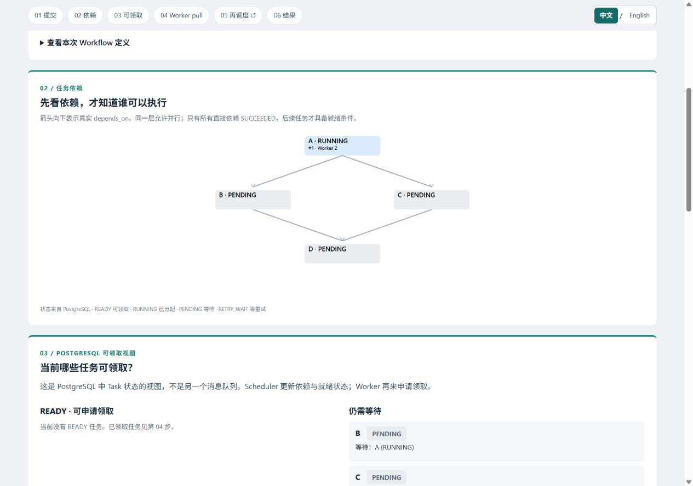
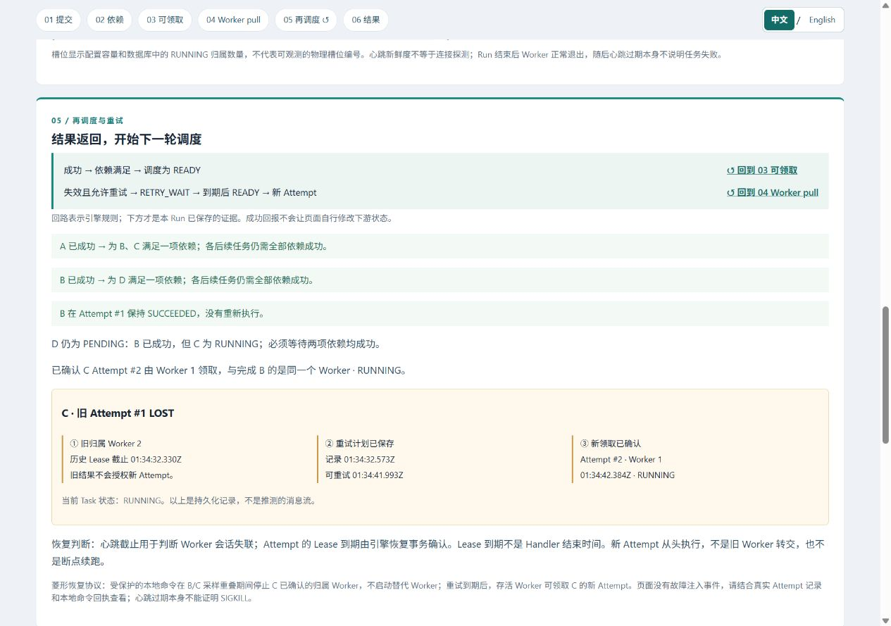

[English](demo.md) | [简体中文](demo.zh-CN.md)

# 本地演示指南

当前场景采用 `A → B/C → D`。三个场景均已通过真实运行与双语浏览器验收，
见注明日期的[菱形场景验收（英文）](diamond-review.md)。

## 启动并打开页面

需要运行 Linux 容器的 Docker Desktop、Python 3.13 和 uv。所有命令均在仓库根目录执行。
这是单台机器上多个独立容器的演示，并非多机部署验证。演示环境与开发用 Compose
及其已有数据分开。

```powershell
uv sync --locked
uv run python scripts/demo.py up
```

命令构建镜像，仅在演示密码文件不存在时创建该忽略文件，启动专用 PostgreSQL，
应用增量迁移，再启动 API 和 Scheduler。默认页面地址为
`http://127.0.0.1:18080/demo/`。
已有安装同样执行 `up`，重建最新页面后刷新浏览器。文档和页面文案修改无需重置数据库。
运行或观看场景时保持 Docker Desktop 开启。
如需其他端口，在**所有**演示命令之前设置 `$env:DWE_DEMO_PORT = "18081"`；
命令输出的地址会反映该端口。演示数据库不向宿主机公开端口。

## 选择页面语言

使用固定流程导航中的 **中文 / English**。首次访问按浏览器首选语言选择：中文使用简体中文，
其他语言回退英文。手动选择会在本地保存，后续访问优先使用该选择；本地存储不可用时，
当前页面仍可切换。切换不会创建或重启 Run、改变当前选择，也不会额外请求引擎。
已展开的详情保持展开；文字换行允许时，页面保留当前阅读区域的位置。
ID、任务原始名称、协议状态、JSON 和时钟含义均不改变。这是界面翻译，不是 API 数据翻译。

## 单独运行场景

```powershell
uv run python scripts/demo.py run parallel
uv run python scripts/demo.py run distribution
uv run python scripts/demo.py run recovery
```

每条命令创建一个新的 Run，并输出 ID 和页面地址。为便于观察，请一次运行一个场景。
parallel 使用一个 Worker 的两个槽位；distribution 和 recovery 使用两个独立的单槽位 Worker 容器。
每个新 DAG 先执行 A（6 秒），再执行 B（8 秒）与 C（14 秒），两条分支成功后执行 D（3 秒）。
recovery 使用 C=20 秒。任务采用可信计时 Handler；真实采样生命周期还包含观测开销。

两个 Worker 的场景有 60 秒启动等待预算：限定 Run 的两个会话必须完成注册，状态为 ACTIVE，
并且心跳按数据库时间仍有效。等待期间 Worker 持续心跳；过期或超时则拒绝开始执行。
有界 I/O 可能使超时报告稍晚。`run` 等待注册就绪，不等待分支 START；
这不会把 B/C 预先分给指定 Worker，也不保证就绪之后进程仍然存活。

启动恢复场景后，立即把输出的 Run ID 填入以下本地命令：

```powershell
uv run python scripts/demo.py fail --run-id "RECOVERY_RUN_ID"
```

将 `RECOVERY_RUN_ID` 替换为输出的 UUID，在 `run` 返回后立即执行 `fail`。
命令在 60 秒等待预算内要求 A 已成功、D 尚未领取，以及不同 Worker 上 B/C 的实际
START/PULSE 区间至少重叠一秒。它确定 **C Attempt #1 的实际执行者**，
复查限定范围容器的不可变 ID 与新鲜证据，再发送一次 SIGKILL。
缺少 START 时仅在启动过程仍合法的情况下等待；过晚、已完成、过期或身份不符会拒绝注入。
命令不会任意选择容器，也不会预先假定 Worker A 执行 C。

六秒的 Lease/心跳窗口与持久化的 5–10 秒抖动退避便于观察恢复。
执行 B 的存活 Worker 完成 B，保留其成功结果，在引擎允许重试后领取 C Attempt #2。
**不会启动替代 Worker。** C 从头重新执行，D 继续等待两条分支成功。
旧 Attempt 为 LOST，没有观测到 FINISH。如果错过安全窗口，请新建恢复 Run。
故障命令结果不确定时不要自动重复；保留的故障文件会阻止重复注入。
页面不控制 Docker，也不通过 HTTP 接收系统命令。[故障防护细节（英文）](demo-design.md#scoped-fault-command)。

## 为已有自定义 Run 启动 Worker

[自定义 API（英文）](demo-api.md#custom-submission) 已支持分别校验和创建受限 Run；
网页编辑器属于后续实施步骤。取得真实 `run_id` 后，在仓库根目录明确启动执行：

```powershell
uv run python scripts/demo.py workers --run-id "CUSTOM_RUN_ID"
```

将 `CUSTOM_RUN_ID` 替换为返回的 UUID。如果 API 使用 18081 端口，将 `--port 18081`
放在 `workers` **之前**。命令不会创建 Run；它核验保存的自定义定义，要求尚无 Worker、
Attempt 历史或预期名称的已有容器，再启动两个专用的单槽位 Worker，使用与分配场景相同
的就绪检查。Worker 从指定 Run 自行领取任务，不预先指定任务归属。
执行这条命令之前，根任务保持 READY，等待执行资源。

运行端重新核验自定义 Worker 名称、单槽位容量、新鲜注册、定义限制和成员关系。
演示成员行上的短事务锁保证最多接纳两个不同会话，不改变核心锁、Lease 或领取契约。
重复或部分完成后的启动会被拒绝，已启动容器和所有证据都会保留；先检查该 Run 与容器
日志，不要盲目重试。如需重复演示，应明确创建新的 Run。这是本地资源限制，不是自动
扩容或租户隔离。`fail` 仍只支持预定义恢复场景，即使自定义定义复制了恢复菱形也不能注入。

## 停止并保留证据

```powershell
uv run python scripts/demo.py down
```

`down` 只停止带专用标签的演示 Worker 和演示服务，保留容器、数据卷、密码以及全部
Run/执行证据。`up` 恢复服务；新的场景命令使用新的身份。保留数据库卷时，不要删除密码。
演示命令不会清空数据、降级、重置、删除数据卷或操作开发环境的 Worker。
创建场景的 POST 失败后不会自动重试：先查看
`http://127.0.0.1:18080/demo/runs`，确认是否已经创建了 Run。

证据语义和验收边界见[演示设计（英文）](demo-design.md)。

## 可重复的证据检查

执行 `up` 后，保持页面打开并勾选**跟随最新 Run / Follow newest Run**：

```powershell
uv run python -m scripts.demo_acceptance
```

脚本创建三个真实 Run，检查同一时钟域内 **B/C** 的采样区间至少重叠一秒，
核对每种场景的槽位和执行者，并注入一次限定范围的恢复故障。仅最终 SUCCEEDED 不能通过。
被 Git 忽略的 `.uv-cache/demo-acceptance/` 保留 `root`、`branches`、`join_wait` 原始检查点；
文件名为 `RUN_ID-CHECKPOINT.json`。
恢复还必须有 `retry`、`RUN_ID-fault-before.json` 和得到确认的本地命令回执 `RUN_ID-fault.json`。
最终快照为 `RUN_ID.json`。缺少证据时验收失败，不推测或补造状态。

检查包括 Run/版本/Task/Attempt 身份及样本前缀未改写、A/B/D 各有一次成功 Attempt、
依赖的完成准入与领取顺序、C 等待期间 D 未领取，以及每个 Attempt 对应一次真实调用。
恢复要求 C #1 LOST 且无 FINISH/完成准入、有持久化退避，C #2 在 B 完成后由 B 原有 Worker 执行成功；
B 不会重试。成功的观测时长必须覆盖可信 Handler 的等待时长。[完整证据检查（英文）](demo-design.md#acceptance-evidence)。
仅运行一个场景时使用 `--scenario recovery`；改变端口时使用 `--port 18081`。
脚本检查引擎证据，浏览器中的实际观察仍是独立验收步骤。
可用 Node.js 22+ 运行时间线计算测试：
`node --test tests/demo-evidence.test.mjs tests/demo-i18n.test.mjs tests/demo-page.test.mjs tests/demo-dag.test.mjs tests/demo-composer.test.mjs`。运行演示本身不需要 Node.js。

## 三分钟演示流程

计时之前先执行 `up`，打开 `http://127.0.0.1:18080/demo/`。
首次下载镜像和构建属于准备时间。保持勾选**跟随最新 Run / Follow newest Run**。
沿编号区域向下浏览，或使用固定导航；第 05 步中的回路链接可以返回 03/04。
页面不展示虚构的网络消息动画。

| 时间 | 操作与讲解要点 |
| --- | --- |
| 0:00 | 执行 `uv run python -m scripts.demo_acceptance`。在 01 确认 Run、场景和实际发布的定义。任务明确使用计时演示 Handler，不是销售报表处理。 |
| 0:05 | 在 02 沿 A 向下看到 B/C，再到 D。A 执行时 B/C 等待 A，D 等待两条分支。在 03 查看真实 PostgreSQL READY/PENDING 状态及具体阻塞任务，不是额外队列。 |
| 0:10 | A 成功后，B/C 在一个 Worker 的两个槽位执行。在 06 观察其采样区间重叠；单凭 RUNNING 不能证明执行。领取、Handler 样本接收和 Lease 续期仍分别展示。 |
| 0:20 | B 先于 C 成功，D 仍为 PENDING 且没有 Attempt。在 05 说明两条依赖都成功后，调度事务才能使 D READY；使用回路链接返回 03/04。 |
| 0:30 | 分配场景开始。在 04 比较两个容器/会话 ID 与 B/C 的实际执行者。两个 Worker 从同一 Run 主动领取，脚本没有指定谁执行哪条分支。 |
| 0:45 | 观察相同的根任务、并行分支和汇合跨两个 Worker 执行。指出 A 成功、B/C 采样重叠、B 成功但 D 仍等待，以及 D 后续的领取。 |
| 1:00 | 恢复场景以两个 Worker 启动。本地命令等待 B/C 重叠，确定 C 的执行者并确认一次限定范围的 SIGKILL。在 04 观察其心跳/续期停止，B 的 Worker 继续执行。 |
| 1:15 | 在 05 查看 C #1 LOST、保留的重试计划与 RETRY_WAIT。D 尚未领取。Worker 注册失效与 Attempt 失效可能出现在不同快照中；Lease 到期不是观测到的 Handler 结束。 |
| 1:30 | B 成功一次。其原有 Worker 在退避后领取 C #2，从头执行 C。没有启动替代 Worker，也没有从中断处恢复。 |
| 2:00 | C #2 成功后，D 执行并使 Run 成功。在 06 对比 C 的两段区间与空档、真实执行者以及领取/观测/完成准入时间。旧 C 没有 FINISH 或被接受的完成回报。 |
| 2:30 | 说明 at-least-once、业务幂等和单机演示边界。任务成功后 Worker 正常退出，其心跳稍后仍会过期；这本身不代表任务失败。打开原始 JSON 或选择历史 Run。 |

以上时间仅供讲解安排，并非恢复时延 SLA。也可使用前面的单独 `run` 与 `fail` 命令手动控制。
带 `?run=...` 的固定地址会停止跟随新 Run；可使用选择框，或重新勾选**跟随最新 Run**。
API 请求与快照字段见[演示 API（英文）](demo-api.md)；交互式 OpenAPI 地址为
`http://127.0.0.1:18080/docs`。

Worker 在所选 Run 结束后正常退出。即使 Run 成功，其注册心跳稍后也会过期并变成 LOST；
这单独不能证明任务失败。恢复证据包括旧 **Attempt** 的 LOST、保留的重试计划、明确的
故障命令以及新 Attempt。浏览器断连时保留最后画面，并显示数据过期警告。

## 真实截图

以下为真实菱形 Run 的原始浏览器截图，截取时请求的视口为 1280 × 900，拍摄于 2026-09-09
（Australia/Sydney；数据库时间为 UTC）。[验收记录（英文）](diamond-review.md#browser-captures)
注明每个 Run 和截图；双语画面依次拍摄，切换时任务仍在继续。

分配场景的根任务正在执行：A 为 RUNNING，B/C 等待 A，D 等待两条分支。
后续的[英文分支画面](images/diamond-branches-en.jpg)展示不同 Worker 已领取 B/C；
保留的采样另行证明其执行重叠：



恢复任务已重新领取：B 保持 Attempt #1 成功，C #2 已由同一个 Worker 执行，D 继续等待。
这张图已过 RETRY_WAIT 阶段；[此前的等待画面（英文）](images/diamond-recovery-workers-en.jpg)展示该状态：



还可查看[单 Worker 最终重叠](images/diamond-parallel-zh-CN.jpg)、
[两个 Worker 的最终时间线](images/diamond-distribution-timeline-zh-CN.jpg)与
[最终恢复结果](images/diamond-recovery-zh-CN.jpg)。

[此前双语截图（英文索引）](release-review.md#browser-captures)、
[最初演示验收（英文）](demo-review.md)与[六步流程验收（英文）](demo-flow-review.md)
保留了全部历史图片及 Run 身份。旧运行使用多个根任务汇合到 Join，或根任务 A 故障后由脚本启动替代 Worker，
不能作为当前菱形场景的证据。选择旧 Run 仍按其保存的定义绘图；历史与截图状态不会被改写或回放到新 Run。

## 正确理解证据

`acquired_at` 是数据库记录的已确认领取时间。Handler START/PULSE/FINISH 是可信调用体内部
实际取得的样本，`recorded_at` 是数据库接收样本的时间。完成回报的 `accepted_at` 是取得锁后
数据库用于接纳回报的时间，不是 Handler 精确返回时间或 COMMIT 时刻。`created_at` 只是创建元数据。

执行重叠由同一时钟域内的单调时钟样本计算，时钟域包含 Linux 启动 ID 和固定的单调时钟偏移。
数据库时间仍为 UTC。没有 FINISH 的旧区间止于最后样本；Lease 到期不能补出缺失的结束时间。
计时 Handler 的生命周期包含等待，重叠不能证明 CPU 吞吐量、多机部署或 exactly-once 执行。
引擎的 at-least-once 执行仍需要业务系统配合实现幂等。

页面在每轮请求完成后等待 500 毫秒再轮询真实快照，网络与数据库耗时会增加延迟。
短暂状态可能被错过；保留的 Attempt 与重试记录仍可查证，但这不是完整请求或事件追踪。
详见[设计与时钟契约（英文）](demo-design.md)和[API 字段（英文）](demo-api.md)。
