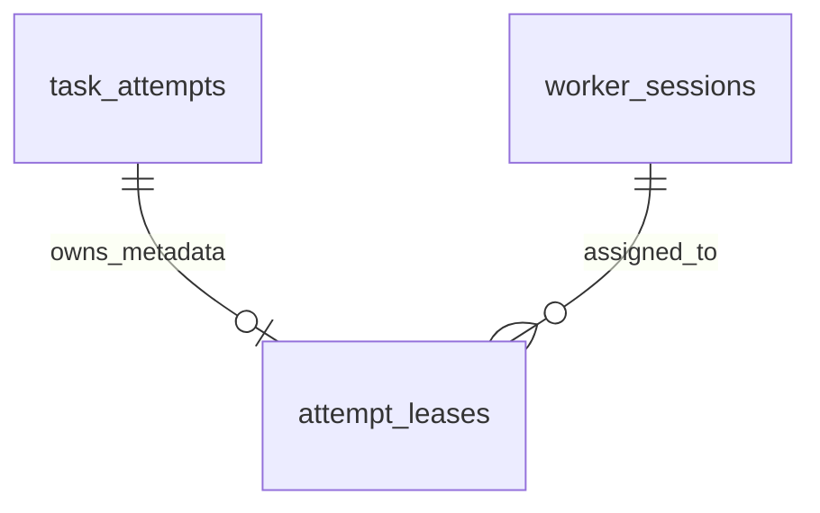

# Attempt lease storage

M2.2b adds revision `0006` and `attempt_leases` for the
[AttemptLease model](attempt-leases.md). This is persistence infrastructure;
M2.2c.1 adds [claim transactions](task-claims.md). Lease renewal and recovery
remain subsequent work.
Existing Workflow, Run and Worker HTTP contracts remain unchanged.

## Schema and identity



| Column | SQL type | Constraint |
| --- | --- | --- |
| attempt_id | UUID | Primary key; references task_attempts.id with ON DELETE RESTRICT. |
| worker_session_id | UUID | References worker_sessions.id with ON DELETE RESTRICT. |
| lease_token | UUID | Unique across all retained leases. |
| acquired_at | timestamptz | Finite acquisition time; immutable. |
| last_renewed_at | timestamptz | Finite last accepted observation. |
| lease_expires_at | timestamptz | Finite exclusive deadline. |

All columns are NOT NULL and have no defaults. The future transaction supplies
UUIDs and samples database time after obtaining its locks. There is no independent
`now()` default that could silently use transaction-start time. PostgreSQL stores
timestamp instants; a caller using raw SQL must still supply correctly interpreted
times. SQL does not enforce the Python model's aware-datetime input type.

The table enforces `acquired_at <= last_renewed_at < lease_expires_at` and rejects
positive/negative infinity. INSERT does not compare timestamps with the current
clock or validate the requested lease duration. It can store historical metadata.
The finite PostgreSQL timestamp range is wider than Python's datetime range;
application writes must also satisfy the domain model's representable UTC range.

One Attempt can have at most one lease. Its attempt UUID, Worker session UUID,
token and acquired time cannot change. Retries must allocate a new Attempt and
lease rather than changing an existing owner. The token's unique constraint also
prevents accidental reuse across old and new Attempts. It is equality-based
identity, not a monotonically increasing external fencing counter.

## Update and history guards

The BEFORE UPDATE trigger rejects identity changes or a decrease in either
`last_renewed_at` or `lease_expires_at`. Equal values are a permitted SQL no-op.
Forward updates still have to satisfy the time-order CHECK. These are local
row invariants, so a waiting UPDATE is checked against the row version it
actually updates, including a predecessor's committed advancement.

A statement-level trigger rejects DELETE and TRUNCATE, including on an empty
table or DELETE with a false predicate. The ownership record remains available
after Attempt completion. No TTL or purge path exists yet. Table owners can still
alter/drop tables or disable triggers; this is application integrity, not a
security boundary against database administrators.

The existing TaskAttempt and Worker history/identity guards remain in place.
Foreign keys ensure parent existence without adding cascading deletions.

## Authorization is a transaction responsibility

The schema does not duplicate Attempt status in this table. It does not enforce:

- Current RUNNING Task/Attempt identity, or all claims having a lease.
- Worker ACTIVE status, heartbeat freshness or available capacity.
- Whether the lease has expired, the server renewal policy or a task timeout.
- Whether the request presented the correct token.

In particular, a structurally valid raw SQL update can advance lease metadata
even if its Attempt is terminal or its deadline has elapsed. Such an update is
not an authorized renewal. A test records this boundary explicitly; only the
future ordered repository transaction will expose renewal as an application action.

The table's triggers deliberately do not acquire Run/Worker/Attempt locks while
updating a lease. That would add reverse lock edges against the planned
`Run -> Worker -> Task -> Attempt -> lease` protocol. Cross-row decisions will be
made under that order in M2.2c. M2.2c.1 implements claim admission, capacity and
allocation with post-lock clock samples and race tests; renewal remains M2.2c.2.
This migration alone does not provide crash recovery or stale-result rejection.

## Indexes and retention trade-offs

| Index | Intended use |
| --- | --- |
| Primary key on attempt_id | Find the current Attempt's lease; enforce one lease per Attempt. |
| Unique lease_token | Prevent token reuse across ownership history. |
| worker_session_id, attempt_id | Join to Attempts when counting a Worker's outstanding ownership across Runs. |
| lease_expires_at, attempt_id | Discover bounded deadline candidates for future recovery. |

The deadline index includes terminal history. A partial index cannot directly
predicate on the status in another table. Future recovery must join/filter and
revalidate current Attempt state; candidate selection does not authorize expiry.
Retaining all rows increases index size and can make old history expensive to
scan. Measure that cost before adding lifecycle duplication or archival machinery.
No performance or fairness guarantee is claimed by these indexes.

## Migration compatibility and rollback

Upgrade 0005 -> 0006 creates an empty lease table and leaves every existing
Workflow, version, Run, Task, Attempt, request binding and Worker row untouched.
There is no backfill with invented owners or tokens. Existing RUNNING Attempts
without leases remain historical/unowned; no executable grant can be inferred
from them. New claim transactions must atomically create Task state, Attempt and
lease. Handling legacy unowned Attempts needs an explicit administrative/recovery
policy, not silent reassignment.

Downgrade 0006 -> 0005 drops the lease table, its indexes/triggers and the two
lease functions. **It destroys ownership history while retaining Attempts.**
Re-upgrade creates an empty lease table; it cannot reconstruct lost tokens or
deadlines. Once execution exists, stop/quiesce writers and address outstanding
Attempts before considering such a downgrade. It is not a failure-recovery method.

## Local upgrade and verification

With Docker running and the development port/secret configuration initialized:

```powershell
docker compose up --build --wait --wait-timeout 120
docker compose exec api alembic upgrade head
docker compose exec api alembic current
docker compose exec api alembic check
```

Expect `0006 (head)` and `No new upgrade operations detected.` Rebuild the API
image first so that its packaged migration includes 0006. API startup does not
automatically upgrade the database. Host-side commands and isolated test database
configuration are described in [migrations](migrations.md) and
[local development](local-development.md).

```console
uv run --locked pytest tests/integration/test_lease_schema.py --database-env-file .env.database-test
```

Tests use private PostgreSQL schemas and cover required fields/defaults, foreign
keys, identity/token uniqueness, infinity/order checks, monotonic updates,
DELETE/TRUNCATE guards, insert rollback, concurrent duplicate identities/tokens,
waiting updates after commit/rollback and explicit authorization boundaries.
A populated 0005 -> 0006 -> 0005 -> 0006 round trip verifies all older records
survive, leases are not fabricated, and downgraded functions are removed.
Metadata comparison and the existing full migration rollback tests also apply.
