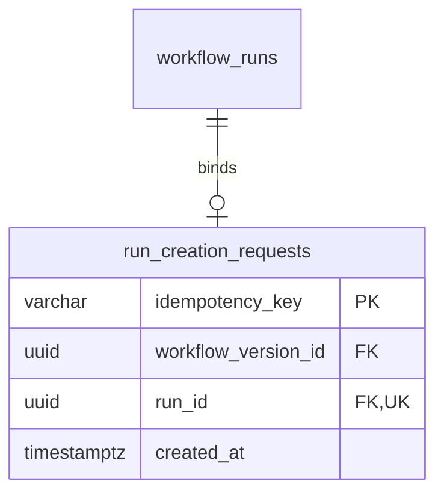

# Run-creation idempotency storage

M1.8 is split into two independently verifiable changes:

- **M1.8a (implemented):** revision 0004 and database request-binding invariants.
- **M1.8b (next):** application key validation, atomic reservation/creation,
  replay/conflict handling and concurrent request protocol tests.

RunRepository.create() and examples/create_run.py still create a new run per
call. No application deduplication or new HTTP endpoint is implemented yet.

## Request identity and result

For the first protocol, a creation request contains a concrete workflow_version_id.
An idempotency key identifies an invocation, not a workflow or its content.
Different keys may intentionally create different runs of the same version.

Keys are scoped globally to run creation in the current single-tenant engine.
They are case-sensitive, 1-128 ASCII characters, beginning with a letter or digit
and continuing with letters, digits, dot, underscore, colon or hyphen.
No trimming, case folding or Unicode normalization is intended. Clients should
generate fresh high-entropy keys such as UUIDs and retain the same key for retries.
A key is not an authorization credential; multi-tenant scope requires a later
explicit design before supporting unrelated tenants.

The planned successful receipt consists of stable run_id and workflow_version_id.
Repeated requests will return that original identity even after execution status
changes. This is not a replay of a mutable Run/Task snapshot or a byte-for-byte
HTTP response cache; HTTP response semantics are a later subtask.

The current input can be compared using its version UUID directly. No hash of
serialized JSON is needed. Adding execution inputs, options or other
creation-affecting fields requires extending the persisted request identity
before accepting them through the idempotent path.

## Schema in revision 0004



All four columns are NOT NULL. created_at defaults to database transaction-start
time. The key uses C collation and a CHECK constraint for the format above.
An immediate primary key rejects duplicate keys; an immediate unique constraint
on run_id prevents multiple bindings to the same run. Existing unkeyed runs
remain valid and are not backfilled with invented request keys.

The pair (run_id, workflow_version_id) references
workflow_runs(id, workflow_version_id). Revision 0004 adds an explicit unique
constraint on that target pair. Although id is already unique, the extra index
allows a composite reference that enforces agreement with the run's pinned
version. Separate independent foreign keys would not enforce that agreement.

The composite foreign key is **DEFERRABLE INITIALLY DEFERRED**, with NO ACTION
on deletion. It permits reservation before the corresponding run insert and
checks the reference at transaction commit. A missing run or mismatched version
makes COMMIT fail and roll back the transaction. Ending a savepoint is not the
outer commit. The primary key and run_id unique constraint remain immediate.
See [PostgreSQL CREATE TABLE](https://www.postgresql.org/docs/18/sql-createtable.html).

This proves the referenced identity exists, not that every DAG node was created,
the run was activated or a worker is available. M1.8b must compose this storage
with the complete M1.7 initialization protocol. Direct SQL can still insert
otherwise structurally valid incomplete runtime data.

A statement-level trigger rejects UPDATE, DELETE and TRUNCATE, including SQL
no-ops and statements matching no rows. Successful bindings cannot be reassigned
or forgotten through ordinary SQL. Administrators capable of DDL can bypass these
guards; the development account is not a production least-privilege policy.

There is no TTL, key reuse or purge. Keeping bindings indefinitely preserves the
deduplication history but consumes storage. Retention, backup/restore consistency
and tenant scoping require explicit policies later. Restoring an older database
backup can lose acknowledged keys; durability is bounded by the database's
configured recovery guarantees.

## Planned M1.8b transaction protocol

The following is the agreed next-step design, not current application behavior:

1. Validate the key and request; enter one PostgreSQL READ COMMITTED transaction.
2. Generate a candidate run UUID and INSERT the binding using
   ON CONFLICT (idempotency_key) DO NOTHING RETURNING.
3. If the insert wins, initialize that exact candidate Run and all tasks, then
   commit both the binding and initialized run together.
4. If it loses, read the binding in a **separate statement**. Compare the persisted
   version UUID: matching input returns the original receipt; different input
   raises a key-conflict error without creating another run.
5. Send success only after commit. Do not silently generate a different key or
   automatically replay arbitrary database failures.

An immediate unique key provides contention arbitration.
ON CONFLICT DO NOTHING avoids invoking the UPDATE prohibition. The separate read
uses a new READ COMMITTED snapshot after a concurrent winner commits.
See [PostgreSQL INSERT](https://www.postgresql.org/docs/18/sql-insert.html) and
[transaction isolation](https://www.postgresql.org/docs/18/transaction-iso.html).
These interactions will be exercised through the application in M1.8b.

If the winner rolls back, its reservation and run vanish together, allowing
another request to win. A disconnected caller with an uncertain COMMIT result
can later retry the same key/input under the implemented protocol. Waiting is
bounded by existing database timeouts; there is no promise of unlimited waiting
or fairness. No committed "in progress" placeholder or placeholder-expiry
recovery loop is needed for this transaction design.

This provides a future at-most-one committed run per retained key, not
exactly-once task execution or idempotent external side effects.

## Migration and verification

```console
docker compose exec api alembic upgrade head
docker compose exec api alembic current
docker compose exec api alembic check
```

Expected head: `0004 (head)`. Upgrade preserves existing versions, runs and tasks.
Adding the unique constraint builds an index and takes database DDL locks; review
migration duration before applying to large production tables. Existing migration
locking/transaction behavior still applies.

**Downgrading to 0003 deletes all request bindings but preserves runs and tasks.**
Re-upgrading restores an empty binding table. It cannot reconstruct old keys;
accepting those keys again could create duplicate invocations. A downgrade is not
a safe deduplication recovery strategy.

Use Alembic rather than metadata.create_all(): triggers are migration DDL.
Alembic check does not independently prove trigger behavior.

```console
uv run --locked pytest tests/integration/test_run_request_schema.py --database-env-file .env.database-test
```

Tests cover valid/invalid keys, null references, case-sensitive uniqueness,
reservation before run insertion, outer-COMMIT rejection and rollback of unrelated
writes, key reuse after rollback, immutable fields, history guards, four concurrent
binding inserts with one committed winner, and populated 0003 upgrade/downgrade
preservation. They establish database invariants; application replay and conflict
handling are intentionally left to the next commit.
