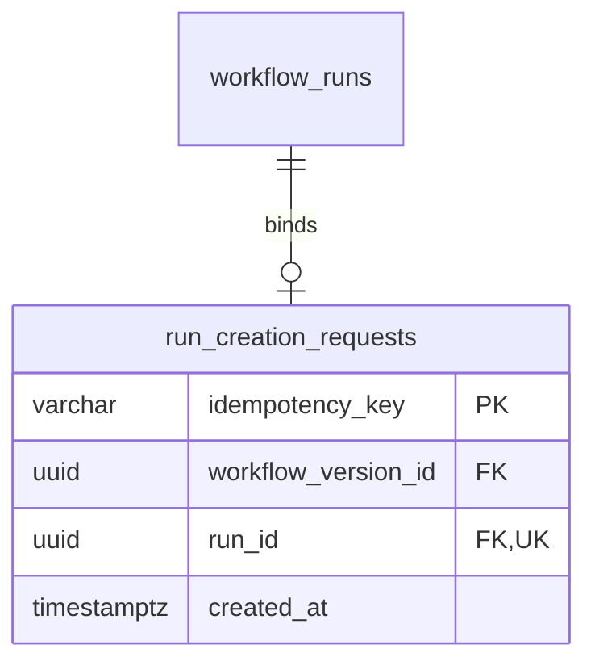

# Run-creation idempotency

M1.8 is split into two independently verifiable changes:

- **M1.8a (implemented):** revision 0004 and database request-binding invariants.
- **M1.8b (implemented):** application key validation, atomic reservation/creation,
  replay/conflict handling and concurrent request protocol tests.

RunRepository.create_idempotent() now creates or replays a durable receipt.
RunRepository.create() and examples/create_run.py remain unkeyed and create a new
run per call. M1.9b exposes [keyed Run creation over HTTP](run-api.md).
The current schema head is 0005; [Worker storage](worker-storage.md) adds no
changes to the Run-creation protocol.

## Request identity and result

For the first protocol, a creation request contains a concrete workflow_version_id.
An idempotency key identifies an invocation, not a workflow or its content.
Different keys may intentionally create different runs of the same version.

Keys are scoped globally to run creation in the current single-tenant engine.
They are case-sensitive, 1-128 ASCII characters, beginning with a letter or digit
and continuing with letters, digits, dot, underscore, colon or hyphen.
No trimming, case folding or Unicode normalization is intended. Clients should
generate fresh high-entropy keys such as UUIDs and retain the same key for retries.
A key is not an authorization credential; multi-tenant scope requires a later
explicit design before supporting unrelated tenants.

The successful receipt consists of stable run_id and workflow_version_id.
Repeated requests return that original identity even after execution status
changes. This is not a replay of a mutable Run/Task snapshot or a byte-for-byte
HTTP response cache; HTTP response semantics are a later subtask.

The current input can be compared using its version UUID directly. No hash of
serialized JSON is needed. Adding execution inputs, options or other
creation-affecting fields requires extending the persisted request identity
before accepting them through the idempotent path.

## Schema in revision 0004



All four columns are NOT NULL. created_at defaults to database transaction-start
time. The key uses C collation and a CHECK constraint for the format above.
An immediate primary key rejects duplicate keys; an immediate unique constraint
on run_id prevents multiple bindings to the same run. Existing unkeyed runs
remain valid and are not backfilled with invented request keys.

The pair (run_id, workflow_version_id) references
workflow_runs(id, workflow_version_id). Revision 0004 adds an explicit unique
constraint on that target pair. Although id is already unique, the extra index
allows a composite reference that enforces agreement with the run's pinned
version. Separate independent foreign keys would not enforce that agreement.

The composite foreign key is **DEFERRABLE INITIALLY DEFERRED**, with NO ACTION
on deletion. It permits reservation before the corresponding run insert and
checks the reference at transaction commit. A missing run or mismatched version
makes COMMIT fail and roll back the transaction. Ending a savepoint is not the
outer commit. The primary key and run_id unique constraint remain immediate.
See [PostgreSQL CREATE TABLE](https://www.postgresql.org/docs/18/sql-createtable.html).

This proves the referenced identity exists, not that every DAG node was created,
the run was activated or a worker is available. M1.8b composes this storage
with the complete M1.7 initialization protocol. Direct SQL can still insert
otherwise structurally valid incomplete runtime data.

A statement-level trigger rejects UPDATE, DELETE and TRUNCATE, including SQL
no-ops and statements matching no rows. Successful bindings cannot be reassigned
or forgotten through ordinary SQL. Administrators capable of DDL can bypass these
guards; the development account is not a production least-privilege policy.

There is no TTL, key reuse or purge. Keeping bindings indefinitely preserves the
deduplication history but consumes storage. Retention, backup/restore consistency
and tenant scoping require explicit policies later. Restoring an older database
backup can lose acknowledged keys; durability is bounded by the database's
configured recovery guarantees.

## Implemented transaction protocol

1. Validate the key and request; enter one PostgreSQL READ COMMITTED transaction.
2. Generate a candidate run UUID and INSERT the binding using
   ON CONFLICT (idempotency_key) DO NOTHING RETURNING.
3. If the insert wins, load and validate the version, then initialize that exact
   candidate Run and all tasks. The caller commits the binding and run together.
4. If it loses, read the binding in a **separate statement**. Compare the persisted
   version UUID: matching input returns the original receipt; different input
   raises a key-conflict error without creating another run.
5. Send success only after commit. Do not silently generate a different key or
   automatically replay arbitrary database failures.

An immediate unique key provides contention arbitration.
ON CONFLICT DO NOTHING avoids invoking the UPDATE prohibition. The separate read
uses a new READ COMMITTED snapshot after a concurrent winner commits.
See [PostgreSQL INSERT](https://www.postgresql.org/docs/18/sql-insert.html) and
[transaction isolation](https://www.postgresql.org/docs/18/transaction-iso.html).
These interactions are exercised through the application in M1.8b.

If the winner rolls back, its reservation and run vanish together, allowing
another request to win. A disconnected caller with an uncertain COMMIT result
can later retry the same key/input under the implemented protocol. Waiting is
bounded by existing database timeouts; there is no promise of unlimited waiting
or fairness. No committed "in progress" placeholder or placeholder-expiry
recovery loop is needed for this transaction design.

This provides at most one committed run per retained key, not
exactly-once task execution or idempotent external side effects.

## Migration and verification

```console
docker compose exec api alembic upgrade head
docker compose exec api alembic current
docker compose exec api alembic check
```

Expected head: `0005 (head)`. Revision 0004 introduced this binding table;
0005 adds Worker sessions. Upgrade preserves existing versions, runs and tasks.
Adding the unique constraint builds an index and takes database DDL locks; review
migration duration before applying to large production tables. Existing migration
locking/transaction behavior still applies.

**Downgrading to 0003 deletes all request bindings but preserves runs and tasks.**
Re-upgrading restores an empty binding table. It cannot reconstruct old keys;
accepting those keys again could create duplicate invocations. A downgrade is not
a safe deduplication recovery strategy.

Use Alembic rather than metadata.create_all(): triggers are migration DDL.
Alembic check does not independently prove trigger behavior.

```console
uv run --locked pytest tests/integration/test_run_request_schema.py --database-env-file .env.database-test
```

Tests cover valid/invalid keys, null references, case-sensitive uniqueness,
reservation before run insertion, outer-COMMIT rejection and rollback of unrelated
writes, key reuse after rollback, immutable fields, history guards, four concurrent
binding inserts with one committed winner, and populated 0003 upgrade/downgrade
preservation. These schema tests complement the application tests below.

## Calling the repository

```python
from workflow_engine.repositories.runs import RunRepository

with engine.begin() as connection:
    receipt = RunRepository(connection).create_idempotent(
        version_id, idempotency_key="client-generated-request-id"
    )
# Receipt is durable only after successful commit.
```

The version argument must be a Python UUID. The key is validated without
coercion by domain/idempotency.py. InvalidIdempotencyKeyError and key-conflict
messages do not echo supplied keys. RunCreationReceipt is a frozen dataclass
with only run_id and workflow_version_id; it has no mutable task state or
"replayed at" field. A receipt is not a current-status query.

Use an active caller-owned PostgreSQL READ COMMITTED transaction with DBAPI
autocommit disabled. Both keyed creation and replay enforce the original
transaction's lifetime. Leave the request foreign key initially deferred;
forcing it immediate defeats reservation-before-initialization.

There is no internal commit, savepoint, exception swallowing or database retry.
A winner returns before the outer COMMIT, whose deferred checks can still fail.
Let initialization failures escape the outer transaction. Never report success
or persist a receipt elsewhere until commit succeeds.

The supported request pattern uses one key per short transaction. Repeating the
same key in that transaction also returns the same provisional receipt. A future
batch taking several keys needs consistent acquisition order to avoid deadlocks;
this implementation does not coordinate arbitrary cross-key batches.

## Errors and retry behavior

| Situation | Behavior |
| --- | --- |
| Invalid key or non-UUID version argument | Reject before reservation; no runtime writes. |
| New key with missing/invalid stored version | Raise WorkflowVersionNotFoundError/StoredDefinitionError; outer rollback removes the reservation. |
| Existing key with the same version | Return the original receipt without reinitializing or changing runtime state. |
| Existing key with another version, even a nonexistent version | Raise IdempotencyConflictError; the existing binding takes precedence over new-version lookup. |
| Caller or initialization fails before COMMIT | Roll back binding, run and tasks together; the key can be retried. |
| Deferred constraint fails at COMMIT | The provisional receipt is not durable; all writes roll back. |
| Competing owner commits | Waiting request reads its binding and replays or reports conflict. |
| Competing owner rolls back | Waiting request can reserve the key and create its own run. |
| Lock/statement timeout or other database failure | Propagate the error; roll back and let the caller decide when to retry. |
| COMMIT outcome is uncertain to the caller | After reconnecting, retry the same key and version to resolve the retained binding. |

Replay intentionally does not revalidate a historical DAG or read current
execution status. The committed binding and foreign key preserve its identity.
Schema or protocol changes must preserve that receipt contract. Direct SQL or
administrative mutation outside the supported protocol remains outside these
application guarantees.

## Runnable example

After publishing a workflow and copying its printed Version ID, run from the
repository root with the database configured:

```powershell
$env:DWE_DATABASE_PORT = "15432"
$env:DWE_DATABASE_PASSWORD_FILE = "secrets/postgres_password.txt"
$versionId = "<published Version ID>"
$requestKey = [guid]::NewGuid().ToString()

uv run --locked python examples/create_idempotent_run.py --version-id $versionId --idempotency-key $requestKey
uv run --locked python examples/create_idempotent_run.py --version-id $versionId --idempotency-key $requestKey
```

Both invocations print the same Run ID and Version ID. Generate the key once;
generating a new key on each retry creates distinct requests. The script also
accepts --env-file for an explicit database configuration. A different version
with the same key produces a conflict. The old examples/create_run.py deliberately
remains unkeyed and always creates a fresh run.

Expected output from both successful invocations:

```text
Run ID: <same UUID on both calls>
Version ID: <requested UUID>
Creation receipt committed; repeat the same key/version to retrieve it.
No tasks executed; receipt does not report current execution status.
```

## Application verification

```console
uv run --locked pytest tests/test_idempotency.py
uv run --locked pytest tests/integration/test_run_idempotency.py --database-env-file .env.database-test
```

Application tests cover exact key validation, same-transaction and committed
replay, replay after runtime states advance, different-version conflicts,
case-sensitive independent keys, rollback/retry after caller and database
failures, and four concurrent callers with identical or conflicting input.

Blocking tests observe pg_blocking_pids before releasing the owning transaction,
then verify both commit/replay and rollback/takeover. A contention-timeout test
checks bounded failure and successful later replay. Injected deferred failure
tests establish that returning from create_idempotent is not a successful COMMIT.
The committed-replay test simulates discarding an acknowledged creation result;
it does not claim to inject a real network disconnect during COMMIT.

M1.9a adds [Run query storage operations](run-queries.md) for current persisted
state. M1.9b exposes [keyed creation and queries over HTTP](run-api.md).
