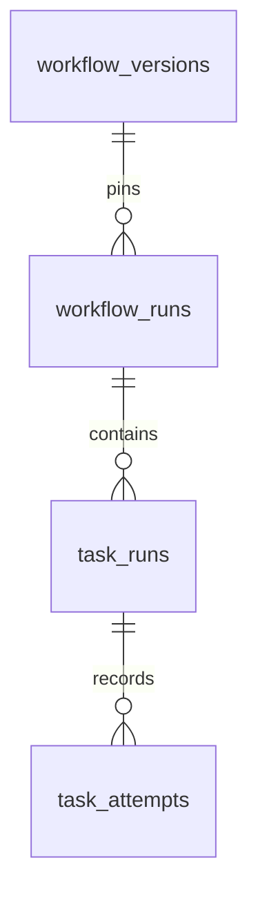

# Runtime storage contract

M1.6 adds Alembic revision `0003`. Revisions `0001` and `0002` are
unchanged. This milestone persists runtime identities and constrains their
lifecycle; run creation, scheduling and execution remain later subtasks.

## Data model



| Table | Fields | Additional constraints |
| --- | --- | --- |
| workflow_runs | id UUID, workflow_version_id UUID, status, created_at | Version foreign key; default PENDING |
| task_runs | id UUID, run_id UUID, task_key varchar(64), status, created_at | Run foreign key; unique (run_id, task_key); identifier format; default PENDING |
| task_attempts | id UUID, task_id UUID, attempt_number integer, status, created_at | Task foreign key; unique (task_id, attempt_number); positive number; default RUNNING |

Every column is NOT NULL. IDs are caller-supplied UUID primary keys. Foreign keys
use ON DELETE RESTRICT. A run pins an immutable version UUID; it never follows
a changing "latest" version.

Status columns use varchar(16), C collation and explicit CHECK membership matching
the [domain state machines](runtime.md). This avoids a separately managed native
PostgreSQL enum type. Changing supported values or transitions still requires a
new migration and coordinated domain changes.

Task keys use the same ASCII identifier rules as definitions and are case-sensitive.
Uniqueness prevents duplicate keys within a run; it does not prove that a key is
in the pinned DAG or that every DAG node has a corresponding task. Run creation
must establish those conditions transactionally.

Attempt numbers are positive PostgreSQL integers, bounded by 2,147,483,647.
The Python domain model currently checks positivity without this storage bound.
The database does not allocate numbers or prove they start at 1 and are consecutive.

All three tables have immutable created_at timestamptz values defaulting to now().
This is database transaction-start metadata, not a task start time, lease expiry
or execution deadline. Pure domain snapshots still contain only identities and
status; a repository must select their fields and decode the correct status enum.

## Uniqueness under concurrency

The database additionally creates:

```sql
CREATE UNIQUE INDEX uq_task_attempts_one_running_per_task
ON task_attempts (task_id)
WHERE status = 'RUNNING';
```

A [PostgreSQL partial unique index](https://www.postgresql.org/docs/18/indexes-partial.html)
enforces uniqueness only for rows matching its predicate. Two concurrent inserts
for one task cannot both commit RUNNING attempts, even with different numbers.
This index is immediate: close the previous attempt before inserting a replacement,
within the future coordinated transaction.

**One RUNNING row does not mean one executing process.** A LOST or TIMED_OUT
attempt may still produce side effects. This constraint implements neither a
lease nor fencing, worker crash detection, safe retries or exactly-once execution.
Those require authoritative ownership checks and cooperating idempotent handlers.

The version foreign key has an explicit lookup index. The unique indexes beginning
with run_id and task_id also support parent lookups. Queue/retry-deadline indexes
will be designed with the actual dispatch and recovery queries.

## Lifecycle and history guards

Revision 0003 installs row-level BEFORE UPDATE guards on all three tables:

- IDs, parent references, task keys, attempt numbers and created_at cannot change.
- Changed statuses must follow the explicit edges in the domain state machines.
- Terminal statuses cannot reopen; stage bypasses are rejected with SQLSTATE 55000.

Unchanged status updates are permitted when protected fields are unchanged.
This SQL no-op is different from replaying a domain event: the domain rejects an
event that is no longer legal. Neither behavior implements request idempotency.

INSERT accepts any whitelisted status, including a terminal snapshot. Defaults
supply normal initial values, but do not prove lifecycle history. The future
creation repository must enforce initial states and complete DAG initialization.
The guards also do not validate relationships between current run, task and
attempt statuses. Dependency readiness, retry budget/deadline, authorized
completion and run aggregation remain transaction-level obligations.
[PostgreSQL constraints](https://www.postgresql.org/docs/18/ddl-constraints.html)
provide structural guarantees; CHECK constraints are not a cross-row workflow protocol.

Statement-level BEFORE DELETE OR TRUNCATE guards retain runtime records, including
terminal attempts. They reject even an empty DELETE; TRUNCATE CASCADE does not
bypass the guards. There is no supported history-retention purge yet. An authorized
future retention policy will need an explicit design and migration.

These are safeguards against ordinary SQL mutations, not protection from a
database administrator who can drop tables or disable triggers. The development
database account is not a production least-privilege policy. New runtime columns
must be reviewed against the update guard in a new migration.

Use Alembic to create this schema. SQLAlchemy metadata.create_all() omits the
trigger/function DDL and is not a supported bootstrap. Alembic check alone also
does not prove those guards exist or behave correctly.

## Migration and verification

With the current image and configured Compose database running:

```console
docker compose exec api alembic upgrade head
docker compose exec api alembic current
docker compose exec api alembic check
```

Current revision should be `0003 (head)`. Upgrading an existing 0002 database
preserves its published definitions. No runtime records are created automatically.

**Downgrading from 0003 to 0002 deletes all runs, tasks and attempts.** It leaves
workflow identities and definition versions intact. Re-upgrading creates empty
runtime tables; it does not recover deleted data. Downgrade tests use disposable
schemas. See [migration execution and failure semantics](migrations.md).

Run the database tests with a dedicated disposable database configuration:

```console
uv run --locked pytest tests/integration/test_runtime_schema.py --database-env-file .env.database-test
```

Tests cover defaults and domain rehydration, every status-to-status update against
the public domain events, invalid values, foreign keys, scoped uniqueness,
immutable identities, terminal-state protection, DELETE/TRUNCATE guards,
concurrent attempt insertion through separate connections, and a populated
0002 upgrade/downgrade round trip that preserves definitions.

After this subtask is committed, pushed and verified in CI, M1.7 will implement
transactional run creation and DAG-node/root initialization. Durable request
idempotency follows as a separate subtask before exposing run creation over HTTP.
