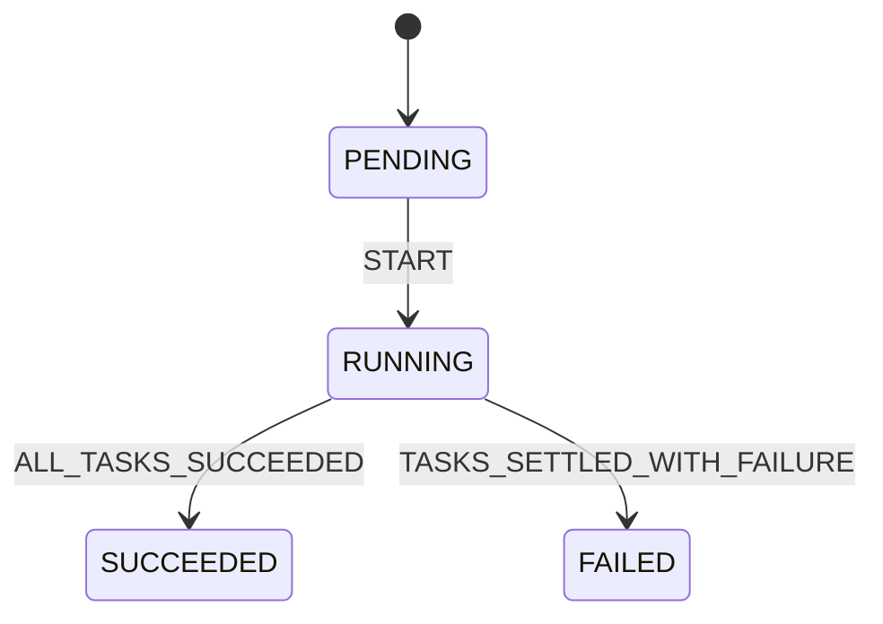
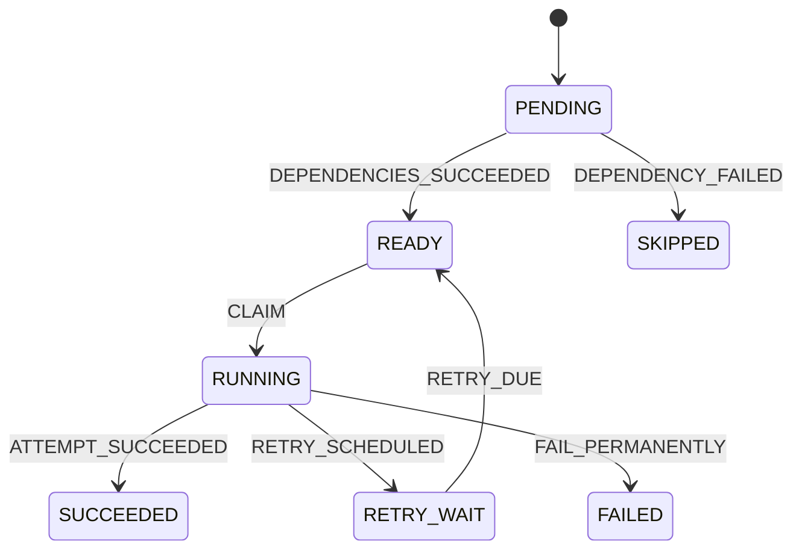

# Runtime identities and state transitions

M1.5 introduces pure, immutable runtime snapshots in `domain/runtime.py`.
These are Python domain objects, not ORM entities or a working scheduler.
M1.6 adds corresponding [runtime storage](runtime-storage.md) in revision `0003`.
The workflow HTTP API remains unchanged.

## Identity model

| Model | Identity and references | Default status |
| --- | --- | --- |
| WorkflowRun | `id` UUID; `workflow_version_id` references one immutable version UUID | PENDING |
| TaskRun | `id` UUID; `run_id` references a run; `task_key` matches TaskDefinition.task_id | PENDING |
| TaskAttempt | `id` UUID; `task_id` references TaskRun.id; positive integer `attempt_number` | RUNNING |

`TaskRun` is the runtime Task in the architecture. The distinct name separates
it from `TaskDefinition`. Its UUID identifies a runtime record; its string
`task_key` identifies a node in the pinned DAG. A new run gets new task UUIDs
even when it uses the same version and node keys.

An attempt number is scoped to one task and starts at 1 under the intended
allocation protocol. The model checks only that it is a positive integer;
it does not allocate or enforce uniqueness/sequential numbering. IDs are supplied
by callers. M1.6 storage enforces foreign-key existence, unique node keys within
a run and unique attempt numbers within a task. Complete DAG-node coverage and
matching require the future run-creation transaction.

These Python snapshots contain only identity and lifecycle information. M1.6 SQL
tables additionally store created_at audit metadata. Retry policy, active-attempt
pointers, lease tokens, worker sessions, outputs and optimistic version counters
need their own atomic storage/ownership contracts.

## Explicit transitions

Call `snapshot.transition(event)` to obtain a new validated snapshot. The
original object and all identity fields are preserved. Ordinary attribute mutation
is rejected. `is_terminal` reports whether that entity has finished.

Events here are typed domain commands, not a persistent event log. There is no
public "set arbitrary status" operation. Supported events that are illegal for
the current status raise `InvalidStateTransition`, which includes the status and
event enum members. A raw string or wrong event enum type raises `TypeError`.

### WorkflowRun



SUCCEEDED and FAILED are terminal. START means run activation, not evidence that
a worker is executing. There is no PENDING-to-terminal shortcut in this contract.
The future run-creation/activation transaction will decide when roots become READY.

The selected aggregation policy will let independent branches finish after a
failure. Once every task has settled, all SUCCEEDED means a successful run;
a FAILED/SKIPPED task means failure. Until then the run stays RUNNING.
**Aggregation and cross-task checks are not implemented in M1.5.** The completion
event is an assertion by the caller, whose evidence must be checked in the future
per-run transaction. There is no automatic fail-fast cancellation.

### TaskRun



| Event | Transition | Caller must establish later |
| --- | --- | --- |
| DEPENDENCIES_SUCCEEDED | PENDING → READY | All direct prerequisites succeeded; roots have no prerequisites. |
| DEPENDENCY_FAILED | PENDING → SKIPPED | At least one prerequisite is FAILED/SKIPPED, so this node cannot execute. |
| CLAIM | READY → RUNNING | Atomically allocate a new owned attempt and persist task/attempt changes. |
| ATTEMPT_SUCCEEDED | RUNNING → SUCCEEDED | Completion belongs to the current, authorized attempt. |
| RETRY_SCHEDULED | RUNNING → RETRY_WAIT | Attempt ended unsuccessfully; policy/budget allows another attempt; persist its retry deadline. |
| RETRY_DUE | RETRY_WAIT → READY | The stored retry deadline has arrived. |
| FAIL_PERMANENTLY | RUNNING → FAILED | Attempt ended unsuccessfully and no retry is allowed. |

SUCCEEDED, FAILED, and SKIPPED are terminal. FAILED never means "try again later";
retry decisions choose RETRY_WAIT before the task becomes terminal. A retry does
not reset the task to PENDING or create a new task identity.

SKIPPED means an unsatisfied prerequisite prevents execution, not that the task
ran and failed. Under static all-success dependencies, a READY task already has
terminal successful prerequisites; there is no READY-to-SKIPPED transition.
Conditional branches, cancellation, and user-requested skips need later designs.

### TaskAttempt

| Event | Transition |
| --- | --- |
| SUCCEED | RUNNING → SUCCEEDED |
| FAIL | RUNNING → FAILED |
| DEADLINE_EXCEEDED | RUNNING → TIMED_OUT |
| LEASE_EXPIRED | RUNNING → LOST |

Every destination is terminal. A claimed attempt starts RUNNING; this means the
engine authorized an attempt, not that a process definitely started or performed
a side effect. There is no READY state on an attempt.

FAILED denotes an unsuccessful reported execution. TIMED_OUT denotes an enforced
attempt deadline; LOST denotes expired task ownership. Deadline calculation,
clock choice, expiry detection, and lease renewal are not implemented here.
A missing worker heartbeat alone is not the authoritative LEASE_EXPIRED decision.

An unsuccessful attempt can correspond to either RETRY_WAIT or FAILED on its
task, depending on retry policy. There is no automatic transition between the
objects. Attempt outcome, task outcome, next retry deadline, and ownership checks
must eventually be persisted together. Retry creates a fresh attempt UUID and
number; the old attempt stays terminal.

TIMED_OUT/LOST do not prove the handler stopped or undo side effects. A late
success cannot reopen a terminal attempt through this state machine. Rejecting
stale database updates additionally requires authoritative ownership/fencing.

## Validation and consistency boundaries

Snapshots are frozen Pydantic models with forbidden extra fields and revalidation
of existing instances. Python status inputs must use the correct enum class;
the strict status field rejects both raw strings and another entity's enum,
even when their textual values match. JSON round trips use the uppercase strings.
A repository decoding database strings must explicitly construct the appropriate
enum. Attempt numbers reject booleans, numeric strings, floats, zero and negatives.

Construction is also a rehydration boundary: callers may construct a valid
terminal snapshot read from storage. It does not prove that the record reached
that state through historical transitions. Pydantic `model_copy(update=...)` and
`model_construct()` are validation bypasses, not supported update mechanisms.
Transitions revalidate their input; deliberately forged but otherwise valid
snapshots cannot be detected without authoritative storage.

**Legal state edges are necessary, not sufficient, for a valid distributed action.**
The model does not receive dependency states, a database clock, retry budget,
worker session, lease expiry, or an attempt token. It cannot verify them.
A RETRY_DUE event does not wait or inspect a timer; a CLAIM does not launch work.

In particular, two callers can transition the same stale PENDING snapshot to
READY independently. In-memory immutability is not compare-and-swap or concurrency
control. Later transactions must lock/re-read authoritative state, validate the
event-specific conditions, and persist all affected records atomically. No
database consistency, recovery, or at-least-once execution is claimed at this stage.

A duplicate event applied to an already-advanced snapshot is rejected; it is not
silently accepted as a no-op. Future idempotent request handlers must identify a
duplicate using durable request/attempt identity and replay the recorded result
without applying a second state transition. This state machine is not that
idempotency protocol.

Cancellation, run timeout, manual reruns, and resuming terminal records are outside
this contract. A future feature must define new events and transitions explicitly.

## Example and verification

```console
uv run --locked python examples/runtime_lifecycle.py
uv run --locked pytest tests/test_runtime.py
```

Expected example output:

```text
Attempt 1: FAILED; task: RETRY_WAIT
Attempt 2: SUCCEEDED; task: SUCCEEDED; run: SUCCEEDED
In-memory lifecycle only; no scheduling, waiting or task execution.
```

The version UUID in the example is illustrative and does not require a persisted
workflow. Docker is not needed for this example or these tests.

Tests cover success/failure/retry paths, preservation of identities, every
attempt outcome, rejection of all events on terminal entities, stage bypasses,
duplicate transitions, strict fields, JSON round trips, frozen fields, invalid
event types, and revalidation of bypassed models.

M1.6 implements runtime table constraints and migrations. Transactional run
creation, root readiness, request idempotency and scheduler integration follow
as separate commit-sized subtasks after storage is verified.
