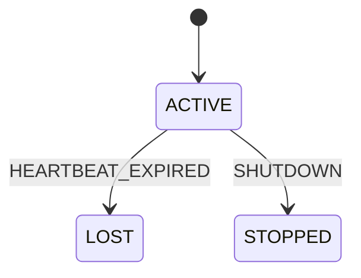

# Worker sessions and registration design

M2.1a implements the pure `WorkerSession` domain model, lifecycle tests and an
in-memory example. M2.1b adds [session storage](worker-storage.md) in revision
`0005`. M2.1c.1 adds [transactional registration](worker-registration.md).
M2.1c.2 adds [heartbeat renewal and per-session expiry](worker-heartbeat.md).
M2.1d adds [registration and heartbeat HTTP endpoints](worker-api.md).
Background loops and task execution remain later work.

## Identity: one UUID per process incarnation

A session represents one start of one worker process. The worker will generate
a new random UUID before its first registration request, reuse it for retries of
that registration, and generate a different UUID after a process restart.
The UUID must never be recovered from an old process's saved configuration.

`worker_name` is an operator label, not a routing address or unique identity.
Several sessions may share a name, including overlapping old/new processes.
The MVP does not introduce a stable machine identity or an exclusive
"current session for this name" pointer.

This avoids treating a delayed heartbeat or completion from an old process as
a message from its replacement. It also permits horizontal replicas without
coordinating display names. The trade-off is that two processes with the same name
are two independent sessions; their capacities are not a shared global limit.
Exclusive logical-worker slots would require a separate takeover/generation
protocol later.

| Field | Contract |
| --- | --- |
| id | Required UUID supplied by the caller; session identity. |
| worker_name | Required existing Identifier: ASCII letter first, then letters/digits/underscore/hyphen, 1–64 characters. |
| max_concurrency | Required strict integer, 1–2147483647; declared concurrent task slots for this session. |
| status | WorkerStatus enum; defaults to ACTIVE. |

The integer bound matches the PostgreSQL INTEGER storage. It is a
representation limit, not a claim that a worker has those resources. The model
does not allocate slots or enforce task concurrency. Future claims must combine
the declared limit with actual free capacity and authoritative ownership checks.

All fields are immutable snapshots. There is no automatic UUID generation or
registration side effect in model construction. M2.1b storage enforces UUID
uniqueness and immutable registration fields. A UUID is an identifier, not
an authentication credential; the existing trusted-worker assumption still applies.

## Session lifecycle



| Event | Result | Preconditions required from later transaction code |
| --- | --- | --- |
| HEARTBEAT_EXPIRED | ACTIVE → LOST | Lock/re-read the session and establish that its persisted heartbeat deadline has elapsed. |
| SHUTDOWN | ACTIVE → STOPPED | Stop new claims and establish that the session has no active owned attempts before recording graceful shutdown. |

ACTIVE means registered/eligible subject to deadline and capacity checks; it is
not proof that a process is alive. LOST means the engine has expired the session,
not proof that the operating system killed the process. STOPPED records an orderly
shutdown; it is not cancellation and does not terminate a handler.

LOST and STOPPED are terminal. Every later domain event is rejected, including
repeated events. A new process must create a new session instead of reopening an
old row. A heartbeat updates deadline metadata through the repository, not an
ACTIVE-to-ACTIVE domain transition.

`transition(event)` returns a new validated model preserving identity, name and
capacity. Illegal transitions raise the shared `InvalidStateTransition`;
a raw string or different enum type raises TypeError. Python status input requires
WorkerStatus, while JSON uses the uppercase strings.

Construction supports rehydrating terminal snapshots. Frozen models are not
database concurrency control. Pydantic validation bypasses are unsupported for
updates; transitions revalidate their input, but cannot detect a forged snapshot
whose fields happen to be valid. Persistence guards are documented separately in
[worker-storage.md](worker-storage.md).

## Registration and heartbeat protocol

M2.1c.1 implements registration steps 1–2 through the Python repository; see
[its exact snapshot, lock and clock contracts](worker-registration.md).
M2.1c.2 implements the per-session heartbeat/expiry checks in step 3.
M2.2c.1 implements claim admission in step 4 through the
[claim repository](task-claims.md). Automatic expiry scanning remains future work:

1. Use the M2.1b session table for UUID, immutable name/capacity, status,
   registration time, last accepted heartbeat time and deadline. Registration
   must derive those values from server/database time, not a worker timestamp.
2. First registration reserves that UUID atomically. Retrying identical fields
   returns the existing registration; conflicting fields produce a conflict.
   Registration replay must not extend a heartbeat deadline or reopen a terminal
   session. New liveness evidence goes through the heartbeat operation.
3. Heartbeat and expiry detection serialize on authoritative session state.
   After obtaining the lock, heartbeat checks both ACTIVE and an unexpired
   deadline; it cannot revive an expired session while waiting for the recovery
   scan. Expiry checks the same deadline under the same serialization rule.
4. Claim admission also checks that deadline rather than trusting an ACTIVE
   flag left behind by a delayed recovery scan. No handler runs while a database
   lock is held. M2.2a specifies the planned Run -> Worker -> Task -> Attempt
   ordering in the [claim protocol](attempt-leases.md#planned-transaction-boundaries);
   M2.2c.1 implements the claim transaction and its race verification.

Repeated heartbeat requests are liveness observations; they are not registration
replays. Before expiry, a delayed heartbeat can still be accepted as an observation
by the server. After expiry, it must be rejected. Strict rejection favors
unambiguous session lifetime over reviving a process after a long pause.

Use the database clock sampled after lock acquisition for deadline decisions:
transaction-start time could be stale after a long wait. Database wall-clock
adjustments remain a limitation of persisted deadlines; heartbeat timing is a
failure detector with possible false suspicions, not proof of a crash.

## Session heartbeat versus attempt lease

A session heartbeat says the worker's control loop reached the engine. It does
not prove that each task subprocess is progressing. A task lease independently
bounds ownership of a particular attempt.

The later claim protocol must bind each attempt to its session UUID and an
attempt-specific ownership identity/token. A matching session UUID alone is
insufficient to accept results. Result and renewal transactions must validate
the current attempt, ownership identity, lease and task state atomically.

Expiring the worker session stops new claims; it does not immediately requeue
all its tasks or declare their leases expired. Existing attempts remain governed
by their own leases. In particular, a still-valid attempt can report a result
under its original ownership even if the worker's heartbeat expired. A replacement
session cannot inherit that ownership by reusing the same worker name.

An expired attempt may eventually be retried while the old handler is still
running. Fencing protects engine state from stale completion, but cannot undo or
prevent arbitrary external side effects. Business idempotency remains necessary
for at-least-once execution. None of lease expiry, recovery, result fencing or
execution is implemented by this model.

| Failure or race | Intended behavior | Current implementation |
| --- | --- | --- |
| Worker restarts with the same label | New UUID; old identity stays separate. | Model/example only; boot/registration code is later. |
| Old session already LOST/STOPPED | Never transition back to ACTIVE. | Domain transitions and database update guards. |
| Registration commits but response is lost | Retry same UUID/fields without creating another session or renewing it. | Registration replay implemented; physical network failure injection remains later. |
| Heartbeat races expiry | Serialize and recheck the authoritative deadline. | Per-session transactions and commit/rollback race tests; automatic scan is later. |
| API/scheduler crashes | Durable session/deadline survives; next scan resumes. | Storage exists; recovery loop is later. |
| Worker stops heartbeating while a task lease is valid | Reject new claims after session expiry; use the attempt's lease for its outcome. | Protocol design only. |

## Example and verification

```console
uv run --locked python examples/worker_lifecycle.py
uv run --locked pytest tests/test_worker.py
```

Expected output:

```text
First session: ACTIVE -> LOST
Restart uses a new session ID: True
Restarted session: ACTIVE -> STOPPED
Old LOST session rejects further transitions.
In-memory lifecycle only; no registration, heartbeat or task execution.
```

Docker and PostgreSQL are not needed for these commands. Tests cover both legal
transitions, all terminal/event pairs, unchanged registration fields, strict
capacity/name/status validation, matching values from incorrect enum classes,
JSON round trips, frozen fields and revalidation of bypassed models.

## Commit-sized follow-up steps

| Subtask | Scope |
| --- | --- |
| M2.1a (implemented) | Session identity, pure lifecycle, tests, example and protocol boundaries. |
| M2.1b (implemented) | Session schema/migration, database constraints and PostgreSQL tests. |
| M2.1c.1 (implemented) | Transactional registration and duplicate/conflict handling with race tests. |
| M2.1c.2 (implemented) | Heartbeat renewal and expiry transactions with deadline/race tests. |
| M2.1d (implemented) | Registration/heartbeat HTTP contracts, validation and real HTTP checks. |

Each requires its own verified commit and owner push before starting the next.
M2.2a adds the pure [Attempt lease model and claim protocol](attempt-leases.md).
M2.2b adds [Attempt lease persistence](lease-storage.md), and M2.2c.1 adds
[single-run claim transactions](task-claims.md). Actual Worker execution follows
these foundations.
