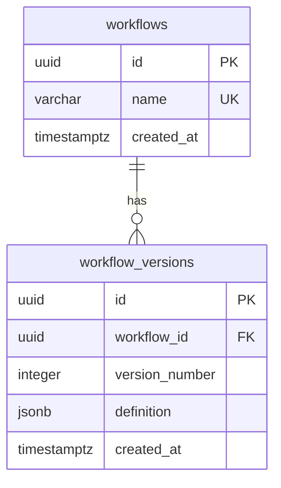

# Workflow identity and version storage

M1.2 adds revision `0002`, containing `workflows` and `workflow_versions`.
It defines storage and database invariants. M1.3 adds transactional publication,
version allocation, and retrieval through a Python repository. M1.4 exposes
[HTTP endpoints](api.md); request idempotency remains future work. Definition
tables remain defined by `0002`; the current head `0003` adds
[runtime storage](runtime-storage.md).



## Tables and indexes

| Table/column | Contract |
| --- | --- |
| `workflows.id` | UUID primary key, supplied by the application. |
| `workflows.name` | Required unique identifier, 1..64 ASCII characters; same naming rules as the domain model. |
| `workflows.created_at` | Required timestamptz, default `now()`. |
| `workflow_versions.id` | UUID primary key for one published snapshot, supplied by the application. |
| `workflow_versions.workflow_id` | Required FK to `workflows.id`, with ON DELETE RESTRICT. |
| `workflow_versions.version_number` | Required positive PostgreSQL integer. |
| `workflow_versions.definition` | Required JSONB object containing the whole definition document. |
| `workflow_versions.created_at` | Required timestamptz, default `now()`. |

A composite unique constraint on `(workflow_id, version_number)` prevents two
committed rows claiming the same version of one workflow. Different workflows
may both have version 1. The repository coordinates allocation under a workflow
row lock; the unique constraint remains the database backstop.

Primary/unique constraints create the needed indexes. The composite version
index also supports listing versions by workflow and finding its highest number,
so no duplicate `workflow_id` index is added. No `latest_version` pointer,
counter, content hash, or JSONB GIN index is stored yet.

The name column uses PostgreSQL's C collation so case-sensitive ASCII identifiers
have predictable comparison semantics. `demo` and `Demo` are distinct names.
There is one global namespace; tenancy and renaming APIs are not implemented.
The UUID is the stable identity; the schema does not make all workflow-row fields
immutable.

Timestamptz stores an instant, with display determined by the session time zone.
Database `now()` reflects transaction start time. Version numbers, not timestamps,
order versions within one workflow.

## Definition snapshot

The snapshot is `WorkflowDefinition.model_dump(mode="json")`, including document
`schema_version`, name, tasks, task types, and dependency lists.
The stored `version_number` is independent of document `schema_version`.
A future WorkflowRun should reference a concrete version UUID, so publishing a
new version cannot change an existing run's definition.

JSONB stores semantic JSON rather than original source text. Object key order and
whitespace are not preserved; array order is retained. Raw request bytes are not
an idempotency fingerprint. Each repository publication appends a new version,
including identical definitions. Canonicalization for request idempotency is
reserved for its own API/storage design.

The database checks that `definition` is an object and is not SQL NULL or JSON
null. It does not repeat Pydantic's field and DAG validation in SQL. An object such
as `{}` still satisfies the database check. Storage callers must validate whole
definitions before writes and validate snapshots on reads before use. Matching
the definition name to the workflow being published is also a caller obligation.

The database does not assign a version number, require it to start at 1, enforce
a gap-free sequence, or deduplicate identical definitions. Those are separate
publication policies, not guarantees provided by this schema.

## Append-only versions

Revision `0002` installs the statement-level
`workflow_versions_append_only` trigger and its
`dwe_reject_workflow_version_mutation()` function. It rejects UPDATE, DELETE,
and TRUNCATE with SQLSTATE `55000`. Inserts remain allowed.

The trigger runs even for a statement that would affect zero rows. Upserts using
ON CONFLICT DO UPDATE are therefore unsuitable for this table; DO NOTHING does
not rewrite existing versions. Deleting a workflow with versions is also blocked
by its foreign key, preventing accidental loss of history.

This protects ordinary DML from accidentally changing a historical definition.
It is not protection from an administrator who disables triggers, changes
replication behavior, or drops tables. Privilege separation is still needed for
a production runtime role; the local Compose user remains a development admin.
Retention, archival, and privileged deletion need an explicit future design.

The trigger is managed by the migration, not by SQLAlchemy metadata.
`metadata.create_all()` would omit it and is not a supported schema setup path.
Alembic autogenerate/check do not prove trigger/function equivalence; dedicated
integration tests exercise its behavior.

See [PostgreSQL statement-level trigger behavior](https://www.postgresql.org/docs/18/trigger-definition.html).

## Migration and validation

From the repository root with the database running and credentials configured:

```powershell
$env:DWE_DATABASE_PORT = "15432"
$env:DWE_DATABASE_PASSWORD_FILE = "secrets/postgres_password.txt"

uv run --locked alembic upgrade head
uv run --locked alembic current
uv run --locked alembic check
```

Current revision should be `0003 (head)`. This supports a fresh database or an
existing `0001`/`0002` database. No published revision was rewritten.
The existing migration transaction and advisory lock also cover the trigger DDL.

Downgrading from `0002` to `0001` drops both business tables, the trigger, and its
function. **This deletes all workflow/version data.** It is tested only on
disposable schemas and is not an automatic rollback strategy. DDL table removal
intentionally bypasses the ordinary DML immutability guard.

Integration tests apply actual migrations to generated test-owned schemas,
rather than constructing tables from current metadata. They verify:

- Upgrade from baseline, metadata comparison, downgrade cleanup, and re-upgrade.
- Unique workflow names and per-workflow version numbers.
- Positive version numbers, foreign keys, and JSONB object/NOT NULL constraints.
- A validated definition round trip and timezone-aware timestamp defaults.
- Rejection of version UPDATE/DELETE/TRUNCATE and workflow deletion with history.

Run them with the explicitly configured test database:

```console
uv run --locked pytest tests/integration --database-env-file .env.database-test
```

The tests create and clean up their own schemas. They do not migrate the
development database's public schema unless you separately run the migration CLI.

## Transactional repository

`WorkflowRepository` in `workflow_engine.repositories.workflows` takes a live
SQLAlchemy Connection inside `engine.begin()`. Use the application's configured
PostgreSQL/psycopg engine. The repository requires READ COMMITTED and checks the
actual driver's autocommit flag, since SQLAlchemy's isolation-level query does
not report AUTOCOMMIT. It rejects autocommit, other isolation levels, and reuse
after its original transaction ends.

The caller owns commit/rollback and the engine lifetime. Returned records are
provisional until commit succeeds. The repository never commits, retries, starts
a transaction, logs successful publication, or shares a connection across threads.
Keep the transaction short: no network requests or task execution while holding
its locks. Reading methods use the same explicit transaction contract.

| Operation | Result |
| --- | --- |
| `publish(definition)` | Revalidated `StoredWorkflowVersion`; create workflow by exact name if absent, then append one version. |
| `get_workflow(name)` | `StoredWorkflow` containing UUID, name, and creation timestamp, or `None`. |
| `get_version(version_id)` | Snapshot by immutable version UUID, or `None`. |
| `get_numbered_version(workflow_id, version_number)` | Snapshot by workflow UUID and version number, or `None`. |
| `get_latest_version(workflow_id)` | Highest currently visible version, or `None`. |

Records are frozen dataclasses; snapshots use frozen domain models. Reads validate
the stored definition again, including DAG constraints and supported schema
version. Invalid snapshots raise `StoredDefinitionError` with a fixed message
without embedding the payload. Invalid publication input raises Pydantic
`ValidationError` before any write, including instances created using validation
bypasses such as `model_copy`. These are internal Python errors; the [HTTP layer](api.md)
maps request validation to 422 and corrupted storage to a fixed 500 response.

```python
from workflow_engine.repositories.workflows import WorkflowRepository

# engine and validated_definition are provided by the application.
with engine.begin() as connection:
    published = WorkflowRepository(connection).publish(validated_definition)
# Only now is published committed.
with engine.begin() as connection:
    stored = WorkflowRepository(connection).get_version(published.id)
```

The runnable version of this example is
[`examples/publish_workflow.py`](../examples/publish_workflow.py).

### Publication protocol and concurrency

1. Validate the whole definition, before acquiring locks.
2. INSERT the workflow identity with ON CONFLICT (name) DO NOTHING.
3. In a **separate statement**, SELECT that workflow's UUID FOR UPDATE.
4. While holding its row lock, select the highest version number and insert its
   successor (1 when none exists), with a fresh version UUID and JSONB snapshot.
5. Return the record; the caller commits or rolls back the entire transaction.

At READ COMMITTED, successive statements get new snapshots. An INSERT ON CONFLICT
DO NOTHING may lose to a concurrent insert invisible to its original snapshot.
The following SELECT can see the winner once it commits; combining these into
one CTE would not provide that fresh snapshot.
See [PostgreSQL transaction isolation](https://www.postgresql.org/docs/18/transaction-iso.html).

Publishers of one workflow serialize on its row lock, held until transaction
completion. Different workflow rows can progress independently. Normal readers
do not take these row locks.
See [PostgreSQL explicit locking](https://www.postgresql.org/docs/18/explicit-locking.html).

Under this protocol, committed versions start at 1 and increase without duplicates;
a rolled-back allocation is reusable because there is no external sequence.
This does not promise HTTP arrival order or fairness, and direct SQL writers
bypassing the protocol are outside that guarantee. Schema uniqueness still
rejects conflicting numbers. The PostgreSQL integer limit also bounds the version
number; exceeding it fails the transaction rather than wrapping.

A latest-version lookup is relative to its statement's READ COMMITTED snapshot.
A subsequent lookup can observe a newer commit. Future run creation must bind to
the concrete returned version UUID, not keep resolving "latest" during execution.

The supported application pattern publishes one workflow per short transaction.
If a future batch touches multiple workflows, it needs a consistent lock order
to avoid deadlocks; this repository does not implement batch coordination.
This is per-workflow publication coordination, separate from the future per-run
scheduling protocol.

### Failure semantics and limits

| Scenario | Behavior |
| --- | --- |
| Caller fails before commit | Let the exception leave `engine.begin()`; workflow identity and version writes roll back together. |
| Version write or later SQL statement fails | Propagate the database error and roll back the outer transaction; no partial publication is committed. |
| Publisher process disconnects before commit | PostgreSQL rolls back when it detects the connection loss and releases locks; detection need not be immediate. |
| Another publisher holds the workflow lock | Wait within the configured SQL statement timeout; a timeout aborts the operation and requires rollback. |
| Same definition is submitted again | A new version is created; there is no content or request deduplication yet. |
| Connection drops during COMMIT | Outcome can be unknown to the caller. No automatic retry; replay could create another version. |
| Stored definition is invalid or from an unsupported document schema | Reject the read; do not pass unchecked data to execution. |
| Repository is used after commit/rollback | Raise `RepositoryTransactionError` before executing SQL. |

The configured statement timeout is not a whole-transaction or idle-transaction
deadline. Long-lived transactions can still hold locks while idle. Production
connection-loss detection and idle-transaction policies need later operational
configuration. Database errors should escape the transaction context; catching
and continuing after a SQL error is not a supported recovery strategy.

A successful repository call does not establish exactly-once publication or
execution. Request idempotency requires a separate durable key/result protocol
before callers can safely retry uncertain requests. No WorkflowRun, task state,
worker, or task execution is introduced here.

### Repository validation

Integration tests use migrated disposable schemas and actual PostgreSQL
connections. They cover committed round trips, version history, identical
publication behavior, missing records, case-sensitive identities, invalid input,
invalid stored snapshots on every lookup path, transaction/isolation guards,
and caller/database rollback.

Four synchronized publisher threads test both absent and existing workflows,
checking a single identity and unique ordered version numbers. A transaction
holding one workflow's lock allows another workflow to publish, while a competing
publisher of the held workflow gets a bounded lock timeout. Subsequent publication
proves the failed attempt did not consume a version.

```console
uv run --locked pytest tests/integration/test_workflow_repository.py --database-env-file .env.database-test
```

The existing container CI job discovers these tests automatically. No new
migration or dependency is needed for M1.3.
