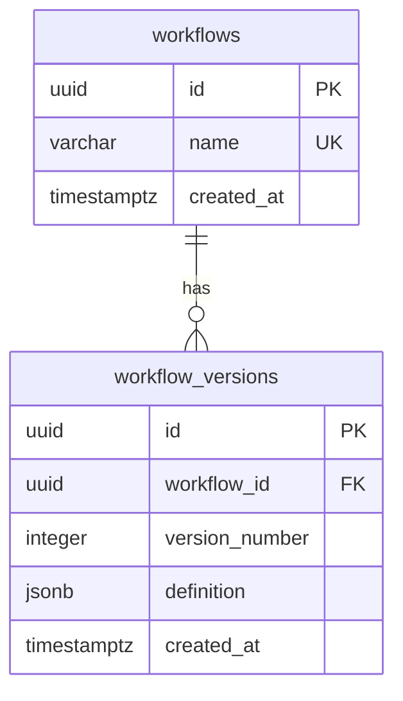

# Workflow identity and version storage

M1.2 adds revision `0002`, containing `workflows` and `workflow_versions`.
It defines storage and database invariants. Publishing/retrieving versions,
allocating version numbers, request idempotency, and HTTP endpoints are later
subtasks.



## Tables and indexes

| Table/column | Contract |
| --- | --- |
| `workflows.id` | UUID primary key, supplied by the application. |
| `workflows.name` | Required unique identifier, 1..64 ASCII characters; same naming rules as the domain model. |
| `workflows.created_at` | Required timestamptz, default `now()`. |
| `workflow_versions.id` | UUID primary key for one published snapshot, supplied by the application. |
| `workflow_versions.workflow_id` | Required FK to `workflows.id`, with ON DELETE RESTRICT. |
| `workflow_versions.version_number` | Required positive PostgreSQL integer. |
| `workflow_versions.definition` | Required JSONB object containing the whole definition document. |
| `workflow_versions.created_at` | Required timestamptz, default `now()`. |

A composite unique constraint on `(workflow_id, version_number)` prevents two
committed rows claiming the same version of one workflow. Different workflows
may both have version 1. This is an invariant, not a version allocator:
concurrent publication still needs transaction coordination in the repository.

Primary/unique constraints create the needed indexes. The composite version
index also supports listing versions by workflow and finding its highest number,
so no duplicate `workflow_id` index is added. No `latest_version` pointer,
counter, content hash, or JSONB GIN index is stored yet.

The name column uses PostgreSQL's C collation so case-sensitive ASCII identifiers
have predictable comparison semantics. `demo` and `Demo` are distinct names.
There is one global namespace; tenancy and renaming APIs are not implemented.
The UUID is the stable identity; the schema does not make all workflow-row fields
immutable.

Timestamptz stores an instant, with display determined by the session time zone.
Database `now()` reflects transaction start time. Version numbers, not timestamps,
order versions within one workflow.

## Definition snapshot

The snapshot is `WorkflowDefinition.model_dump(mode="json")`, including document
`schema_version`, name, tasks, task types, and dependency lists.
The stored `version_number` is independent of document `schema_version`.
A future WorkflowRun should reference a concrete version UUID, so publishing a
new version cannot change an existing run's definition.

JSONB stores semantic JSON rather than original source text. Object key order and
whitespace are not preserved; array order is retained. Raw request bytes are not
an idempotency fingerprint. Canonicalization and repeated-publication semantics
will be decided with the repository/API layer.

The database checks that `definition` is an object and is not SQL NULL or JSON
null. It does not repeat Pydantic's field and DAG validation in SQL. An object such
as `{}` still satisfies the database check. Storage callers must validate whole
definitions before writes and validate snapshots on reads before use. Matching
the definition name to the workflow being published is also a caller obligation.

The database does not assign a version number, require it to start at 1, enforce
a gap-free sequence, or deduplicate identical definitions. Those are separate
publication policies, not guarantees provided by this schema.

## Append-only versions

Revision `0002` installs the statement-level
`workflow_versions_append_only` trigger and its
`dwe_reject_workflow_version_mutation()` function. It rejects UPDATE, DELETE,
and TRUNCATE with SQLSTATE `55000`. Inserts remain allowed.

The trigger runs even for a statement that would affect zero rows. Upserts using
ON CONFLICT DO UPDATE are therefore unsuitable for this table; DO NOTHING does
not rewrite existing versions. Deleting a workflow with versions is also blocked
by its foreign key, preventing accidental loss of history.

This protects ordinary DML from accidentally changing a historical definition.
It is not protection from an administrator who disables triggers, changes
replication behavior, or drops tables. Privilege separation is still needed for
a production runtime role; the local Compose user remains a development admin.
Retention, archival, and privileged deletion need an explicit future design.

The trigger is managed by the migration, not by SQLAlchemy metadata.
`metadata.create_all()` would omit it and is not a supported schema setup path.
Alembic autogenerate/check do not prove trigger/function equivalence; dedicated
integration tests exercise its behavior.

See [PostgreSQL statement-level trigger behavior](https://www.postgresql.org/docs/18/trigger-definition.html).

## Migration and validation

From the repository root with the database running and credentials configured:

```powershell
$env:DWE_DATABASE_PORT = "15432"
$env:DWE_DATABASE_PASSWORD_FILE = "secrets/postgres_password.txt"

uv run --locked alembic upgrade head
uv run --locked alembic current
uv run --locked alembic check
```

Current revision should be `0002 (head)`. This supports a fresh database or an
existing `0001` baseline. No published revision was rewritten.
The existing migration transaction and advisory lock also cover the trigger DDL.

Downgrading from `0002` to `0001` drops both business tables, the trigger, and its
function. **This deletes all workflow/version data.** It is tested only on
disposable schemas and is not an automatic rollback strategy. DDL table removal
intentionally bypasses the ordinary DML immutability guard.

Integration tests apply actual migrations to generated test-owned schemas,
rather than constructing tables from current metadata. They verify:

- Upgrade from baseline, metadata comparison, downgrade cleanup, and re-upgrade.
- Unique workflow names and per-workflow version numbers.
- Positive version numbers, foreign keys, and JSONB object/NOT NULL constraints.
- A validated definition round trip and timezone-aware timestamp defaults.
- Rejection of version UPDATE/DELETE/TRUNCATE and workflow deletion with history.

Run them with the explicitly configured test database:

```console
uv run --locked pytest tests/integration --database-env-file .env.database-test
```

The tests create and clean up their own schemas. They do not migrate the
development database's public schema unless you separately run the migration CLI.
