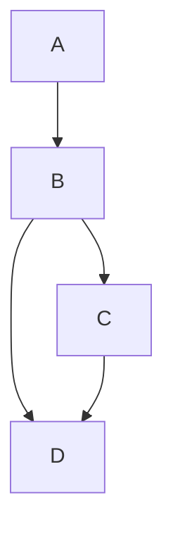

# Workflow definition and DAG contract

M1.1 introduces static workflow definitions and graph validation as pure Python
domain code. It has no database, HTTP, scheduler, worker, or handler imports.
Validation performs no task execution or infrastructure access.

## Definition document, schema version 1

See [the runnable example](../examples/diamond.json):

```json
{
  "schema_version": 1,
  "name": "diamond",
  "tasks": [
    {"task_id": "A", "task_type": "demo.echo"},
    {"task_id": "B", "task_type": "demo.echo", "depends_on": ["A"]},
    {"task_id": "C", "task_type": "demo.echo", "depends_on": ["B"]},
    {"task_id": "D", "task_type": "demo.echo", "depends_on": ["B", "C"]}
  ]
}
```



`B.depends_on = ["A"]` declares the edge A → B. D requires both B and C.
Edges represent successful prerequisite completion in the intended execution
model. Runtime readiness and state transitions will be implemented later.

| Field | Contract |
| --- | --- |
| `schema_version` | Integer 1; defaults to 1. Strings, floats, and booleans are rejected. |
| `name` | Required workflow name, using the identifier rules below. |
| `tasks` | Required nonempty collection, at most 1,000 task definitions. |
| `task_id` | Required identifier, unique within this definition. |
| `task_type` | Required opaque handler registry key, up to 128 characters. |
| `depends_on` | Task IDs in this definition; defaults to an empty collection. |

Names and task IDs are case-sensitive ASCII identifiers, 1..64 characters:
start with a letter, followed by letters, digits, underscores, or hyphens.
Task types use the same rules with a 128-character limit and may additionally
contain dots, for example `demo.echo`. Strings are not trimmed or coerced from
numbers/bytes. Unknown fields are rejected, including misspelled dependency keys.

`schema_version` describes the document format. It is not a stored workflow
version number, run ID, or optimistic-lock version. Persistent immutable workflow
versions now have a [storage schema](workflow-storage.md); publication logic is
implemented in the next subtask.

This contract currently contains graph identity and structure. Handler inputs,
outputs, retries, task timeout, runtime state, conditional branches, dynamic
fan-out, and external workflow dependencies are not fields in version 1.
The `task_type` key is not resolved against a registry during validation and is
never treated as executable code or an import path.

## Run the example

From the repository root:

```console
uv run --locked python examples/validate_workflow.py
```

Expected output:

```text
Workflow: diamond
Roots: A
Topological order: A, B, C, D
Validation only; no tasks were executed.
```

The example uses the installed package and locates its JSON file relative to the
script. To validate another document from application code:

```python
from workflow_engine.domain.workflow import WorkflowDefinition

workflow = WorkflowDefinition.model_validate_json(document_json)
dag = workflow.dag()
```

`model_validate(...)` accepts decoded data, and `model_dump_json()` serializes
a definition back to JSON. JSON arrays become tuples internally. Task declaration
and dependency order are preserved by model serialization; the graph analysis
normalizes ordering separately. A canonical content hash/idempotency contract has
not been defined yet.

## Graph invariants and errors

Workflow construction validates structure first, then the complete graph.
The graph must have:

- Unique task IDs.
- No duplicate dependency edge for a task.
- No references to a missing task.
- No self-dependencies.
- No directed cycle.
- At most 10,000 dependency edges across the definition.

Multiple roots, disconnected components, and redundant transitive edges are
allowed. Every declared task belongs to the workflow, including independent
components. Repeating an edge is rejected rather than silently deduplicated.

Graph errors exposed through Pydantic ValidationError have stable types:

| Error type | Meaning |
| --- | --- |
| `duplicate_task_id` | A task ID appears more than once. |
| `duplicate_dependency` | A task lists the same prerequisite more than once. |
| `unknown_dependency` | A prerequisite does not exist in the definition. |
| `self_dependency` | A task refers to itself. |
| `cycle_detected` | No complete topological order exists. |
| `too_many_edges` | Total edge count exceeds the limit. |

Field errors use Pydantic's normal error types, such as `too_short`,
`too_long`, `string_pattern_mismatch`, and `extra_forbidden`.
The lower-level `analyze_dag(mapping)` helper raises DAGValidationError and also
checks empty/oversized mappings; WorkflowDefinition checks collection lengths
before graph analysis.

Graph error context includes `task_ids`. For a cycle this is the set of
**blocked tasks remaining after traversal**: it can include descendants of a
cycle, not only nodes inside a cycle. It is not an exact cycle witness.
The validator reports the first graph error found, after field validation.

The graph limits bound domain work; a future HTTP API still needs request-body
limits because parsing and field validation happen before whole-graph analysis.

## Analysis and scheduling boundary

The analysis result contains:

- `roots`: lexicographically ordered task IDs with no prerequisites.
- `topological_order`: each task exactly once, after all of its prerequisites.
- `dependencies`: task ID → immutable tuple of prerequisite IDs.
- `dependents`: task ID → immutable tuple of directly downstream IDs.

Kahn's algorithm uses an indegree counter and a min-heap for deterministic
lexicographic tie-breaking. It is iterative, so a long chain does not consume the
Python recursion stack. Including sorting for stable indexes, the upper bound is
O((V + E) log V) time and O(V + E) memory.

Equivalent graphs produce the same analysis regardless of declaration order.
Topological order is not a sequential execution plan or task priority.
Independent tasks may run concurrently even when far apart in that order.
The indexes will support future scheduler dependency resolution, but this module
does not read task states, mark tasks READY, dispatch work, or enforce leases.

Workflow construction analyzes the graph to validate it. Calling `dag()` produces
a fresh snapshot and repeats that bounded analysis; there is no hidden mutable
cache. Compile once and reuse the returned snapshot where repeated access is
needed.

## Immutability and validation boundaries

Models are frozen, and all current nested fields are strings, integers, tuples,
or frozen TaskDefinition objects. Parsing detaches mutable input lists.
Analysis results returned by `analyze_dag` use frozen dataclasses, read-only
mapping proxies, and tuple values backed by private copies.

Pydantic `model_construct()` and `model_copy(update=...)` bypass validation and
are not suitable for untrusted definition updates. Re-enter through
`WorkflowDefinition.model_validate(...)`; existing model instances are configured
to be revalidated, including nested tasks. Frozen objects are an application
invariant, not protection against Python reflection or deliberate bypasses.

This immutability protects in-memory definitions. The [storage layer](workflow-storage.md) now guards version rows against mutation;
publication concurrency and run snapshots require subsequent repository work.

## Verification and next steps

```console
uv run --locked pytest tests/test_dag.py tests/test_workflow.py
```

Tests cover invalid graphs and field shapes, JSON round trips, input isolation,
frozen nested fields, deterministic ordering across declaration permutations,
long chains, inclusive edge limits, and reproducibly generated DAGs whose every
edge must respect the resulting order.

M1.2 adds the [workflow/version database schema](workflow-storage.md).
Transactional repository operations, submission APIs, and durable/idempotent run
creation follow as separate commit-sized subtasks.
